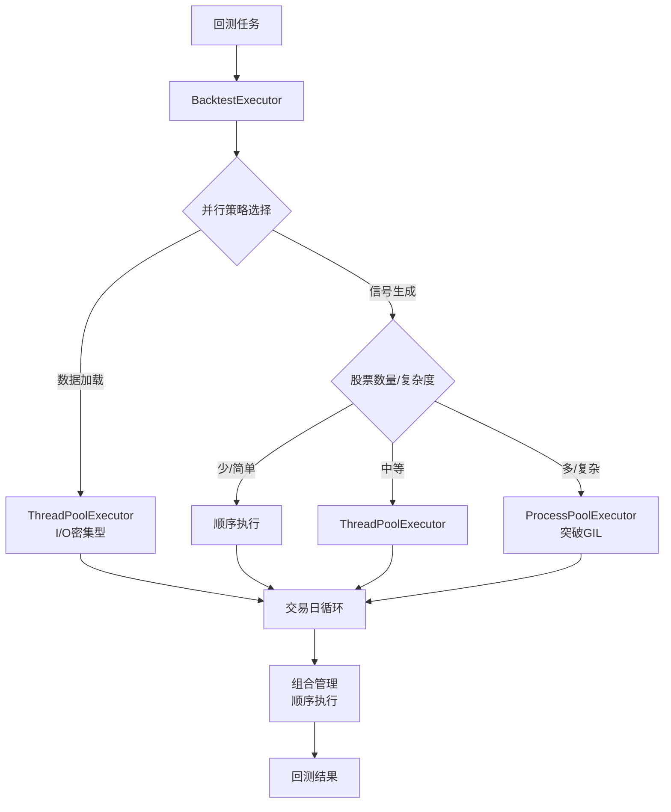

# 回测性能优化：突破GIL限制方案

## 问题分析

### 当前实现的问题

1. **GIL限制**：回测执行器使用 `ThreadPoolExecutor` 进行信号生成并行化，但受Python GIL限制
2. **CPU密集型任务**：策略的信号生成涉及大量pandas/numpy计算，虽然部分操作会释放GIL，但整体仍受限制
3. **性能瓶颈**：多股票回测时，线程池无法充分利用多核CPU，导致回测速度慢

### 当前架构

- 任务执行：已在进程池中执行（`execute_backtest_task_simple`）
- 数据加载：使用 `ThreadPoolExecutor`（I/O密集型，适合）
- 信号生成：使用 `ThreadPoolExecutor`（CPU密集型，受GIL限制）

## 优化方案

### 核心思路

采用**混合并行化策略**：

- **数据加载**：继续使用线程池（I/O密集型）
- **信号生成**：改为使用进程池（CPU密集型，突破GIL）
- **交易日循环**：保持顺序执行（有状态依赖）

### 实现策略

#### 1. 进程池信号生成器

在 `BacktestExecutor` 中添加进程池支持：

**文件**: `backend/app/services/backtest/backtest_executor.py`

- 添加 `ProcessPoolExecutor` 用于信号生成
- 创建可序列化的信号生成函数（独立函数，不依赖策略对象）
- 实现进程间数据传递（pandas DataFrame序列化）

**关键改动**：

```python
# 将策略配置和股票数据序列化，在进程中重建策略对象
def _generate_signals_in_process(
    strategy_name: str,
    strategy_config: Dict,
    stock_code: str,
    data_serialized: bytes,  # 序列化的DataFrame
    current_date: datetime
) -> List[Dict]:  # 返回可序列化的信号字典
    """在独立进程中生成信号（突破GIL限制）"""
    # 反序列化数据
    # 重建策略对象
    # 生成信号
    # 序列化信号返回
```

#### 2. 配置管理

在配置中添加进程池相关设置：

**文件**: `backend/app/core/config.py`

- `BACKTEST_USE_PROCESS_POOL`: 是否使用进程池（默认True）
- `BACKTEST_PROCESS_POOL_SIZE`: 进程池大小（默认CPU核心数）
- `BACKTEST_THREAD_POOL_SIZE`: 线程池大小（用于I/O操作）

#### 3. 智能选择并行策略

根据任务特征自动选择线程池或进程池：

- **股票数量少（≤3）**：顺序执行
- **股票数量中等（4-10）**：线程池（开销小）
- **股票数量多（>10）或策略复杂**：进程池（突破GIL）

#### 4. 数据序列化优化

优化进程间数据传递：

- 使用 `pickle` 序列化DataFrame（pandas原生支持）
- 对于大数据，考虑使用 `pyarrow` 或 `parquet` 格式
- 缓存策略对象配置，避免重复序列化

#### 5. 性能监控

添加性能指标：

- 记录进程池 vs 线程池的执行时间
- 监控CPU利用率
- 记录内存使用情况

## 实现细节

### 架构图



### 关键代码结构

1. **进程池信号生成函数**（独立模块，可序列化）
2. **BacktestExecutor增强**（支持进程池和线程池切换）
3. **配置管理**（灵活控制并行策略）
4. **性能监控**（记录和对比不同策略的性能）

## 预期效果

### 性能提升

- **多股票回测（>10只）**：预计提升 **3-5倍**（充分利用多核）
- **复杂策略**：预计提升 **2-4倍**（突破GIL限制）
- **单股票或简单策略**：保持现有性能（避免进程开销）

### 资源利用

- CPU利用率：从单核提升到多核（根据进程池大小）
- 内存使用：适度增加（每个进程独立内存空间）
- 响应时间：显著降低（特别是多股票场景）

## 注意事项

1. **进程开销**：进程创建和通信有开销，需要根据任务规模选择
2. **数据序列化**：大数据传递需要时间，需要优化序列化方式
3. **内存使用**：每个进程独立内存，多进程会增加内存占用
4. **调试难度**：多进程调试较复杂，需要完善的日志

## 实施步骤

1. 创建进程池信号生成模块
2. 修改 `BacktestExecutor` 支持进程池
3. 添加配置选项
4. 实现智能并行策略选择
5. 添加性能监控和对比
6. 测试和优化
7. 更新文档

## 兼容性

- 保持向后兼容：默认行为可通过配置控制
- 支持渐进式迁移：可以逐步启用进程池
- 保留线程池选项：适合I/O密集型或简单任务