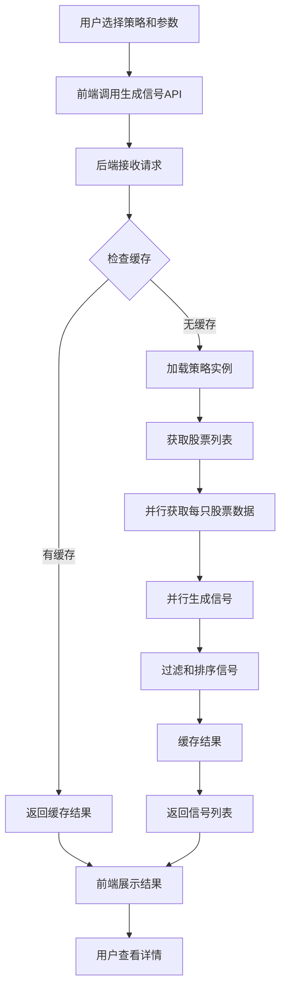

# 实时策略选股功能设计

## 功能概述

实现一个实时选股功能，允许用户：

1. 选择策略和参数
2. 查看今天（或指定日期）符合买入/卖出条件的股票列表
3. 查看每个股票的信号强度、原因和关键指标
4. 支持筛选和排序

## 业界最佳实践

### 1. 策略验证流程

- **回测验证**：在实盘使用前，策略需要通过历史回测验证有效性
- **模拟交易**：在实盘前进行模拟交易验证
- **实时监控**：实盘后持续监控策略表现

### 2. 实时选股架构

- **信号生成服务**：独立于回测的实时信号生成服务
- **数据更新**：依赖实时或准实时的市场数据
- **缓存机制**：对计算结果进行缓存，避免重复计算
- **定时任务**：在交易时间定期更新选股结果

### 3. 回测与实盘的关系

- **回测用于验证**：回测验证策略的历史表现，但不直接决定当天买卖
- **实盘信号生成**：实盘使用相同的策略逻辑，但基于最新数据生成信号
- **参数优化**：通过回测找到最优参数，然后应用到实盘

## 系统架构设计

### 后端设计

#### 1. 新增服务：实时信号生成服务

**文件**: `backend/app/services/signals/realtime_signal_service.py`

核心功能：

- 加载策略实例
- 获取股票列表和最新数据
- 对每只股票生成交易信号
- 支持并行计算提升性能
- 缓存机制（避免重复计算）
```python
class RealtimeSignalService:
    async def generate_signals(
        self,
        strategy_name: str,
        strategy_config: Dict[str, Any],
        target_date: datetime,
        stock_codes: Optional[List[str]] = None,
        signal_type: Optional[SignalType] = None  # BUY, SELL, 或 None(全部)
    ) -> List[TradingSignal]
```


#### 2. 新增API端点

**文件**: `backend/app/api/v1/signals.py`

主要端点：

- `GET /api/v1/signals/today` - 获取今天的选股结果
- `POST /api/v1/signals/generate` - 生成指定日期的选股结果
- `GET /api/v1/signals/{signal_id}` - 获取信号详情
- `GET /api/v1/signals/history` - 获取历史信号记录

请求示例：

```python
POST /api/v1/signals/generate
{
    "strategy_name": "moving_average",
    "strategy_config": {
        "short_window": 5,
        "long_window": 20
    },
    "target_date": "2024-01-15",
    "signal_type": "BUY",  # 可选: BUY, SELL, 或省略(全部)
    "stock_codes": null  # 可选: 指定股票列表，null表示全部
}
```

响应格式：

```python
{
    "success": true,
    "data": {
        "signals": [
            {
                "stock_code": "000001.SZ",
                "stock_name": "平安银行",
                "signal_type": "BUY",
                "strength": 0.85,
                "price": 12.50,
                "reason": "短期均线上穿长期均线，差值: 0.023",
                "timestamp": "2024-01-15T09:30:00",
                "metadata": {
                    "sma_short": 12.45,
                    "sma_long": 12.20,
                    "ma_diff": 0.023
                }
            }
        ],
        "summary": {
            "total_signals": 25,
            "buy_signals": 15,
            "sell_signals": 10,
            "generated_at": "2024-01-15T09:35:00"
        }
    }
}
```

#### 3. 数据获取优化

- 复用现有的 `SimpleDataService` 获取股票数据
- 确保获取到目标日期的最新数据
- 对于"今天"，需要获取到最新交易日的数据

#### 4. 缓存策略

- 使用Redis或内存缓存存储当天的选股结果
- 缓存键：`signal:{strategy_name}:{strategy_config_hash}:{target_date}`
- 缓存过期时间：交易日内每小时更新，非交易日缓存到下一个交易日

### 前端设计

#### 1. 新增页面：实时选股页面

**文件**: `frontend/src/app/signals/page.tsx`

页面功能：

- 策略选择器（复用现有的策略列表）
- 参数配置表单（复用现有的策略配置组件）
- 日期选择器（默认今天）
- 信号类型筛选（买入/卖出/全部）
- 选股结果表格
- 信号详情展示

#### 2. 新增组件

**文件**: `frontend/src/components/signals/SignalList.tsx`

- 信号列表表格组件
- 支持按信号强度、股票代码、信号类型排序
- 支持搜索和筛选

**文件**: `frontend/src/components/signals/SignalDetail.tsx`

- 信号详情弹窗
- 显示技术指标、信号原因、历史表现等

#### 3. 新增服务

**文件**: `frontend/src/services/signalService.ts`

- API调用封装
- 数据格式转换
- 错误处理

### 数据流设计



## 实现步骤

### 阶段1：后端核心功能

1. 创建 `RealtimeSignalService` 服务类
2. 实现信号生成逻辑（复用策略的 `generate_signals` 方法）
3. 实现数据获取和缓存机制
4. 创建API路由和端点

### 阶段2：前端界面

1. 创建选股页面路由
2. 实现策略选择器（复用现有组件）
3. 实现信号列表组件
4. 实现信号详情组件
5. 集成API调用

### 阶段3：优化和增强

1. 添加定时任务（可选：自动更新当天的选股结果）
2. 添加信号历史记录功能
3. 添加信号回测验证（查看该信号在历史回测中的表现）
4. 性能优化（并行计算、缓存优化）

## 关键技术点

### 1. 策略复用

- 直接使用现有的 `BaseStrategy` 及其子类
- 策略的 `generate_signals` 方法可以用于实时信号生成
- 需要确保数据格式一致

### 2. 日期处理

- "今天"需要转换为最新交易日
- 非交易日需要处理（返回上一个交易日的结果或提示）
- 需要交易日历支持

### 3. 性能优化

- 并行处理多只股票的信号生成
- 使用异步IO获取数据
- 合理使用缓存减少重复计算

### 4. 数据一致性

- 确保使用的数据是最新的
- 处理数据缺失的情况
- 验证数据的完整性

## 与回测的关系

### 回测的作用

1. **策略验证**：验证策略在历史数据上的表现
2. **参数优化**：找到最优的策略参数
3. **风险评估**：评估策略的风险指标（回撤、波动率等）

### 实时选股的作用

1. **信号生成**：基于最新数据生成交易信号
2. **决策支持**：为交易决策提供参考
3. **实时监控**：监控策略在当前市场的表现

### 最佳实践

- 先通过回测验证策略有效性
- 使用回测找到的最优参数进行实时选股
- 定期对比实时信号与回测结果的一致性
- 持续监控实盘表现，必要时调整策略

## 文件清单

### 后端新增文件

- `backend/app/services/signals/__init__.py`
- `backend/app/services/signals/realtime_signal_service.py`
- `backend/app/api/v1/signals.py`

### 前端新增文件

- `frontend/src/app/signals/page.tsx`
- `frontend/src/components/signals/SignalList.tsx`
- `frontend/src/components/signals/SignalDetail.tsx`
- `frontend/src/services/signalService.ts`

### 需要修改的文件

- `backend/app/api/v1/__init__.py` - 注册新的路由
- `frontend/src/app/layout.tsx` - 添加导航链接（如需要）