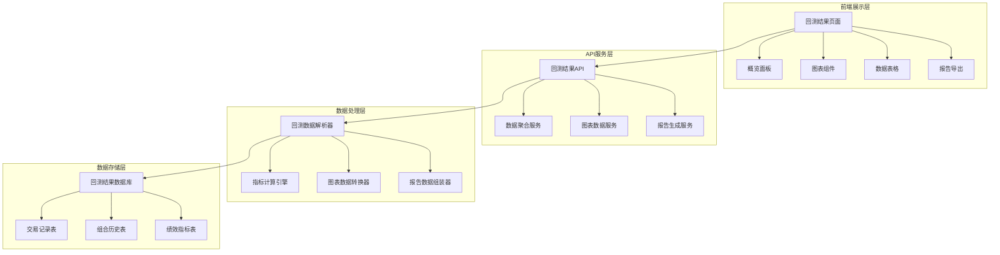

# 回测结果可视化展示设计文档

## 概述

本设计文档描述了一个完整的回测结果可视化系统，旨在解决当前系统中回测结果展示不够详细的问题。系统将提供丰富的图表、详细的数据分析和交互式的用户界面，让用户能够深入分析回测表现。

## 架构设计

### 系统架构图



### 技术栈选择

**前端技术栈:**
- React 18 + TypeScript - 主框架
- Next.js 14 - 全栈框架
- Recharts - 图表库（轻量级，适合金融图表）
- HeroUI - UI组件库
- Tailwind CSS - 样式框架
- React Query - 数据获取和缓存

**后端技术栈:**
- FastAPI - API框架
- Pandas + NumPy - 数据处理
- Matplotlib/Plotly - 服务端图表生成
- ReportLab - PDF报告生成
- WebSocket - 实时数据推送

## 组件设计

### 1. 回测结果概览组件 (BacktestOverview)

```typescript
interface BacktestOverviewProps {
  backtestId: string;
  data: BacktestSummary;
}

interface BacktestSummary {
  totalReturn: number;
  annualizedReturn: number;
  sharpeRatio: number;
  maxDrawdown: number;
  volatility: number;
  winRate: number;
  totalTrades: number;
  profitFactor: number;
}
```

**设计特点:**
- 使用卡片布局展示关键指标
- 颜色编码：绿色表示正收益，红色表示负收益
- 悬停提示显示指标说明
- 响应式设计，支持移动端

### 2. 收益曲线图表组件 (EquityCurveChart)

```typescript
interface EquityCurveChartProps {
  portfolioHistory: PortfolioSnapshot[];
  benchmarkData?: BenchmarkData[];
  showDrawdown?: boolean;
}

interface PortfolioSnapshot {
  date: string;
  portfolioValue: number;
  cash: number;
  totalReturn: number;
  drawdown: number;
}
```

**设计特点:**
- 双轴图表：主轴显示收益曲线，副轴显示回撤
- 支持基准对比（沪深300指数）
- 交互功能：缩放、平移、数据点悬停
- 时间范围选择器

### 3. 交易记录表格组件 (TradeHistoryTable)

```typescript
interface TradeHistoryTableProps {
  trades: TradeRecord[];
  onTradeClick: (trade: TradeRecord) => void;
}

interface TradeRecord {
  tradeId: string;
  stockCode: string;
  action: 'BUY' | 'SELL';
  quantity: number;
  price: number;
  timestamp: string;
  commission: number;
  pnl: number;
  holdingDays?: number;
}
```

**设计特点:**
- 分页显示，每页50条记录
- 多字段排序和筛选
- 盈亏颜色区分
- 点击查看交易详情弹窗

### 4. 持仓分析组件 (PositionAnalysis)

```typescript
interface PositionAnalysisProps {
  stockPerformance: StockPerformance[];
  positionWeights: PositionWeight[];
}

interface StockPerformance {
  stockCode: string;
  stockName: string;
  totalReturn: number;
  holdingDays: number;
  tradeCount: number;
  winRate: number;
  avgHoldingPeriod: number;
}
```

**设计特点:**
- 股票表现排行榜
- 持仓权重饼图
- 股票详细分析弹窗
- 持仓周转率分析

## 数据模型设计

### 现有回测结果数据结构分析

基于现有系统分析，当前回测任务产生的数据结构如下：

```python
# 现有的回测报告结构（来自BacktestExecutor._generate_backtest_report）
current_backtest_report = {
    "strategy_name": str,
    "stock_codes": List[str],
    "start_date": str,  # ISO格式
    "end_date": str,    # ISO格式
    "initial_cash": float,
    "final_value": float,
    
    # 收益指标
    "total_return": float,
    "annualized_return": float,
    
    # 风险指标
    "volatility": float,
    "sharpe_ratio": float,
    "max_drawdown": float,
    
    # 交易统计
    "total_trades": int,
    "win_rate": float,
    "profit_factor": float,
    "winning_trades": int,
    "losing_trades": int,
    
    # 配置信息
    "backtest_config": {
        "commission_rate": float,
        "slippage_rate": float,
        "max_position_size": float
    },
    
    # 交易记录（来自PortfolioManager.trades）
    "trade_history": [
        {
            "trade_id": str,
            "stock_code": str,
            "action": str,  # "BUY" or "SELL"
            "quantity": int,
            "price": float,
            "timestamp": str,  # ISO格式
            "commission": float,
            "pnl": float
        }
    ],
    
    # 组合历史（来自PortfolioManager.portfolio_history）
    "portfolio_history": [
        {
            "date": datetime,
            "portfolio_value": float,
            "cash": float,
            "positions_count": int,
            "positions": {
                "stock_code": {
                    "quantity": int,
                    "avg_cost": float,
                    "current_price": float,
                    "market_value": float,
                    "unrealized_pnl": float
                }
            }
        }
    ]
}
```

### 适配后的数据结构

为了支持完整的可视化功能，我们需要扩展现有数据结构：

```python
@dataclass
class EnhancedBacktestResult:
    """增强的回测结果数据结构（基于现有格式扩展）"""
    
    # === 现有字段（保持兼容） ===
    strategy_name: str
    stock_codes: List[str]
    start_date: str
    end_date: str
    initial_cash: float
    final_value: float
    total_return: float
    annualized_return: float
    volatility: float
    sharpe_ratio: float
    max_drawdown: float
    total_trades: int
    win_rate: float
    profit_factor: float
    winning_trades: int
    losing_trades: int
    backtest_config: Dict[str, Any]
    trade_history: List[Dict[str, Any]]
    portfolio_history: List[Dict[str, Any]]
    
    # === 新增字段（用于增强可视化） ===
    # 扩展的风险指标
    extended_risk_metrics: Dict[str, float] = None
    # 月度收益分析
    monthly_returns: List[Dict[str, Any]] = None
    # 持仓分析
    position_analysis: List[Dict[str, Any]] = None
    # 基准对比数据
    benchmark_data: Optional[Dict[str, Any]] = None
    # 回撤详细分析
    drawdown_analysis: Dict[str, Any] = None

# 扩展的风险指标结构
@dataclass
class ExtendedRiskMetrics:
    """扩展的风险指标（基于现有数据计算）"""
    # 现有指标
    volatility: float
    sharpe_ratio: float
    max_drawdown: float
    
    # 新增指标
    sortino_ratio: float = 0.0
    calmar_ratio: float = 0.0
    max_drawdown_duration: int = 0
    var_95: float = 0.0  # 95% VaR
    downside_deviation: float = 0.0
    
    # 从现有数据计算得出
    @classmethod
    def from_portfolio_history(cls, portfolio_history: List[Dict], initial_cash: float) -> 'ExtendedRiskMetrics':
        """从组合历史数据计算扩展风险指标"""
        # 实现计算逻辑...
        pass

# 月度收益分析结构
@dataclass
class MonthlyReturnsAnalysis:
    """月度收益分析"""
    year: int
    month: int
    monthly_return: float
    cumulative_return: float
    volatility: float
    
    @classmethod
    def from_portfolio_history(cls, portfolio_history: List[Dict]) -> List['MonthlyReturnsAnalysis']:
        """从组合历史计算月度收益"""
        # 实现计算逻辑...
        pass

# 持仓分析结构
@dataclass
class PositionAnalysis:
    """持仓分析（基于交易记录计算）"""
    stock_code: str
    stock_name: str = ""
    total_return: float = 0.0
    holding_days: int = 0
    trade_count: int = 0
    win_rate: float = 0.0
    avg_holding_period: int = 0
    max_position_value: float = 0.0
    
    @classmethod
    def from_trade_history(cls, trade_history: List[Dict]) -> List['PositionAnalysis']:
        """从交易记录计算持仓分析"""
        # 实现计算逻辑...
        pass
```

### 数据库表设计（扩展现有结构）

基于现有的`tasks`表和`backtest_results`表，我们需要扩展以支持详细的可视化数据：

```sql
-- 现有的tasks表已包含基础回测结果（task.result字段存储JSON）
-- 现有的backtest_results表已包含基本指标

-- 新增：回测详细数据表（存储可视化所需的详细数据）
CREATE TABLE backtest_detailed_results (
    id BIGINT AUTO_INCREMENT PRIMARY KEY,
    task_id VARCHAR(50) NOT NULL,
    backtest_id VARCHAR(50) NOT NULL,
    
    -- 扩展风险指标
    sortino_ratio DECIMAL(8,4) DEFAULT 0,
    calmar_ratio DECIMAL(8,4) DEFAULT 0,
    max_drawdown_duration INT DEFAULT 0,
    var_95 DECIMAL(8,4) DEFAULT 0,
    downside_deviation DECIMAL(8,4) DEFAULT 0,
    
    -- 回撤分析数据
    drawdown_analysis JSON,
    
    -- 月度收益数据
    monthly_returns JSON,
    
    -- 持仓分析数据
    position_analysis JSON,
    
    -- 基准对比数据
    benchmark_comparison JSON,
    
    created_at TIMESTAMP DEFAULT CURRENT_TIMESTAMP,
    updated_at TIMESTAMP DEFAULT CURRENT_TIMESTAMP ON UPDATE CURRENT_TIMESTAMP,
    
    FOREIGN KEY (task_id) REFERENCES tasks(task_id),
    INDEX idx_task_id (task_id),
    INDEX idx_backtest_id (backtest_id)
);

-- 现有的portfolio_snapshots表结构保持不变，已经满足需求
-- 现有的trade_records表结构保持不变，已经满足需求

-- 新增：回测图表数据缓存表（用于提高图表加载性能）
CREATE TABLE backtest_chart_cache (
    id BIGINT AUTO_INCREMENT PRIMARY KEY,
    task_id VARCHAR(50) NOT NULL,
    chart_type VARCHAR(50) NOT NULL,  -- 'equity_curve', 'drawdown_curve', 'monthly_heatmap'
    chart_data JSON NOT NULL,
    created_at TIMESTAMP DEFAULT CURRENT_TIMESTAMP,
    expires_at TIMESTAMP,
    
    FOREIGN KEY (task_id) REFERENCES tasks(task_id),
    UNIQUE KEY uk_task_chart (task_id, chart_type),
    INDEX idx_expires (expires_at)
);
```

## API设计（基于现有结构扩展）

### 扩展现有的回测结果API

```python
# 扩展现有的 /tasks/{task_id} 端点
@router.get("/{task_id}/detailed", response_model=StandardResponse)
async def get_task_detailed_result(task_id: str):
    """获取任务的详细回测结果（用于可视化）"""
    session = SessionLocal()
    try:
        task_repository = TaskRepository(session)
        
        # 获取基础任务信息
        task = task_repository.get_task_by_id(task_id)
        if not task or task.task_type != "backtest":
            raise HTTPException(status_code=404, detail="回测任务不存在")
        
        # 获取原始回测结果
        raw_result = task.result
        if not raw_result:
            raise HTTPException(status_code=404, detail="回测结果不存在")
        
        # 使用适配器转换数据
        adapter = BacktestDataAdapter()
        enhanced_result = await adapter.adapt_backtest_result(raw_result)
        
        return StandardResponse(
            success=True,
            message="获取详细回测结果成功",
            data=enhanced_result.to_dict()
        )
        
    except HTTPException:
        raise
    except Exception as e:
        logger.error(f"获取详细回测结果失败: {e}", exc_info=True)
        raise HTTPException(status_code=500, detail=f"获取详细回测结果失败: {str(e)}")
    finally:
        session.close()

# 新增专门的图表数据端点
@router.get("/{task_id}/charts/{chart_type}")
async def get_chart_data(task_id: str, chart_type: str):
    """获取特定图表数据"""
    
    valid_chart_types = [
        "equity_curve", "drawdown_curve", "monthly_heatmap", 
        "trade_distribution", "position_weights"
    ]
    
    if chart_type not in valid_chart_types:
        raise HTTPException(status_code=400, detail=f"不支持的图表类型: {chart_type}")
    
    session = SessionLocal()
    try:
        # 先检查缓存
        cached_data = await get_cached_chart_data(task_id, chart_type)
        if cached_data:
            return StandardResponse(
                success=True,
                message="获取图表数据成功（缓存）",
                data=cached_data
            )
        
        # 获取原始数据并生成图表数据
        task_repository = TaskRepository(session)
        task = task_repository.get_task_by_id(task_id)
        
        if not task or not task.result:
            raise HTTPException(status_code=404, detail="回测数据不存在")
        
        chart_generator = ChartDataGenerator()
        chart_data = await chart_generator.generate_chart_data(
            task.result, chart_type
        )
        
        # 缓存结果
        await cache_chart_data(task_id, chart_type, chart_data)
        
        return StandardResponse(
            success=True,
            message="获取图表数据成功",
            data=chart_data
        )
        
    except HTTPException:
        raise
    except Exception as e:
        logger.error(f"获取图表数据失败: {e}", exc_info=True)
        raise HTTPException(status_code=500, detail=f"获取图表数据失败: {str(e)}")
    finally:
        session.close()

# 新增对比分析端点
@router.post("/compare")
async def compare_backtest_results(request: BacktestCompareRequest):
    """对比多个回测结果"""
    
    if len(request.task_ids) > 5:
        raise HTTPException(status_code=400, detail="最多支持对比5个回测结果")
    
    session = SessionLocal()
    try:
        task_repository = TaskRepository(session)
        comparison_results = []
        
        for task_id in request.task_ids:
            task = task_repository.get_task_by_id(task_id)
            if task and task.result:
                adapter = BacktestDataAdapter()
                enhanced_result = await adapter.adapt_backtest_result(task.result)
                comparison_results.append({
                    "task_id": task_id,
                    "task_name": task.task_name,
                    "result": enhanced_result.to_dict()
                })
        
        # 计算对比指标
        comparison_analyzer = BacktestComparisonAnalyzer()
        comparison_analysis = await comparison_analyzer.analyze_comparison(
            comparison_results
        )
        
        return StandardResponse(
            success=True,
            message="回测对比分析完成",
            data={
                "individual_results": comparison_results,
                "comparison_analysis": comparison_analysis
            }
        )
        
    except Exception as e:
        logger.error(f"回测对比分析失败: {e}", exc_info=True)
        raise HTTPException(status_code=500, detail=f"回测对比分析失败: {str(e)}")
    finally:
        session.close()

# 新增报告导出端点
@router.post("/{task_id}/export")
async def export_backtest_report(
    task_id: str,
    export_request: BacktestExportRequest
):
    """导出回测报告"""
    
    session = SessionLocal()
    try:
        task_repository = TaskRepository(session)
        task = task_repository.get_task_by_id(task_id)
        
        if not task or not task.result:
            raise HTTPException(status_code=404, detail="回测数据不存在")
        
        # 生成报告
        report_generator = BacktestReportGenerator()
        
        if export_request.format == "pdf":
            report_path = await report_generator.generate_pdf_report(
                task.result, 
                export_request.include_charts,
                export_request.include_tables
            )
        elif export_request.format == "excel":
            report_path = await report_generator.generate_excel_report(
                task.result,
                export_request.include_raw_data
            )
        else:
            raise HTTPException(status_code=400, detail="不支持的导出格式")
        
        return StandardResponse(
            success=True,
            message="报告生成成功",
            data={
                "download_url": f"/api/v1/files/download/{report_path}",
                "file_name": os.path.basename(report_path),
                "file_size": os.path.getsize(report_path)
            }
        )
        
    except HTTPException:
        raise
    except Exception as e:
        logger.error(f"导出回测报告失败: {e}", exc_info=True)
        raise HTTPException(status_code=500, detail=f"导出回测报告失败: {str(e)}")
    finally:
        session.close()

# 数据传输对象
@dataclass
class BacktestCompareRequest:
    task_ids: List[str]
    comparison_metrics: List[str] = None  # 指定对比的指标

@dataclass 
class BacktestExportRequest:
    format: str  # "pdf" or "excel"
    include_charts: List[str] = None
    include_tables: List[str] = None
    include_raw_data: bool = False
```

### WebSocket实时更新

```python
@router.websocket("/backtest/{backtest_id}/progress")
async def backtest_progress_websocket(websocket: WebSocket, backtest_id: str):
    """回测进度实时更新WebSocket"""
    await websocket.accept()
    
    try:
        while True:
            # 获取回测进度
            progress = await get_backtest_progress(backtest_id)
            
            # 发送进度更新
            await websocket.send_json({
                "type": "progress_update",
                "backtest_id": backtest_id,
                "progress": progress.percentage,
                "current_date": progress.current_date,
                "estimated_completion": progress.estimated_completion,
                "status": progress.status
            })
            
            if progress.status in ["completed", "failed"]:
                break
                
            await asyncio.sleep(1)
            
    except WebSocketDisconnect:
        logger.info(f"WebSocket disconnected for backtest {backtest_id}")
```

## 数据处理层设计

### 回测数据适配器

```python
class BacktestDataAdapter:
    """回测数据适配器 - 将现有回测结果转换为可视化所需格式"""
    
    def __init__(self):
        self.metrics_calculator = EnhancedMetricsCalculator()
        self.chart_data_converter = ChartDataConverter()
    
    async def adapt_backtest_result(self, task_result: Dict[str, Any]) -> EnhancedBacktestResult:
        """适配现有回测结果为增强格式"""
        
        # 1. 提取现有数据
        base_data = self._extract_base_data(task_result)
        
        # 2. 计算扩展风险指标
        extended_risk_metrics = await self._calculate_extended_risk_metrics(
            task_result.get("portfolio_history", []),
            task_result.get("initial_cash", 100000)
        )
        
        # 3. 分析月度收益
        monthly_returns = await self._analyze_monthly_returns(
            task_result.get("portfolio_history", [])
        )
        
        # 4. 分析持仓表现
        position_analysis = await self._analyze_positions(
            task_result.get("trade_history", [])
        )
        
        # 5. 计算回撤详细分析
        drawdown_analysis = await self._analyze_drawdowns(
            task_result.get("portfolio_history", [])
        )
        
        return EnhancedBacktestResult(
            # 现有字段直接映射
            strategy_name=base_data["strategy_name"],
            stock_codes=base_data["stock_codes"],
            start_date=base_data["start_date"],
            end_date=base_data["end_date"],
            initial_cash=base_data["initial_cash"],
            final_value=base_data["final_value"],
            total_return=base_data["total_return"],
            annualized_return=base_data["annualized_return"],
            volatility=base_data["volatility"],
            sharpe_ratio=base_data["sharpe_ratio"],
            max_drawdown=base_data["max_drawdown"],
            total_trades=base_data["total_trades"],
            win_rate=base_data["win_rate"],
            profit_factor=base_data["profit_factor"],
            winning_trades=base_data["winning_trades"],
            losing_trades=base_data["losing_trades"],
            backtest_config=base_data["backtest_config"],
            trade_history=base_data["trade_history"],
            portfolio_history=base_data["portfolio_history"],
            
            # 新增字段
            extended_risk_metrics=extended_risk_metrics,
            monthly_returns=monthly_returns,
            position_analysis=position_analysis,
            drawdown_analysis=drawdown_analysis
        )
    
    def _extract_base_data(self, task_result: Dict[str, Any]) -> Dict[str, Any]:
        """提取现有的基础数据"""
        return {
            "strategy_name": task_result.get("strategy_name", ""),
            "stock_codes": task_result.get("stock_codes", []),
            "start_date": task_result.get("start_date", ""),
            "end_date": task_result.get("end_date", ""),
            "initial_cash": task_result.get("initial_cash", 100000),
            "final_value": task_result.get("final_value", 100000),
            "total_return": task_result.get("total_return", 0),
            "annualized_return": task_result.get("annualized_return", 0),
            "volatility": task_result.get("volatility", 0),
            "sharpe_ratio": task_result.get("sharpe_ratio", 0),
            "max_drawdown": task_result.get("max_drawdown", 0),
            "total_trades": task_result.get("total_trades", 0),
            "win_rate": task_result.get("win_rate", 0),
            "profit_factor": task_result.get("profit_factor", 0),
            "winning_trades": task_result.get("winning_trades", 0),
            "losing_trades": task_result.get("losing_trades", 0),
            "backtest_config": task_result.get("backtest_config", {}),
            "trade_history": task_result.get("trade_history", []),
            "portfolio_history": task_result.get("portfolio_history", [])
        }
    
    async def _calculate_extended_risk_metrics(
        self, 
        portfolio_history: List[Dict], 
        initial_cash: float
    ) -> Dict[str, float]:
        """基于现有组合历史计算扩展风险指标"""
        
        if not portfolio_history:
            return {}
        
        # 转换为pandas DataFrame
        df = pd.DataFrame(portfolio_history)
        if 'date' in df.columns:
            df['date'] = pd.to_datetime(df['date'])
            df.set_index('date', inplace=True)
        
        # 计算收益率序列
        returns = df['portfolio_value'].pct_change().dropna()
        
        # 计算扩展指标
        extended_metrics = {}
        
        # Sortino比率
        downside_returns = returns[returns < 0]
        if len(downside_returns) > 0:
            downside_deviation = downside_returns.std() * np.sqrt(252)
            annualized_return = (df['portfolio_value'].iloc[-1] / initial_cash) ** (252 / len(returns)) - 1
            extended_metrics['sortino_ratio'] = annualized_return / downside_deviation if downside_deviation > 0 else 0
            extended_metrics['downside_deviation'] = downside_deviation
        
        # Calmar比率
        max_drawdown = self._calculate_max_drawdown(df['portfolio_value'])
        if max_drawdown < 0:
            extended_metrics['calmar_ratio'] = annualized_return / abs(max_drawdown)
        
        # VaR 95%
        extended_metrics['var_95'] = returns.quantile(0.05)
        
        # 最大回撤持续时间
        extended_metrics['max_drawdown_duration'] = self._calculate_max_drawdown_duration(df['portfolio_value'])
        
        return extended_metrics
    
    async def _analyze_monthly_returns(self, portfolio_history: List[Dict]) -> List[Dict[str, Any]]:
        """分析月度收益"""
        
        if not portfolio_history:
            return []
        
        df = pd.DataFrame(portfolio_history)
        if 'date' in df.columns:
            df['date'] = pd.to_datetime(df['date'])
            df.set_index('date', inplace=True)
        
        # 按月重采样
        monthly_values = df['portfolio_value'].resample('ME').last()
        monthly_returns = monthly_values.pct_change().dropna()
        
        result = []
        cumulative_return = 0
        
        for date, monthly_return in monthly_returns.items():
            cumulative_return = (1 + cumulative_return) * (1 + monthly_return) - 1
            
            result.append({
                'year': date.year,
                'month': date.month,
                'date': date.strftime('%Y-%m'),
                'monthly_return': float(monthly_return),
                'cumulative_return': float(cumulative_return)
            })
        
        return result
    
    async def _analyze_positions(self, trade_history: List[Dict]) -> List[Dict[str, Any]]:
        """分析持仓表现"""
        
        if not trade_history:
            return []
        
        # 按股票分组分析
        stock_stats = {}
        
        for trade in trade_history:
            stock_code = trade.get('stock_code', '')
            if stock_code not in stock_stats:
                stock_stats[stock_code] = {
                    'stock_code': stock_code,
                    'trades': [],
                    'total_pnl': 0,
                    'buy_trades': 0,
                    'sell_trades': 0,
                    'winning_trades': 0,
                    'losing_trades': 0
                }
            
            stock_stats[stock_code]['trades'].append(trade)
            pnl = trade.get('pnl', 0)
            stock_stats[stock_code]['total_pnl'] += pnl
            
            if trade.get('action') == 'BUY':
                stock_stats[stock_code]['buy_trades'] += 1
            elif trade.get('action') == 'SELL':
                stock_stats[stock_code]['sell_trades'] += 1
                if pnl > 0:
                    stock_stats[stock_code]['winning_trades'] += 1
                elif pnl < 0:
                    stock_stats[stock_code]['losing_trades'] += 1
        
        # 计算每只股票的统计指标
        result = []
        for stock_code, stats in stock_stats.items():
            total_trades = stats['sell_trades']  # 只计算卖出交易
            win_rate = stats['winning_trades'] / total_trades if total_trades > 0 else 0
            
            # 计算平均持仓期（简化计算）
            avg_holding_period = self._calculate_avg_holding_period(stats['trades'])
            
            result.append({
                'stock_code': stock_code,
                'stock_name': stock_code,  # 可以后续从股票信息服务获取
                'total_return': stats['total_pnl'],
                'trade_count': total_trades,
                'win_rate': win_rate,
                'avg_holding_period': avg_holding_period,
                'winning_trades': stats['winning_trades'],
                'losing_trades': stats['losing_trades']
            })
        
        # 按总收益排序
        result.sort(key=lambda x: x['total_return'], reverse=True)
        
        return result
    
    def _calculate_avg_holding_period(self, trades: List[Dict]) -> int:
        """计算平均持仓期"""
        # 简化实现：配对买卖交易计算持仓期
        buy_trades = [t for t in trades if t.get('action') == 'BUY']
        sell_trades = [t for t in trades if t.get('action') == 'SELL']
        
        if not buy_trades or not sell_trades:
            return 0
        
        # 简单配对最近的买卖交易
        holding_periods = []
        for sell_trade in sell_trades:
            sell_date = pd.to_datetime(sell_trade.get('timestamp', ''))
            # 找到最近的买入交易
            for buy_trade in reversed(buy_trades):
                buy_date = pd.to_datetime(buy_trade.get('timestamp', ''))
                if buy_date <= sell_date:
                    holding_period = (sell_date - buy_date).days
                    holding_periods.append(holding_period)
                    break
        
        return int(np.mean(holding_periods)) if holding_periods else 0
    
    async def _analyze_drawdowns(self, portfolio_history: List[Dict]) -> Dict[str, Any]:
        """分析回撤详情"""
        
        if not portfolio_history:
            return {}
        
        df = pd.DataFrame(portfolio_history)
        if 'date' in df.columns:
            df['date'] = pd.to_datetime(df['date'])
            df.set_index('date', inplace=True)
        
        values = df['portfolio_value']
        
        # 计算回撤序列
        peak = values.expanding().max()
        drawdown = (values - peak) / peak
        
        # 找到最大回撤期间
        max_dd_idx = drawdown.idxmin()
        max_dd_value = drawdown.min()
        
        # 找到最大回撤开始和结束时间
        max_dd_start = None
        max_dd_end = None
        
        # 向前找到峰值点
        for i in range(len(drawdown)):
            if drawdown.index[i] >= max_dd_idx:
                break
            if drawdown.iloc[i] == 0:  # 新高点
                max_dd_start = drawdown.index[i]
        
        # 向后找到恢复点
        for i in range(len(drawdown) - 1, -1, -1):
            if drawdown.index[i] <= max_dd_idx:
                continue
            if drawdown.iloc[i] >= -0.001:  # 基本恢复
                max_dd_end = drawdown.index[i]
                break
        
        return {
            'max_drawdown': float(max_dd_value),
            'max_drawdown_date': max_dd_idx.isoformat() if max_dd_idx else None,
            'max_drawdown_start': max_dd_start.isoformat() if max_dd_start else None,
            'max_drawdown_end': max_dd_end.isoformat() if max_dd_end else None,
            'max_drawdown_duration': (max_dd_end - max_dd_start).days if max_dd_start and max_dd_end else 0,
            'drawdown_curve': [
                {
                    'date': date.isoformat(),
                    'drawdown': float(dd)
                }
                for date, dd in drawdown.items()
            ]
        }
    
    def _calculate_max_drawdown(self, values: pd.Series) -> float:
        """计算最大回撤"""
        peak = values.expanding().max()
        drawdown = (values - peak) / peak
        return drawdown.min()
    
    def _calculate_max_drawdown_duration(self, values: pd.Series) -> int:
        """计算最大回撤持续时间"""
        peak = values.expanding().max()
        drawdown = (values - peak) / peak
        
        # 找到所有回撤期间
        is_drawdown = drawdown < -0.001  # 小于-0.1%认为是回撤
        drawdown_periods = []
        current_period = 0
        
        for in_dd in is_drawdown:
            if in_dd:
                current_period += 1
            else:
                if current_period > 0:
                    drawdown_periods.append(current_period)
                current_period = 0
        
        if current_period > 0:
            drawdown_periods.append(current_period)
        
        return max(drawdown_periods) if drawdown_periods else 0


class EnhancedMetricsCalculator:
    """增强的指标计算器"""
    
    async def calculate_benchmark_comparison(
        self, 
        portfolio_history: List[Dict], 
        benchmark_symbol: str = "000300.SH"  # 沪深300
    ) -> Dict[str, Any]:
        """计算与基准的对比指标"""
        
        # 这里可以集成现有的数据服务获取基准数据
        # 暂时返回模拟数据结构
        return {
            'benchmark_symbol': benchmark_symbol,
            'benchmark_name': '沪深300指数',
            'correlation': 0.75,
            'beta': 1.2,
            'alpha': 0.05,
            'tracking_error': 0.15,
            'information_ratio': 0.33,
            'excess_return': 0.08
        }
```

### 指标计算引擎

```python
class MetricsCalculator:
    """指标计算引擎"""
    
    async def calculate_performance_metrics(
        self, 
        portfolio_history: List[Dict], 
        trade_history: List[Dict]
    ) -> PerformanceMetrics:
        """计算绩效指标"""
        
        # 转换为pandas DataFrame便于计算
        portfolio_df = pd.DataFrame(portfolio_history)
        portfolio_df['date'] = pd.to_datetime(portfolio_df['date'])
        portfolio_df.set_index('date', inplace=True)
        
        # 计算收益率序列
        returns = portfolio_df['portfolio_value'].pct_change().dropna()
        
        # 基础收益指标
        total_return = (portfolio_df['portfolio_value'].iloc[-1] / portfolio_df['portfolio_value'].iloc[0]) - 1
        annualized_return = (1 + total_return) ** (252 / len(returns)) - 1
        volatility = returns.std() * np.sqrt(252)
        
        # 风险调整收益指标
        sharpe_ratio = annualized_return / volatility if volatility > 0 else 0
        downside_returns = returns[returns < 0]
        downside_deviation = downside_returns.std() * np.sqrt(252)
        sortino_ratio = annualized_return / downside_deviation if downside_deviation > 0 else 0
        
        # 回撤指标
        cumulative_returns = (1 + returns).cumprod()
        running_max = cumulative_returns.expanding().max()
        drawdown = (cumulative_returns - running_max) / running_max
        max_drawdown = drawdown.min()
        
        # 交易统计
        trades_df = pd.DataFrame(trade_history)
        total_trades = len(trades_df)
        winning_trades = len(trades_df[trades_df['pnl'] > 0])
        losing_trades = len(trades_df[trades_df['pnl'] < 0])
        win_rate = winning_trades / total_trades if total_trades > 0 else 0
        
        # 盈亏比
        gross_profit = trades_df[trades_df['pnl'] > 0]['pnl'].sum()
        gross_loss = abs(trades_df[trades_df['pnl'] < 0]['pnl'].sum())
        profit_factor = gross_profit / gross_loss if gross_loss > 0 else float('inf')
        
        return PerformanceMetrics(
            total_return=total_return,
            annualized_return=annualized_return,
            volatility=volatility,
            sharpe_ratio=sharpe_ratio,
            sortino_ratio=sortino_ratio,
            calmar_ratio=annualized_return / abs(max_drawdown) if max_drawdown < 0 else 0,
            max_drawdown=max_drawdown,
            max_drawdown_duration=self._calculate_max_drawdown_duration(drawdown),
            win_rate=win_rate,
            profit_factor=profit_factor,
            total_trades=total_trades,
            winning_trades=winning_trades,
            losing_trades=losing_trades
        )
    
    def _calculate_max_drawdown_duration(self, drawdown_series: pd.Series) -> int:
        """计算最大回撤持续时间"""
        is_drawdown = drawdown_series < 0
        drawdown_periods = []
        current_period = 0
        
        for in_drawdown in is_drawdown:
            if in_drawdown:
                current_period += 1
            else:
                if current_period > 0:
                    drawdown_periods.append(current_period)
                current_period = 0
        
        if current_period > 0:
            drawdown_periods.append(current_period)
        
        return max(drawdown_periods) if drawdown_periods else 0
```

## 前端组件实现（基于现有数据结构）

### 回测结果主页面（适配现有任务系统）

```typescript
// components/backtest/BacktestResultPage.tsx
interface BacktestResultPageProps {
  taskId: string;  // 使用现有的task_id而不是backtest_id
}

export default function BacktestResultPage({ taskId }: BacktestResultPageProps) {
  const [activeTab, setActiveTab] = useState('overview');
  
  // 使用现有的任务详情API，但获取详细的回测数据
  const { data: taskData, isLoading: taskLoading } = useQuery({
    queryKey: ['task-detail', taskId],
    queryFn: () => DataService.getTaskDetail(taskId)
  });
  
  // 获取增强的回测数据
  const { data: detailedData, isLoading: detailLoading } = useQuery({
    queryKey: ['backtest-detailed', taskId],
    queryFn: () => DataService.getDetailedBacktestResult(taskId),
    enabled: !!taskData && taskData.task_type === 'backtest'
  });
  
  const isLoading = taskLoading || detailLoading;
  
  if (isLoading) {
    return <LoadingSpinner text="加载回测结果..." />;
  }
  
  if (!taskData || taskData.task_type !== 'backtest') {
    return <div className="text-center py-8">该任务不是回测任务</div>;
  }
  
  if (!detailedData) {
    return <div className="text-center py-8">暂无回测结果数据</div>;
  }
  
  return (
    <div className="container mx-auto px-4 py-6">
      <div className="mb-6">
        <h1 className="text-3xl font-bold">回测结果分析</h1>
        <p className="text-gray-600 mt-2">
          任务: {taskData.task_name} | 
          策略: {detailedData.strategy_name} | 
          期间: {detailedData.start_date} - {detailedData.end_date}
        </p>
      </div>
      
      <Tabs value={activeTab} onValueChange={setActiveTab}>
        <TabsList className="grid w-full grid-cols-6">
          <TabsTrigger value="overview">概览</TabsTrigger>
          <TabsTrigger value="charts">图表分析</TabsTrigger>
          <TabsTrigger value="trades">交易记录</TabsTrigger>
          <TabsTrigger value="positions">持仓分析</TabsTrigger>
          <TabsTrigger value="risk">风险分析</TabsTrigger>
          <TabsTrigger value="reports">报告导出</TabsTrigger>
        </TabsList>
        
        <TabsContent value="overview">
          <BacktestOverview 
            data={detailedData} 
            taskInfo={taskData}
          />
        </TabsContent>
        
        <TabsContent value="charts">
          <BacktestCharts 
            taskId={taskId}
            portfolioHistory={detailedData.portfolio_history}
            drawdownAnalysis={detailedData.drawdown_analysis}
          />
        </TabsContent>
        
        <TabsContent value="trades">
          <TradeHistoryTable 
            trades={detailedData.trade_history}
            onTradeClick={handleTradeClick}
          />
        </TabsContent>
        
        <TabsContent value="positions">
          <PositionAnalysis 
            positionAnalysis={detailedData.position_analysis}
            stockCodes={detailedData.stock_codes}
          />
        </TabsContent>
        
        <TabsContent value="risk">
          <RiskAnalysis 
            riskMetrics={detailedData.extended_risk_metrics}
            monthlyReturns={detailedData.monthly_returns}
          />
        </TabsContent>
        
        <TabsContent value="reports">
          <ReportExport taskId={taskId} />
        </TabsContent>
      </Tabs>
    </div>
  );
}
```

### 回测概览组件（适配现有数据）

```typescript
// components/backtest/BacktestOverview.tsx
interface BacktestOverviewProps {
  data: EnhancedBacktestResult;
  taskInfo: TaskDetail;
}

export function BacktestOverview({ data, taskInfo }: BacktestOverviewProps) {
  // 从现有数据结构中提取关键指标
  const keyMetrics = [
    {
      label: '总收益率',
      value: `${(data.total_return * 100).toFixed(2)}%`,
      color: data.total_return >= 0 ? 'text-green-600' : 'text-red-600',
      description: '整个回测期间的总收益率'
    },
    {
      label: '年化收益率',
      value: `${(data.annualized_return * 100).toFixed(2)}%`,
      color: data.annualized_return >= 0 ? 'text-green-600' : 'text-red-600',
      description: '按年化计算的收益率'
    },
    {
      label: '夏普比率',
      value: data.sharpe_ratio.toFixed(3),
      color: data.sharpe_ratio >= 1 ? 'text-green-600' : 
             data.sharpe_ratio >= 0.5 ? 'text-yellow-600' : 'text-red-600',
      description: '风险调整后的收益指标，越高越好'
    },
    {
      label: '最大回撤',
      value: `${(data.max_drawdown * 100).toFixed(2)}%`,
      color: 'text-red-600',
      description: '投资组合从峰值下跌的最大幅度'
    },
    {
      label: '波动率',
      value: `${(data.volatility * 100).toFixed(2)}%`,
      color: 'text-gray-600',
      description: '收益率的标准差，衡量投资风险'
    },
    {
      label: '胜率',
      value: `${(data.win_rate * 100).toFixed(1)}%`,
      color: data.win_rate >= 0.5 ? 'text-green-600' : 'text-red-600',
      description: '盈利交易占总交易的比例'
    },
    {
      label: '盈亏比',
      value: data.profit_factor.toFixed(2),
      color: data.profit_factor >= 1 ? 'text-green-600' : 'text-red-600',
      description: '总盈利与总亏损的比值'
    },
    {
      label: '交易次数',
      value: data.total_trades.toString(),
      color: 'text-gray-600',
      description: '回测期间的总交易次数'
    }
  ];
  
  return (
    <div className="space-y-6">
      {/* 任务基础信息 */}
      <Card>
        <CardHeader>
          <h3 className="text-lg font-semibold">回测基础信息</h3>
        </CardHeader>
        <CardBody>
          <div className="grid grid-cols-2 md:grid-cols-4 gap-4">
            <div>
              <span className="text-sm text-gray-500">任务状态</span>
              <div className="font-medium">
                <Chip 
                  color={taskInfo.status === 'completed' ? 'success' : 'default'}
                  size="sm"
                >
                  {taskInfo.status === 'completed' ? '已完成' : taskInfo.status}
                </Chip>
              </div>
            </div>
            <div>
              <span className="text-sm text-gray-500">策略名称</span>
              <div className="font-medium">{data.strategy_name}</div>
            </div>
            <div>
              <span className="text-sm text-gray-500">股票数量</span>
              <div className="font-medium">{data.stock_codes.length} 只</div>
            </div>
            <div>
              <span className="text-sm text-gray-500">初始资金</span>
              <div className="font-medium">¥{data.initial_cash.toLocaleString()}</div>
            </div>
          </div>
        </CardBody>
      </Card>
      
      {/* 关键指标网格 */}
      <div className="grid grid-cols-2 md:grid-cols-4 gap-4">
        {keyMetrics.map((metric, index) => (
          <Card key={index} className="hover:shadow-md transition-shadow">
            <CardBody className="p-4">
              <div className="flex flex-col">
                <span className="text-sm text-gray-500 mb-1">{metric.label}</span>
                <span className={`text-2xl font-bold ${metric.color}`}>
                  {metric.value}
                </span>
                <Tooltip content={metric.description}>
                  <span className="text-xs text-gray-400 mt-1 cursor-help">
                    {metric.description.slice(0, 20)}...
                  </span>
                </Tooltip>
              </div>
            </CardBody>
          </Card>
        ))}
      </div>
      
      {/* 扩展指标（如果有的话） */}
      {data.extended_risk_metrics && (
        <Card>
          <CardHeader>
            <h3 className="text-lg font-semibold">扩展风险指标</h3>
          </CardHeader>
          <CardBody>
            <div className="grid grid-cols-2 md:grid-cols-4 gap-4">
              {data.extended_risk_metrics.sortino_ratio && (
                <div>
                  <span className="text-sm text-gray-500">Sortino比率</span>
                  <div className="font-medium text-lg">
                    {data.extended_risk_metrics.sortino_ratio.toFixed(3)}
                  </div>
                </div>
              )}
              {data.extended_risk_metrics.calmar_ratio && (
                <div>
                  <span className="text-sm text-gray-500">Calmar比率</span>
                  <div className="font-medium text-lg">
                    {data.extended_risk_metrics.calmar_ratio.toFixed(3)}
                  </div>
                </div>
              )}
              {data.extended_risk_metrics.var_95 && (
                <div>
                  <span className="text-sm text-gray-500">VaR (95%)</span>
                  <div className="font-medium text-lg text-red-600">
                    {(data.extended_risk_metrics.var_95 * 100).toFixed(2)}%
                  </div>
                </div>
              )}
              {data.extended_risk_metrics.max_drawdown_duration && (
                <div>
                  <span className="text-sm text-gray-500">最大回撤持续</span>
                  <div className="font-medium text-lg">
                    {data.extended_risk_metrics.max_drawdown_duration} 天
                  </div>
                </div>
              )}
            </div>
          </CardBody>
        </Card>
      )}
    </div>
  );
}
```

### 图表组件（使用现有数据结构）

```typescript
// components/backtest/BacktestCharts.tsx
interface BacktestChartsProps {
  taskId: string;
  portfolioHistory: Array<{
    date: string;
    portfolio_value: number;
    cash: number;
    positions_count: number;
  }>;
  drawdownAnalysis?: {
    drawdown_curve: Array<{
      date: string;
      drawdown: number;
    }>;
  };
}

export function BacktestCharts({ taskId, portfolioHistory, drawdownAnalysis }: BacktestChartsProps) {
  const [dateRange, setDateRange] = useState<[Date, Date] | null>(null);
  const [showDrawdown, setShowDrawdown] = useState(true);
  
  // 处理现有数据格式
  const chartData = useMemo(() => {
    if (!portfolioHistory || portfolioHistory.length === 0) {
      return [];
    }
    
    // 计算收益率
    const initialValue = portfolioHistory[0]?.portfolio_value || 100000;
    
    let data = portfolioHistory.map((point, index) => {
      const totalReturn = ((point.portfolio_value - initialValue) / initialValue) * 100;
      
      // 计算回撤（如果没有详细的回撤数据）
      let drawdown = 0;
      if (drawdownAnalysis?.drawdown_curve) {
        const drawdownPoint = drawdownAnalysis.drawdown_curve.find(
          d => d.date === point.date
        );
        drawdown = drawdownPoint ? drawdownPoint.drawdown * 100 : 0;
      } else {
        // 简单计算回撤
        const maxValueSoFar = Math.max(
          ...portfolioHistory.slice(0, index + 1).map(p => p.portfolio_value)
        );
        drawdown = ((point.portfolio_value - maxValueSoFar) / maxValueSoFar) * 100;
      }
      
      return {
        date: point.date,
        portfolioValue: point.portfolio_value,
        totalReturn: totalReturn,
        drawdown: drawdown,
        cash: point.cash,
        positionsCount: point.positions_count
      };
    });
    
    // 应用日期范围筛选
    if (dateRange) {
      data = data.filter(point => {
        const date = new Date(point.date);
        return date >= dateRange[0] && date <= dateRange[1];
      });
    }
    
    return data;
  }, [portfolioHistory, drawdownAnalysis, dateRange]);
  
  if (!portfolioHistory || portfolioHistory.length === 0) {
    return (
      <Card>
        <CardBody className="flex items-center justify-center h-64">
          <div className="text-center text-gray-500">
            <TrendingUp className="w-12 h-12 mx-auto mb-2" />
            <p>暂无图表数据</p>
          </div>
        </CardBody>
      </Card>
    );
  }
  
  return (
    <div className="space-y-6">
      {/* 收益曲线图 */}
      <Card>
        <CardHeader>
          <div className="flex justify-between items-center">
            <h3 className="text-lg font-semibold">收益曲线</h3>
            <div className="flex gap-2">
              <Switch
                checked={showDrawdown}
                onCheckedChange={setShowDrawdown}
                label="显示回撤"
              />
              <DateRangePicker
                value={dateRange}
                onChange={setDateRange}
                placeholder="选择时间范围"
              />
            </div>
          </div>
        </CardHeader>
        <CardBody>
          <ResponsiveContainer width="100%" height={400}>
            <ComposedChart data={chartData}>
              <CartesianGrid strokeDasharray="3 3" />
              <XAxis 
                dataKey="date" 
                tickFormatter={(value) => new Date(value).toLocaleDateString()}
              />
              <YAxis yAxisId="left" orientation="left" />
              {showDrawdown && <YAxis yAxisId="right" orientation="right" />}
              
              <Tooltip
                labelFormatter={(value) => new Date(value).toLocaleDateString()}
                formatter={(value: number, name: string) => [
                  `${value.toFixed(2)}${name.includes('Return') || name.includes('Drawdown') ? '%' : ''}`,
                  name === 'totalReturn' ? '总收益率' :
                  name === 'drawdown' ? '回撤' :
                  name === 'portfolioValue' ? '组合价值' : name
                ]}
              />
              
              <Legend />
              
              {/* 组合价值线 */}
              <Line
                yAxisId="left"
                type="monotone"
                dataKey="portfolioValue"
                stroke="#3b82f6"
                strokeWidth={2}
                name="组合价值"
                dot={false}
              />
              
              {/* 收益率线 */}
              <Line
                yAxisId="left"
                type="monotone"
                dataKey="totalReturn"
                stroke="#10b981"
                strokeWidth={2}
                name="总收益率"
                dot={false}
              />
              
              {/* 回撤区域 */}
              {showDrawdown && (
                <Area
                  yAxisId="right"
                  type="monotone"
                  dataKey="drawdown"
                  fill="#ef4444"
                  fillOpacity={0.3}
                  stroke="#ef4444"
                  name="回撤"
                />
              )}
            </ComposedChart>
          </ResponsiveContainer>
        </CardBody>
      </Card>
      
      {/* 其他图表... */}
    </div>
  );
}
```

## 正确性属性

*属性是一个特征或行为，应该在系统的所有有效执行中保持为真——本质上是关于系统应该做什么的正式声明。属性作为人类可读规范和机器可验证正确性保证之间的桥梁。*

### 属性1: 回测概览数据完整性
*对于任何*回测结果概览，显示的关键指标（总收益率、年化收益率、夏普比率、最大回撤）都应该存在且数值格式正确
**验证: 需求 1.1, 1.4**

### 属性2: 颜色编码一致性
*对于任何*收益指标显示，正收益应该使用绿色样式，负收益应该使用红色样式，颜色编码与数值符号保持一致
**验证: 需求 1.2, 3.5**

### 属性3: 图表数据一致性
*对于任何*收益曲线图表，显示的数据点数量和数值应该与原始组合历史数据完全一致，不存在数据丢失或错误转换
**验证: 需求 2.1, 2.2**

### 属性4: 时间范围筛选准确性
*对于任何*时间范围筛选操作，筛选后的数据应该只包含指定时间范围内的记录，且数据完整性保持不变
**验证: 需求 2.5**

### 属性5: 交易记录完整性
*对于任何*交易记录表格，显示的交易总数应该等于原始数据中的交易数量，且每笔交易的所有必需字段都应该正确显示
**验证: 需求 3.1**

### 属性6: 排序和筛选正确性
*对于任何*交易记录的排序和筛选操作，结果应该按照指定字段正确排序，筛选条件应该准确应用
**验证: 需求 3.2**

### 属性7: 分页逻辑准确性
*对于任何*超过分页阈值的数据集，分页应该正确分割数据，每页显示指定数量的记录，且所有记录都能被访问到
**验证: 需求 3.3**

### 属性8: 持仓统计计算准确性
*对于任何*股票持仓分析，各股票的累计收益、持仓天数、交易次数、胜率等统计指标应该基于实际交易数据准确计算
**验证: 需求 4.1**

### 属性9: 权重分布计算正确性
*对于任何*持仓权重分析，各股票权重之和应该等于100%，且权重计算应该基于实际持仓价值
**验证: 需求 4.4**

### 属性10: 金融指标计算准确性
*对于任何*风险指标计算，夏普比率、索提诺比率、最大回撤等指标应该严格按照金融学标准公式计算，结果在合理范围内
**验证: 需求 5.1, 5.3**

### 属性11: 波动率计算一致性
*对于任何*不同时间周期的波动率计算，年化波动率应该基于相应周期的收益率数据正确计算，且符合统计学原理
**验证: 需求 5.2**

### 属性12: 月度聚合计算准确性
*对于任何*月度表现分析，每月收益率应该基于该月内的实际组合价值变化准确计算，聚合结果与原始数据一致
**验证: 需求 6.1, 6.2**

### 属性13: 滚动指标计算正确性
*对于任何*滚动窗口指标计算，每个时间点的滚动指标应该基于指定窗口期内的数据正确计算，窗口滑动逻辑准确
**验证: 需求 6.4**

### 属性14: 基准对比计算准确性
*对于任何*基准对比分析，超额收益和跟踪误差应该基于组合收益与基准收益的差异准确计算
**验证: 需求 6.5**

### 属性15: WebSocket进度更新单调性
*对于任何*回测进度WebSocket推送，进度百分比应该单调递增，且最终完成状态与实际任务状态保持一致
**验证: 需求 8.1, 8.2**

### 属性16: 错误处理完整性
*对于任何*系统错误情况，应该立即向用户推送包含详细错误信息的通知，且错误状态应该正确记录
**验证: 需求 8.3**

### 属性17: 参数敏感性分析有效性
*对于任何*策略参数敏感性测试，不同参数组合的回测结果应该反映参数变化对策略表现的真实影响
**验证: 需求 9.1, 9.2**

### 属性18: 蒙特卡洛分析统计特性
*对于任何*蒙特卡洛随机性测试，多次随机模拟的结果分布应该符合预期的统计特性，且能够有效评估策略稳定性
**验证: 需求 9.4**

### 属性19: 多策略对比数据一致性
*对于任何*多策略对比分析，各策略的指标计算应该使用相同的计算方法和时间基准，确保对比结果的公平性
**验证: 需求 10.2, 10.3**

### 属性20: 策略相关性计算准确性
*对于任何*策略间相关性分析，相关系数应该基于策略收益时间序列正确计算，且相关系数矩阵应该对称且对角线为1
**验证: 需求 10.4**

## 错误处理

### 数据加载错误处理

```typescript
// hooks/useBacktestResult.ts
export function useBacktestResult(backtestId: string) {
  return useQuery({
    queryKey: ['backtest-result', backtestId],
    queryFn: async () => {
      try {
        const response = await api.get(`/backtest/${backtestId}/overview`);
        return response.data;
      } catch (error) {
        if (error.response?.status === 404) {
          throw new Error('回测结果不存在');
        } else if (error.response?.status === 500) {
          throw new Error('服务器内部错误，请稍后重试');
        }
        throw new Error('加载回测结果失败');
      }
    },
    retry: 3,
    retryDelay: 1000,
    staleTime: 5 * 60 * 1000, // 5分钟缓存
  });
}
```

### 图表渲染错误处理

```typescript
// components/backtest/EquityCurveChart.tsx
export function EquityCurveChart({ portfolioHistory }: EquityCurveChartProps) {
  const [error, setError] = useState<string | null>(null);
  
  useEffect(() => {
    try {
      // 验证数据格式
      if (!portfolioHistory || portfolioHistory.length === 0) {
        setError('暂无图表数据');
        return;
      }
      
      // 验证必需字段
      const requiredFields = ['date', 'portfolioValue', 'totalReturn'];
      const hasAllFields = portfolioHistory.every(point => 
        requiredFields.every(field => point[field] !== undefined)
      );
      
      if (!hasAllFields) {
        setError('数据格式不完整');
        return;
      }
      
      setError(null);
    } catch (err) {
      setError('数据处理错误');
    }
  }, [portfolioHistory]);
  
  if (error) {
    return (
      <Card>
        <CardBody className="flex items-center justify-center h-64">
          <div className="text-center">
            <AlertCircle className="w-12 h-12 text-red-500 mx-auto mb-2" />
            <p className="text-red-600">{error}</p>
          </div>
        </CardBody>
      </Card>
    );
  }
  
  // 正常渲染图表...
}
```

## 测试策略

### 单元测试
- 指标计算函数的准确性测试
- 数据转换函数的正确性测试
- 组件渲染的基本功能测试

### 集成测试
- API端点的完整流程测试
- 前后端数据传输的一致性测试
- WebSocket实时更新的可靠性测试

### 属性测试
- 使用随机生成的回测数据验证指标计算的数学正确性
- 测试图表组件在各种数据情况下的稳定性
- 验证报告导出功能的完整性和格式正确性

### 性能测试
- 大量交易记录的加载和渲染性能
- 复杂图表的交互响应速度
- 并发用户访问的系统稳定性

通过这个设计，我们将为用户提供一个功能完整、交互友好的回测结果可视化系统，解决当前只能看到基础信息的问题，让用户能够深入分析策略表现。