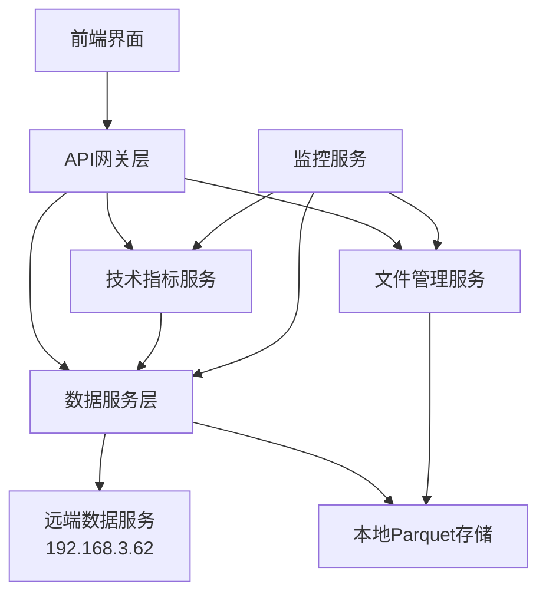

# 数据管理真实功能实现设计文档

## 概述

本设计文档描述了如何将后端服务中的打桩数据管理功能替换为真实实现。系统已经具备了完整的数据服务基础设施（Stock_Data_Service）和远端服务连接（192.168.3.62），现在需要将API层的模拟响应替换为真实的服务调用，并完善相关的管理和监控功能。

## 架构

### 整体架构


### 服务依赖关系
- **API Routes** 依赖所有服务层组件
- **Technical Indicators Service** 依赖 Stock Data Service
- **Parquet Manager** 独立管理本地存储
- **Data Sync Engine** 协调数据服务和文件管理器
- **Monitoring Service** 监控所有组件状态

## 组件和接口

### 1. API路由层改造 (routes.py)

#### 核心接口
```python
class RealDataAPIRoutes:
    def __init__(self, 
                 data_service: StockDataService,
                 indicators_service: TechnicalIndicatorCalculator,
                 parquet_manager: ParquetManager,
                 sync_engine: DataSyncEngine):
        self.data_service = data_service
        self.indicators_service = indicators_service
        self.parquet_manager = parquet_manager
        self.sync_engine = sync_engine
```

#### 主要方法
- `get_stock_data()` - 调用真实数据服务
- `get_technical_indicators()` - 调用真实技术指标计算
- `get_data_service_status()` - 返回真实服务状态
- `get_local_data_files()` - 返回真实文件列表
- `sync_data_from_remote()` - 执行真实数据同步

### 2. 增强的Parquet管理器

#### 新增功能
```python
class EnhancedParquetManager(ParquetManager):
    def get_detailed_file_list(self, filters: FileFilters) -> List[DetailedFileInfo]
    def get_comprehensive_stats(self) -> ComprehensiveStats
    def validate_file_integrity(self, file_path: str) -> ValidationResult
    def delete_files_safely(self, file_paths: List[str]) -> DeletionResult
    def filter_files(self, criteria: FilterCriteria) -> List[FileInfo]
```

#### 数据模型
```python
@dataclass
class DetailedFileInfo:
    file_path: str
    stock_code: str
    date_range: Tuple[datetime, datetime]
    record_count: int
    file_size: int
    last_modified: datetime
    integrity_status: str
    compression_ratio: float
```

### 3. 数据同步引擎

#### 核心功能
```python
class DataSyncEngine:
    def __init__(self, 
                 data_service: StockDataService,
                 parquet_manager: ParquetManager):
        self.data_service = data_service
        self.parquet_manager = parquet_manager
        self.sync_queue = asyncio.Queue()
        self.progress_tracker = SyncProgressTracker()
    
    async def sync_stocks_batch(self, request: BatchSyncRequest) -> BatchSyncResult
    async def sync_single_stock(self, stock_code: str, options: SyncOptions) -> SyncResult
    def get_sync_progress(self, sync_id: str) -> SyncProgress
    async def retry_failed_syncs(self, sync_id: str) -> RetryResult
```

### 4. 监控和统计服务

#### 监控接口
```python
class DataMonitoringService:
    def get_service_health(self) -> ServiceHealthStatus
    def get_performance_metrics(self) -> PerformanceMetrics
    def get_error_statistics(self) -> ErrorStatistics
    def get_data_quality_report(self) -> DataQualityReport
    def get_sync_history(self, limit: int = 100) -> List[SyncHistoryEntry]
```

## 数据模型

### 文件管理相关模型
```python
@dataclass
class ComprehensiveStats:
    total_files: int
    total_size_bytes: int
    total_records: int
    stock_count: int
    date_range: Tuple[datetime, datetime]
    average_file_size: float
    storage_efficiency: float
    last_sync_time: datetime
    stocks_by_size: List[Tuple[str, int]]
    monthly_distribution: Dict[str, int]

@dataclass
class FilterCriteria:
    stock_codes: Optional[List[str]] = None
    date_range: Optional[Tuple[datetime, datetime]] = None
    min_file_size: Optional[int] = None
    max_file_size: Optional[int] = None
    min_records: Optional[int] = None
    integrity_status: Optional[str] = None
```

### 同步相关模型
```python
@dataclass
class BatchSyncRequest:
    stock_codes: List[str]
    start_date: Optional[datetime] = None
    end_date: Optional[datetime] = None
    force_update: bool = False
    sync_mode: str = "incremental"  # "incremental" or "full"
    max_concurrent: int = 3
    retry_count: int = 3

@dataclass
class SyncProgress:
    sync_id: str
    total_stocks: int
    completed_stocks: int
    failed_stocks: int
    current_stock: Optional[str]
    progress_percentage: float
    estimated_remaining_time: Optional[timedelta]
    start_time: datetime
    status: str  # "running", "completed", "failed", "paused"
```

### 监控相关模型
```python
@dataclass
class ServiceHealthStatus:
    api_server: ComponentHealth
    data_service: ComponentHealth
    remote_service: ComponentHealth
    parquet_storage: ComponentHealth
    overall_status: str
    last_check: datetime

@dataclass
class ComponentHealth:
    status: str  # "healthy", "degraded", "unhealthy"
    response_time_ms: Optional[float]
    error_rate: float
    last_error: Optional[str]
    uptime_percentage: float
```

## 正确性属性

*属性是一个特征或行为，应该在系统的所有有效执行中保持为真——本质上是关于系统应该做什么的正式声明。属性作为人类可读规范和机器可验证正确性保证之间的桥梁。*

基于需求分析，以下是系统必须满足的正确性属性：

### 属性反思

在编写具体属性之前，让我分析prework中识别的属性，消除冗余：

- 属性1.1-1.5都是测试API路由是否调用真实服务，可以合并为一个综合属性
- 属性2.1-2.5都是测试Parquet管理器功能，可以按功能类型合并
- 属性3.1-3.5都是测试技术指标计算，可以合并为计算准确性属性
- 属性4.1-4.5都是测试数据同步功能，可以合并为同步完整性属性
- 属性5.1-5.5都是测试监控功能，可以合并为监控准确性属性
- 属性6.1-6.5都是测试错误处理，可以合并为错误处理属性
- 属性7.1-7.5都是测试性能优化，可以合并为性能属性

### 核心正确性属性

**属性 1: API路由真实服务调用**
*对于任何* API端点调用，当请求有效数据时，API应该调用真实的后端服务而不是返回模拟数据，并且返回的数据应该来自真实的数据源
**验证: 需求 1.1, 1.2, 1.3, 1.4, 1.5**

**属性 2: Parquet文件管理完整性**
*对于任何* 文件管理操作（扫描、统计、删除、验证），Parquet管理器应该准确反映文件系统的真实状态，并且操作结果应该与实际文件系统状态一致
**验证: 需求 2.1, 2.2, 2.3, 2.4, 2.5**

**属性 3: 技术指标计算准确性**
*对于任何* 有效的股票价格数据序列，技术指标计算应该基于真实数据使用标准算法产生数学上正确的结果
**验证: 需求 3.1, 3.2, 3.3, 3.4, 3.5**

**属性 4: 数据同步完整性**
*对于任何* 数据同步请求，同步引擎应该正确处理所有股票代码，并且同步结果应该准确反映每只股票的同步状态和数据完整性
**验证: 需求 4.1, 4.2, 4.3, 4.4, 4.5**

**属性 5: 监控数据准确性**
*对于任何* 系统状态查询，监控服务应该返回反映系统真实状态的准确信息，包括服务健康状况、性能指标和错误统计
**验证: 需求 5.1, 5.2, 5.3, 5.4, 5.5**

**属性 6: 错误处理和降级策略**
*对于任何* 服务故障或异常情况，系统应该实施适当的降级策略，记录错误信息，并在可能的情况下提供替代服务
**验证: 需求 6.1, 6.2, 6.3, 6.4, 6.5**

**属性 7: 性能优化有效性**
*对于任何* 重复或大量数据操作，系统应该通过缓存、流式处理和连接池等优化技术保持响应时间在可接受范围内
**验证: 需求 7.1, 7.2, 7.3, 7.4, 7.5**

## 错误处理

### 错误分类和处理策略

#### 1. 远端服务错误
- **连接超时**: 重试机制，最多3次，指数退避
- **服务不可用**: 自动降级到本地数据
- **数据格式错误**: 数据验证和清洗
- **认证失败**: 记录错误，通知管理员

#### 2. 本地存储错误
- **磁盘空间不足**: 清理旧文件，压缩数据
- **文件损坏**: 从远端重新获取数据
- **权限错误**: 记录错误，提供修复建议
- **I/O错误**: 重试操作，检查磁盘健康

#### 3. 数据质量错误
- **缺失数据**: 标记数据范围，提供部分数据
- **异常值**: 数据清洗，异常值标记
- **时间序列断裂**: 尝试填补，标记不连续区间
- **重复数据**: 自动去重，记录重复情况

### 错误恢复机制
```python
class ErrorRecoveryManager:
    def handle_remote_service_error(self, error: RemoteServiceError) -> RecoveryAction
    def handle_storage_error(self, error: StorageError) -> RecoveryAction
    def handle_data_quality_error(self, error: DataQualityError) -> RecoveryAction
    def get_recovery_suggestions(self, error_type: str) -> List[str]
```

## 测试策略

### 双重测试方法

本系统采用单元测试和基于属性的测试相结合的方法：

#### 单元测试
- **具体示例验证**: 测试特定的API调用和数据处理场景
- **边界条件测试**: 测试空数据、极大数据量等边界情况
- **错误条件测试**: 测试各种错误情况的处理
- **集成点测试**: 测试组件之间的交互

#### 基于属性的测试
- **通用属性验证**: 通过随机输入验证系统的通用属性
- **全面输入覆盖**: 通过随机化测试大量输入组合
- **最少100次迭代**: 每个属性测试运行至少100次随机测试
- **属性标记格式**: **功能: data-management-implementation, 属性 {编号}: {属性文本}**

#### 测试配置
- **属性测试库**: 使用Python的Hypothesis库进行基于属性的测试
- **测试标记**: 每个属性测试必须引用设计文档中的对应属性
- **并发测试**: 测试系统在并发访问下的行为
- **性能测试**: 验证系统在负载下的性能表现

### 测试覆盖范围
- API路由层的真实服务调用
- Parquet文件管理的完整性
- 技术指标计算的准确性
- 数据同步的可靠性
- 监控数据的准确性
- 错误处理和恢复机制
- 性能优化的有效性