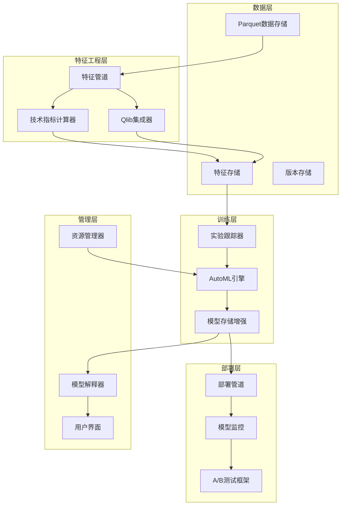

# MLOps流程优化设计文档

## 概述

本设计文档基于现有股票预测平台的基础设施，提出一套务实的MLOps流程优化方案。设计重点关注与现有系统的集成，特别是基于Parquet数据存储的特征工程、Qlib框架集成，以及增强现有模型管理功能。

## 架构概览

### 系统架构图



## 核心组件设计

### 1. 特征工程管道 (Feature Pipeline)

**职责：** 基于现有Parquet数据，自动化计算技术指标和量化因子

**核心功能：**
- 集成到现有数据同步流程
- 在数据更新时自动计算技术指标
- 集成Qlib特征提取
- 增量更新特征缓存

**技术实现：**
```python
class FeaturePipeline:
    def __init__(self, qlib_config: dict):
        self.qlib_config = qlib_config
        self.indicator_calculator = TechnicalIndicatorCalculator()
        self.qlib_integrator = QlibIntegrator(qlib_config)
        self.feature_store = FeatureStore()
    
    async def on_data_sync_complete(self, stock_code: str, date_range: tuple):
        """在数据管理模块完成数据同步后调用"""
        # 1. 获取新同步的数据
        # 2. 计算技术指标
        # 3. 调用Qlib特征提取
        # 4. 更新特征存储
        pass
```

**技术指标支持：**
- **趋势指标：** SMA, EMA, 布林带, SAR
- **动量指标：** RSI, Stochastic, Williams %R, CCI
- **成交量指标：** VWAP, OBV, A/D Line
- **波动率指标：** ATR, 历史波动率

### 2. 统一Qlib训练引擎 (Unified Qlib Training Engine)

**职责：** 基于Qlib框架的统一模型训练引擎，替代现有的多种训练方式

**核心功能：**
- 统一使用Qlib数据格式和Alpha158因子
- 支持Qlib内置的所有模型类型
- 集成Qlib的超参数优化和早停策略
- 实时训练进度跟踪和WebSocket通知

**集成点：**
- 完全替换现有的模型训练逻辑
- 保持相同的API接口和前端交互
- 复用现有的数据库存储和进度跟踪

**技术实现：**
```python
class UnifiedQlibTrainingEngine:
    def __init__(self, websocket_manager):
        self.websocket_manager = websocket_manager
        self.qlib_provider = None
        self.supported_models = {
            'lightgbm': 'qlib.contrib.model.gbdt.LGBModel',
            'xgboost': 'qlib.contrib.model.xgboost.XGBModel', 
            'mlp': 'qlib.contrib.model.pytorch_nn.DNNModelPytorch',
            'linear': 'qlib.contrib.model.linear.LinearModel'
        }
    
    async def train_model(
        self,
        model_id: str,
        model_name: str, 
        model_type: str,
        stock_codes: List[str],
        start_date: datetime,
        end_date: datetime,
        hyperparameters: Dict[str, Any]
    ):
        """统一的Qlib模型训练流程"""
        
        # 1. 初始化Qlib环境
        await self._initialize_qlib()
        
        # 2. 准备数据集（包含Alpha158因子）
        await self._notify_progress(model_id, 10.0, "preparing", "准备Qlib数据集")
        dataset = await self._prepare_qlib_dataset(stock_codes, start_date, end_date)
        
        # 3. 创建Qlib模型配置
        await self._notify_progress(model_id, 20.0, "configuring", "配置Qlib模型")
        model_config = self._create_qlib_model_config(model_type, hyperparameters)
        
        # 4. 训练模型
        await self._notify_progress(model_id, 30.0, "training", "开始Qlib模型训练")
        model, metrics = await self._train_qlib_model(model_config, dataset, model_id)
        
        # 5. 评估和保存
        await self._notify_progress(model_id, 90.0, "evaluating", "评估模型性能")
        final_metrics = await self._evaluate_model(model, dataset)
        model_path = await self._save_model(model, model_id)
        
        # 6. 完成通知
        await self._notify_progress(model_id, 100.0, "completed", "训练完成")
        
        return model_path, final_metrics
    
    async def _prepare_qlib_dataset(self, stock_codes, start_date, end_date):
        """准备包含Alpha158因子的Qlib数据集"""
        # 使用增强的QlibDataProvider
        enhanced_provider = EnhancedQlibIntegrator(self.qlib_provider)
        return await enhanced_provider.prepare_qlib_dataset(
            stock_codes, start_date, end_date, include_alpha_factors=True
        )
    
    def _create_qlib_model_config(self, model_type: str, hyperparameters: Dict):
        """创建Qlib模型配置"""
        if model_type not in self.supported_models:
            raise ValueError(f"不支持的模型类型: {model_type}")
        
        model_class = self.supported_models[model_type]
        
        # 基础配置
        config = {
            "class": model_class.split('.')[-1],
            "module_path": '.'.join(model_class.split('.')[:-1]),
            "kwargs": self._get_default_hyperparameters(model_type)
        }
        
        # 合并用户超参数
        if hyperparameters:
            config["kwargs"].update(hyperparameters)
        
        return config
    
    async def _train_qlib_model(self, config, dataset, model_id):
        """训练Qlib模型并实时更新进度"""
        from qlib.utils import init_instance_by_config
        
        # 创建模型实例
        model = init_instance_by_config(config)
        
        # 训练模型（这里需要添加进度回调）
        model.fit(dataset)
        
        # 获取训练指标
        pred = model.predict(dataset)
        metrics = self._calculate_qlib_metrics(dataset, pred)
        
        return model, metrics
```

**数据库集成：**
```python
# 扩展现有ModelInfo表
class ModelInfo:
    # ... 现有字段
    training_progress: float = 0.0
    training_stage: str = "not_started"  # preparing, training, evaluating, completed, failed
    training_log: JSON = None  # 存储训练过程数据
    training_start_time: datetime = None
    training_end_time: datetime = None
    error_message: str = None
```

**前端集成：**
```typescript
// 实时接收训练进度
websocket.on('training_progress', (data) => {
    updateModelProgress(data.model_id, data.progress);
    updateTrainingMetrics(data.model_id, data.metrics);
});

// 训练完成后查看详细报告
const viewTrainingReport = async (modelId: string) => {
    const report = await api.get(`/models/${modelId}/training-report`);
    showTrainingReportModal(report);
};
```

## 前端界面设计

### 1. 特征管理界面

**新增特征管理页面：**
```tsx
// frontend/src/app/features/page.tsx
const FeaturesPage = () => {
    const [features, setFeatures] = useState([]);
    const [indicators, setIndicators] = useState([]);
    const [alphaFactors, setAlphaFactors] = useState([]);
    
    return (
        <div className="container mx-auto px-4 py-6 space-y-6">
            <div className="flex justify-between items-center">
                <h1 className="text-3xl font-bold">特征管理</h1>
                <Button color="primary" onPress={onCalculateFeatures}>
                    重新计算特征
                </Button>
            </div>
            
            <Tabs>
                <Tab key="indicators" title="技术指标">
                    <TechnicalIndicatorsPanel indicators={indicators} />
                </Tab>
                <Tab key="alpha" title="Alpha因子">
                    <AlphaFactorsPanel factors={alphaFactors} />
                </Tab>
                <Tab key="custom" title="自定义特征">
                    <CustomFeaturesPanel />
                </Tab>
            </Tabs>
        </div>
    );
};
```

### 2. 模型对比界面

**模型对比页面：**
```tsx
// frontend/src/app/models/compare/page.tsx
const ModelComparePage = () => {
    const [selectedModels, setSelectedModels] = useState([]);
    const [comparisonData, setComparisonData] = useState(null);
    
    return (
        <div className="container mx-auto px-4 py-6 space-y-6">
            <h1 className="text-3xl font-bold">模型对比</h1>
            
            <Card>
                <CardHeader>选择对比模型</CardHeader>
                <CardBody>
                    <ModelSelector 
                        multiple
                        value={selectedModels}
                        onChange={setSelectedModels}
                        maxSelection={4}
                    />
                </CardBody>
            </Card>
            
            {comparisonData && (
                <div className="grid grid-cols-2 gap-6">
                    <Card>
                        <CardHeader>性能对比</CardHeader>
                        <CardBody>
                            <PerformanceComparisonChart data={comparisonData.metrics} />
                        </CardBody>
                    </Card>
                    
                    <Card>
                        <CardHeader>特征重要性对比</CardHeader>
                        <CardBody>
                            <FeatureImportanceComparison data={comparisonData.features} />
                        </CardBody>
                    </Card>
                </div>
            )}
        </div>
    );
};
```

### 3. 监控仪表板

**实时监控仪表板：**
```tsx
// frontend/src/app/monitoring/page.tsx
const MonitoringDashboard = () => {
    const [systemMetrics, setSystemMetrics] = useState({});
    const [modelMetrics, setModelMetrics] = useState([]);
    const [alerts, setAlerts] = useState([]);
    
    return (
        <div className="container mx-auto px-4 py-6 space-y-6">
            <h1 className="text-3xl font-bold">系统监控</h1>
            
            {/* 系统状态概览 */}
            <div className="grid grid-cols-4 gap-4">
                <MetricCard 
                    title="活跃模型" 
                    value={systemMetrics.activeModels}
                    icon={<Brain />}
                    color="blue"
                />
                <MetricCard 
                    title="训练任务" 
                    value={systemMetrics.trainingTasks}
                    icon={<Activity />}
                    color="green"
                />
                <MetricCard 
                    title="预测请求/小时" 
                    value={systemMetrics.predictionsPerHour}
                    icon={<TrendingUp />}
                    color="purple"
                />
                <MetricCard 
                    title="系统负载" 
                    value={`${systemMetrics.cpuUsage}%`}
                    icon={<Cpu />}
                    color="orange"
                />
            </div>
            
            {/* 告警面板 */}
            <Card>
                <CardHeader>
                    <div className="flex items-center gap-2">
                        <AlertTriangle className="w-5 h-5" />
                        <span>系统告警</span>
                        <Chip size="sm" color="danger">{alerts.length}</Chip>
                    </div>
                </CardHeader>
                <CardBody>
                    <AlertsList alerts={alerts} />
                </CardBody>
            </Card>
            
            {/* 模型性能监控 */}
            <Card>
                <CardHeader>模型性能监控</CardHeader>
                <CardBody>
                    <ModelPerformanceChart data={modelMetrics} />
                </CardBody>
            </Card>
        </div>
    );
};
```

### 4. A/B测试管理界面

**A/B测试管理页面：**
```tsx
// frontend/src/app/experiments/page.tsx
const ExperimentsPage = () => {
    const [experiments, setExperiments] = useState([]);
    const { isOpen, onOpen, onClose } = useDisclosure();
    
    return (
        <div className="container mx-auto px-4 py-6 space-y-6">
            <div className="flex justify-between items-center">
                <h1 className="text-3xl font-bold">A/B测试管理</h1>
                <Button color="primary" onPress={onOpen}>
                    创建实验
                </Button>
            </div>
            
            <div className="grid gap-6">
                {experiments.map(experiment => (
                    <ExperimentCard 
                        key={experiment.id}
                        experiment={experiment}
                        onViewResults={() => viewExperimentResults(experiment.id)}
                        onStop={() => stopExperiment(experiment.id)}
                    />
                ))}
            </div>
            
            <CreateExperimentModal 
                isOpen={isOpen}
                onClose={onClose}
                onSubmit={createExperiment}
            />
        </div>
    );
};
```

### 5. 数据版本控制界面

**数据版本管理页面：**
```tsx
// frontend/src/app/data/versions/page.tsx
const DataVersionsPage = () => {
    const [versions, setVersions] = useState([]);
    const [selectedVersion, setSelectedVersion] = useState(null);
    
    return (
        <div className="container mx-auto px-4 py-6 space-y-6">
            <h1 className="text-3xl font-bold">数据版本控制</h1>
            
            <div className="grid grid-cols-3 gap-6">
                {/* 版本列表 */}
                <Card className="col-span-2">
                    <CardHeader>数据版本历史</CardHeader>
                    <CardBody>
                        <Table>
                            <TableHeader>
                                <TableColumn>版本</TableColumn>
                                <TableColumn>创建时间</TableColumn>
                                <TableColumn>数据范围</TableColumn>
                                <TableColumn>状态</TableColumn>
                                <TableColumn>操作</TableColumn>
                            </TableHeader>
                            <TableBody>
                                {versions.map(version => (
                                    <TableRow key={version.id}>
                                        <TableCell>{version.version}</TableCell>
                                        <TableCell>{formatDate(version.createdAt)}</TableCell>
                                        <TableCell>{version.dateRange}</TableCell>
                                        <TableCell>
                                            <Chip color={getVersionStatusColor(version.status)}>
                                                {version.status}
                                            </Chip>
                                        </TableCell>
                                        <TableCell>
                                            <Button 
                                                size="sm"
                                                onPress={() => setSelectedVersion(version)}
                                            >
                                                查看详情
                                            </Button>
                                        </TableCell>
                                    </TableRow>
                                ))}
                            </TableBody>
                        </Table>
                    </CardBody>
                </Card>
                
                {/* 版本详情 */}
                <Card>
                    <CardHeader>版本详情</CardHeader>
                    <CardBody>
                        {selectedVersion ? (
                            <VersionDetails version={selectedVersion} />
                        ) : (
                            <p className="text-gray-500">选择一个版本查看详情</p>
                        )}
                    </CardBody>
                </Card>
            </div>
        </div>
    );
};
```

### 6. 模型解释性界面

**模型解释性分析页面：**
```tsx
// frontend/src/app/models/[id]/explain/page.tsx
const ModelExplainPage = ({ params }) => {
    const [explanations, setExplanations] = useState(null);
    const [selectedFeature, setSelectedFeature] = useState(null);
    
    return (
        <div className="container mx-auto px-4 py-6 space-y-6">
            <h1 className="text-3xl font-bold">模型解释性分析</h1>
            
            <div className="grid grid-cols-2 gap-6">
                {/* SHAP值分析 */}
                <Card>
                    <CardHeader>SHAP特征重要性</CardHeader>
                    <CardBody>
                        <SHAPImportanceChart data={explanations?.shap} />
                    </CardBody>
                </Card>
                
                {/* 技术指标影响分析 */}
                <Card>
                    <CardHeader>技术指标影响</CardHeader>
                    <CardBody>
                        <TechnicalIndicatorImpact data={explanations?.indicators} />
                    </CardBody>
                </Card>
                
                {/* 局部解释 */}
                <Card className="col-span-2">
                    <CardHeader>预测解释（选择具体预测查看）</CardHeader>
                    <CardBody>
                        <LocalExplanationViewer 
                            predictions={explanations?.predictions}
                            onSelectPrediction={setSelectedFeature}
                        />
                    </CardBody>
                </Card>
            </div>
        </div>
    );
};
```

### 7. 导航和布局更新

**更新主导航：**
```tsx
// frontend/src/components/layout/Navigation.tsx
const navigationItems = [
    { name: '仪表板', href: '/dashboard', icon: Home },
    { name: '数据管理', href: '/data', icon: Database },
    { name: '特征工程', href: '/features', icon: Settings },
    { name: '模型管理', href: '/models', icon: Brain },
    { name: '模型对比', href: '/models/compare', icon: BarChart },
    { name: 'A/B测试', href: '/experiments', icon: TestTube },
    { name: '系统监控', href: '/monitoring', icon: Activity },
    { name: '数据版本', href: '/data/versions', icon: GitBranch },
];
```
```tsx
// 训练进度显示组件
const TrainingProgressCard = ({ model }) => {
    const [progress, setProgress] = useState(model.training_progress);
    const [stage, setStage] = useState(model.training_stage);
    
    useEffect(() => {
        // 订阅WebSocket进度更新
        const unsubscribe = subscribeToTrainingProgress(model.model_id, (data) => {
            setProgress(data.progress);
            setStage(data.stage);
        });
        return unsubscribe;
    }, [model.model_id]);
    
    return (
        <Card>
            <CardHeader>
                <div className="flex justify-between items-center">
                    <h3>{model.model_name}</h3>
                    <Chip color={getStatusColor(model.status)}>
                        {getStatusText(model.status)}
                    </Chip>
                </div>
            </CardHeader>
            <CardBody>
                {model.status === 'training' && (
                    <div className="space-y-2">
                        <div className="flex justify-between text-sm">
                            <span>训练进度</span>
                            <span>{progress.toFixed(1)}%</span>
                        </div>
                        <Progress value={progress} className="w-full" />
                        <div className="text-xs text-gray-500">
                            当前阶段: {getStageText(stage)}
                        </div>
                        {progress > 0 && (
                            <Button 
                                size="sm" 
                                variant="outline"
                                onClick={() => showLiveTrainingDetails(model.model_id)}
                            >
                                查看实时详情
                            </Button>
                        )}
                    </div>
                )}
                {model.status === 'ready' && (
                    <div className="space-y-2">
                        <div className="grid grid-cols-2 gap-4 text-sm">
                            <div>
                                <span className="text-gray-500">准确率</span>
                                <div className="font-medium">{(model.accuracy * 100).toFixed(2)}%</div>
                            </div>
                            <div>
                                <span className="text-gray-500">训练时长</span>
                                <div className="font-medium">{formatDuration(model.training_duration)}</div>
                            </div>
                        </div>
                        <Button 
                            size="sm" 
                            variant="outline"
                            onClick={() => showTrainingReport(model.model_id)}
                        >
                            查看训练报告
                        </Button>
                    </div>
                )}
            </CardBody>
        </Card>
    );
};
```

2. **实时训练详情弹窗**
```tsx
const LiveTrainingModal = ({ modelId, isOpen, onClose }) => {
    const [trainingData, setTrainingData] = useState(null);
    const [metrics, setMetrics] = useState([]);
    
    useEffect(() => {
        if (isOpen) {
            // 获取当前训练数据
            fetchCurrentTrainingData(modelId).then(setTrainingData);
            
            // 订阅实时更新
            const unsubscribe = subscribeToTrainingProgress(modelId, (data) => {
                setMetrics(prev => [...prev, {
                    epoch: data.epoch,
                    loss: data.metrics.loss,
                    accuracy: data.metrics.accuracy,
                    timestamp: new Date()
                }]);
            });
            
            return unsubscribe;
        }
    }, [isOpen, modelId]);
    
    return (
        <Modal isOpen={isOpen} onClose={onClose} size="4xl">
            <ModalContent>
                <ModalHeader>实时训练监控 - {trainingData?.model_name}</ModalHeader>
                <ModalBody>
                    <div className="grid grid-cols-2 gap-6">
                        {/* 左侧：实时指标 */}
                        <div className="space-y-4">
                            <h4 className="font-semibold">实时指标</h4>
                            <div className="grid grid-cols-2 gap-4">
                                <MetricCard 
                                    title="当前Loss" 
                                    value={metrics[metrics.length - 1]?.loss?.toFixed(4) || 'N/A'}
                                    trend={calculateTrend(metrics, 'loss')}
                                />
                                <MetricCard 
                                    title="当前准确率" 
                                    value={metrics[metrics.length - 1]?.accuracy?.toFixed(3) || 'N/A'}
                                    trend={calculateTrend(metrics, 'accuracy')}
                                />
                            </div>
                            
                            <div className="space-y-2">
                                <div className="flex justify-between text-sm">
                                    <span>总体进度</span>
                                    <span>{trainingData?.progress?.toFixed(1)}%</span>
                                </div>
                                <Progress value={trainingData?.progress || 0} />
                                <div className="text-xs text-gray-500">
                                    预计剩余时间: {estimateRemainingTime(trainingData)}
                                </div>
                            </div>
                        </div>
                        
                        {/* 右侧：训练曲线 */}
                        <div className="space-y-4">
                            <h4 className="font-semibold">训练曲线</h4>
                            <div className="h-64">
                                <LineChart
                                    data={metrics}
                                    xKey="epoch"
                                    lines={[
                                        { key: 'loss', name: 'Loss', color: '#ef4444' },
                                        { key: 'accuracy', name: 'Accuracy', color: '#10b981' }
                                    ]}
                                />
                            </div>
                        </div>
                    </div>
                    
                    {/* 底部：训练日志 */}
                    <div className="mt-6">
                        <h4 className="font-semibold mb-2">训练日志</h4>
                        <div className="bg-gray-50 p-3 rounded-lg h-32 overflow-y-auto text-sm font-mono">
                            {trainingData?.logs?.map((log, index) => (
                                <div key={index} className="text-gray-700">
                                    [{log.timestamp}] {log.message}
                                </div>
                            ))}
                        </div>
                    </div>
                </ModalBody>
                <ModalFooter>
                    <Button variant="light" onPress={onClose}>关闭</Button>
                    <Button 
                        color="danger" 
                        variant="light"
                        onPress={() => stopTraining(modelId)}
                    >
                        停止训练
                    </Button>
                </ModalFooter>
            </ModalContent>
        </Modal>
    );
};
```

3. **训练报告详情页面**
```tsx
const TrainingReportModal = ({ modelId, isOpen, onClose }) => {
    const [report, setReport] = useState(null);
    const [loading, setLoading] = useState(false);
    
    useEffect(() => {
        if (isOpen && modelId) {
            setLoading(true);
            fetchTrainingReport(modelId)
                .then(setReport)
                .finally(() => setLoading(false));
        }
    }, [isOpen, modelId]);
    
    if (loading) return <LoadingSpinner />;
    
    return (
        <Modal isOpen={isOpen} onClose={onClose} size="5xl" scrollBehavior="inside">
            <ModalContent>
                <ModalHeader>训练报告 - {report?.model_name}</ModalHeader>
                <ModalBody>
                    <div className="space-y-6">
                        {/* 训练概览 */}
                        <div>
                            <h3 className="text-lg font-semibold mb-3">训练概览</h3>
                            <div className="grid grid-cols-4 gap-4">
                                <div className="bg-blue-50 p-3 rounded-lg">
                                    <div className="text-sm text-blue-600">训练时长</div>
                                    <div className="text-lg font-semibold">{formatDuration(report?.training_duration)}</div>
                                </div>
                                <div className="bg-green-50 p-3 rounded-lg">
                                    <div className="text-sm text-green-600">最终准确率</div>
                                    <div className="text-lg font-semibold">{(report?.final_metrics?.accuracy * 100)?.toFixed(2)}%</div>
                                </div>
                                <div className="bg-purple-50 p-3 rounded-lg">
                                    <div className="text-sm text-purple-600">总轮次</div>
                                    <div className="text-lg font-semibold">{report?.total_epochs}</div>
                                </div>
                                <div className="bg-orange-50 p-3 rounded-lg">
                                    <div className="text-sm text-orange-600">最佳轮次</div>
                                    <div className="text-lg font-semibold">{report?.best_epoch}</div>
                                </div>
                            </div>
                        </div>
                        
                        {/* 训练曲线 */}
                        <div>
                            <h3 className="text-lg font-semibold mb-3">训练曲线</h3>
                            <div className="h-80">
                                <LineChart
                                    data={report?.training_history || []}
                                    xKey="epoch"
                                    lines={[
                                        { key: 'train_loss', name: '训练Loss', color: '#ef4444' },
                                        { key: 'val_loss', name: '验证Loss', color: '#f97316' },
                                        { key: 'train_accuracy', name: '训练准确率', color: '#10b981' },
                                        { key: 'val_accuracy', name: '验证准确率', color: '#06b6d4' }
                                    ]}
                                />
                            </div>
                        </div>
                        
                        {/* 特征重要性 */}
                        {report?.feature_importance && (
                            <div>
                                <h3 className="text-lg font-semibold mb-3">特征重要性</h3>
                                <div className="h-64">
                                    <BarChart
                                        data={Object.entries(report.feature_importance).map(([name, importance]) => ({
                                            name,
                                            importance
                                        }))}
                                        xKey="name"
                                        yKey="importance"
                                    />
                                </div>
                            </div>
                        )}
                        
                        {/* 超参数 */}
                        <div>
                            <h3 className="text-lg font-semibold mb-3">超参数配置</h3>
                            <div className="bg-gray-50 p-4 rounded-lg">
                                <pre className="text-sm">
                                    {JSON.stringify(report?.hyperparameters, null, 2)}
                                </pre>
                            </div>
                        </div>
                    </div>
                </ModalBody>
                <ModalFooter>
                    <Button variant="light" onPress={onClose}>关闭</Button>
                    <Button 
                        color="primary"
                        onPress={() => downloadReport(report)}
                    >
                        下载报告
                    </Button>
                </ModalFooter>
            </ModalContent>
        </Modal>
    );
};
```

**WebSocket集成：**
```typescript
class TrainingProgressWebSocket {
    private ws: WebSocket;
    private subscribers: Map<string, Function[]> = new Map();
    
    connect() {
        this.ws = new WebSocket(`${WS_URL}/training-progress`);
        
        this.ws.onmessage = (event) => {
            const data = JSON.parse(event.data);
            const subscribers = this.subscribers.get(data.model_id) || [];
            subscribers.forEach(callback => callback(data));
        };
    }
    
    subscribeToModel(modelId: string, callback: Function) {
        if (!this.subscribers.has(modelId)) {
            this.subscribers.set(modelId, []);
        }
        this.subscribers.get(modelId)!.push(callback);
        
        return () => {
            const callbacks = this.subscribers.get(modelId) || [];
            const index = callbacks.indexOf(callback);
            if (index > -1) {
                callbacks.splice(index, 1);
            }
        };
    }
}
```

### 3. 模型存储增强 (Enhanced Model Storage)

**职责：** 在现有模型存储基础上增加生命周期管理功能

**增强功能：**
- 模型状态跟踪和历史记录
- 训练血缘和依赖关系
- 兼容性验证
- 简化的搜索和标签功能

**集成方式：**
```python
class EnhancedModelStorage(ModelStorage):
    def __init__(self, base_storage: ModelStorage):
        self.base_storage = base_storage
        self.lifecycle_manager = ModelLifecycleManager()
        self.lineage_tracker = LineageTracker()
    
    def save_model_with_lifecycle(self, model, metadata, experiment_info):
        # 调用原有存储功能
        model_id = self.base_storage.save_model(model, metadata)
        # 增加生命周期管理
        self.lifecycle_manager.track_model_creation(model_id, experiment_info)
        return model_id
```

### 4. Qlib模型配置管理器

**职责：** 管理Qlib模型的配置、超参数和训练策略

**核心功能：**
- 提供Qlib模型的默认配置
- 支持超参数优化和调优
- 管理模型训练策略
- 集成Qlib的早停和正则化

**模型支持：**
```python
class QlibModelManager:
    def get_supported_models(self) -> Dict[str, str]:
        """获取支持的Qlib模型列表"""
        return {
            # 传统机器学习模型
            'lightgbm': 'LightGBM梯度提升模型',
            'xgboost': 'XGBoost梯度提升模型', 
            'linear': '线性回归模型',
            
            # 深度学习模型
            'mlp': '多层感知机神经网络',
            'lstm': 'LSTM循环神经网络',
            'transformer': 'Transformer时间序列模型',
            'informer': 'Informer长序列预测模型',
            'timesnet': 'TimesNet时间序列模型',
            'patchtst': 'PatchTST补丁时间序列模型',
            'tabnet': 'TabNet深度学习模型'
        }
    
    def get_default_hyperparameters(self, model_type: str) -> Dict[str, Any]:
        """获取模型默认超参数"""
        defaults = {
            'lightgbm': {
                'objective': 'regression',
                'num_leaves': 210,
                'learning_rate': 0.05,
                'feature_fraction': 0.85,
                'bagging_fraction': 0.85,
                'bagging_freq': 5,
                'min_child_samples': 20,
                'num_boost_round': 1000,
                'early_stopping_rounds': 50
            },
            'xgboost': {
                'objective': 'reg:squarederror',
                'max_depth': 6,
                'learning_rate': 0.05,
                'subsample': 0.85,
                'colsample_bytree': 0.85,
                'n_estimators': 1000,
                'early_stopping_rounds': 50
            },
            'mlp': {
                'lr': 0.001,
                'n_epochs': 200,
                'batch_size': 2000,
                'early_stop': 20,
                'optimizer': 'adam',
                'hidden_size': 512,
                'dropout': 0.1
            },
            'lstm': {
                'lr': 0.001,
                'n_epochs': 200,
                'batch_size': 800,
                'early_stop': 20,
                'hidden_size': 64,
                'num_layers': 2,
                'dropout': 0.1,
                'lookback': 20
            },
            'transformer': {
                'lr': 0.0001,
                'n_epochs': 100,
                'batch_size': 512,
                'early_stop': 15,
                'd_model': 64,
                'n_heads': 8,
                'num_layers': 3,
                'dropout': 0.1,
                'seq_len': 20,
                'pred_len': 5
            },
            'informer': {
                'lr': 0.0001,
                'n_epochs': 100,
                'batch_size': 256,
                'early_stop': 15,
                'd_model': 64,
                'n_heads': 8,
                'e_layers': 2,
                'd_layers': 1,
                'dropout': 0.1,
                'seq_len': 60,
                'label_len': 30,
                'pred_len': 5,
                'factor': 3
            },
            'timesnet': {
                'lr': 0.001,
                'n_epochs': 100,
                'batch_size': 256,
                'early_stop': 15,
                'd_model': 64,
                'num_kernels': 6,
                'dropout': 0.1,
                'seq_len': 20,
                'pred_len': 5
            },
            'patchtst': {
                'lr': 0.001,
                'n_epochs': 100,
                'batch_size': 256,
                'early_stop': 15,
                'd_model': 64,
                'patch_len': 16,
                'stride': 8,
                'dropout': 0.1,
                'seq_len': 96,
                'pred_len': 5
            }
        }
        return defaults.get(model_type, {})
    
    def get_qlib_model_config(self, model_type: str, hyperparameters: Dict) -> Dict:
        """获取Qlib模型配置"""
        model_configs = {
            'lightgbm': {
                'class': 'LGBModel',
                'module_path': 'qlib.contrib.model.gbdt'
            },
            'xgboost': {
                'class': 'XGBModel', 
                'module_path': 'qlib.contrib.model.xgboost'
            },
            'linear': {
                'class': 'LinearModel',
                'module_path': 'qlib.contrib.model.linear'
            },
            'mlp': {
                'class': 'DNNModelPytorch',
                'module_path': 'qlib.contrib.model.pytorch_nn'
            },
            'lstm': {
                'class': 'LSTMModel',
                'module_path': 'qlib.contrib.model.pytorch_lstm'
            },
            'transformer': {
                'class': 'TransformerModel',
                'module_path': 'qlib.contrib.model.pytorch_transformer'
            },
            'informer': {
                'class': 'InformerModel', 
                'module_path': 'qlib.contrib.model.pytorch_informer'
            },
            'timesnet': {
                'class': 'TimesNetModel',
                'module_path': 'qlib.contrib.model.pytorch_timesnet'
            },
            'patchtst': {
                'class': 'PatchTSTModel',
                'module_path': 'qlib.contrib.model.pytorch_patchtst'
            }
        }
        
        if model_type not in model_configs:
            raise ValueError(f"不支持的模型类型: {model_type}")
        
        config = model_configs[model_type].copy()
        
        # 合并默认参数和用户参数
        default_params = self.get_default_hyperparameters(model_type)
        default_params.update(hyperparameters or {})
        config['kwargs'] = default_params
        
        return config
```

**自定义Qlib模型适配器：**
```python
class CustomQlibModelAdapter:
    """自定义Qlib模型适配器，用于集成非标准Qlib模型"""
    
    def __init__(self):
        self.custom_models = {}
    
    def register_transformer_model(self):
        """注册Transformer模型到Qlib"""
        from qlib.contrib.model.pytorch_nn import DNNModelPytorch
        import torch
        import torch.nn as nn
        
        class TransformerModel(DNNModelPytorch):
            def __init__(self, d_model=64, n_heads=8, num_layers=3, dropout=0.1, 
                        seq_len=20, pred_len=5, **kwargs):
                self.d_model = d_model
                self.n_heads = n_heads
                self.num_layers = num_layers
                self.seq_len = seq_len
                self.pred_len = pred_len
                super().__init__(**kwargs)
            
            def _build_model(self, input_dim):
                """构建Transformer模型"""
                class TransformerNet(nn.Module):
                    def __init__(self, input_dim, d_model, n_heads, num_layers, dropout):
                        super().__init__()
                        self.input_projection = nn.Linear(input_dim, d_model)
                        self.positional_encoding = nn.Parameter(torch.randn(1000, d_model))
                        
                        encoder_layer = nn.TransformerEncoderLayer(
                            d_model=d_model,
                            nhead=n_heads,
                            dropout=dropout,
                            batch_first=True
                        )
                        self.transformer = nn.TransformerEncoder(encoder_layer, num_layers)
                        self.output_projection = nn.Linear(d_model, 1)
                        self.dropout = nn.Dropout(dropout)
                    
                    def forward(self, x):
                        # x shape: (batch_size, seq_len, input_dim)
                        seq_len = x.size(1)
                        
                        # 输入投影
                        x = self.input_projection(x)
                        
                        # 位置编码
                        pos_enc = self.positional_encoding[:seq_len, :].unsqueeze(0)
                        x = x + pos_enc
                        
                        # Transformer编码
                        x = self.transformer(x)
                        
                        # 输出投影（取最后一个时间步）
                        x = self.output_projection(x[:, -1, :])
                        
                        return x
                
                return TransformerNet(input_dim, self.d_model, self.n_heads, 
                                    self.num_layers, self.dropout)
        
        # 注册到Qlib
        self.custom_models['transformer'] = TransformerModel
        return TransformerModel
    
    def register_informer_model(self):
        """注册Informer模型到Qlib"""
        # 类似的实现Informer模型
        pass
    
    def get_custom_model(self, model_type: str):
        """获取自定义模型类"""
        if model_type not in self.custom_models:
            # 动态注册模型
            if model_type == 'transformer':
                return self.register_transformer_model()
            elif model_type == 'informer':
                return self.register_informer_model()
            else:
                raise ValueError(f"不支持的自定义模型: {model_type}")
        
        return self.custom_models[model_type]
```

### 5. Qlib集成器优化

**当前状况分析：**
- 现有QlibDataProvider使用内存模式初始化：`qlib.init(provider_uri="memory://", region=REG_CN)`
- 已集成本地Parquet数据加载和技术指标计算
- 支持从SimpleDataService获取远程数据作为备选
- 技术指标计算器已实现RSI、MACD、布林带等常用指标
- 缺少Alpha因子库的深度集成

**优化设计：**

**职责：** 基于现有QlibDataProvider，增强Qlib框架集成和量化因子计算

**核心改进：**
- 扩展现有QlibDataProvider支持Alpha158因子
- 优化数据格式转换和缓存机制
- 集成Qlib模型训练接口
- 添加因子有效性分析

**技术实现：**
```python
class EnhancedQlibIntegrator:
    """增强版Qlib集成器，基于现有QlibDataProvider"""
    
    def __init__(self, base_provider: QlibDataProvider):
        self.base_provider = base_provider
        self.alpha_calculator = Alpha158Calculator()
        self.factor_cache = FactorCache()
        
    async def prepare_qlib_dataset(
        self, 
        stock_codes: List[str], 
        start_date: datetime, 
        end_date: datetime,
        include_alpha_factors: bool = True
    ) -> pd.DataFrame:
        """准备Qlib标准格式的数据集"""
        # 1. 使用现有方法获取基础特征
        base_features = await self.base_provider.prepare_features(
            stock_codes, start_date, end_date
        )
        
        # 2. 转换为Qlib标准格式
        qlib_data = self._convert_to_qlib_format(base_features)
        
        # 3. 计算Alpha158因子（如果需要）
        if include_alpha_factors:
            alpha_factors = await self._calculate_alpha_factors(qlib_data)
            qlib_data = pd.concat([qlib_data, alpha_factors], axis=1)
        
        return qlib_data
    
    def _convert_to_qlib_format(self, df: pd.DataFrame) -> pd.DataFrame:
        """转换为Qlib标准格式"""
        # Qlib期望的格式：MultiIndex (instrument, datetime)
        if 'stock_code' in df.columns and 'date' in df.columns:
            df_qlib = df.set_index(['stock_code', 'date'])
        else:
            # 如果已经是正确格式，直接返回
            df_qlib = df.copy()
        
        # 标准化列名（Qlib使用小写）
        column_mapping = {
            'open': '$open',
            'high': '$high', 
            'low': '$low',
            'close': '$close',
            'volume': '$volume'
        }
        
        df_qlib = df_qlib.rename(columns=column_mapping)
        return df_qlib
    
    async def _calculate_alpha_factors(self, qlib_data: pd.DataFrame) -> pd.DataFrame:
        """计算Alpha158因子"""
        try:
            if not QLIB_AVAILABLE:
                logger.warning("Qlib不可用，跳过Alpha因子计算")
                return pd.DataFrame(index=qlib_data.index)
            
            # 使用Qlib的Alpha158因子
            from qlib.data.dataset.handler import Alpha158
            
            # 创建Alpha158处理器
            alpha_handler = Alpha158()
            
            # 计算因子
            alpha_factors = alpha_handler.fetch(qlib_data)
            
            return alpha_factors
            
        except Exception as e:
            logger.error(f"Alpha因子计算失败: {e}")
            return pd.DataFrame(index=qlib_data.index)
    
    async def create_qlib_model_config(
        self, 
        model_type: str, 
        hyperparameters: Dict[str, Any]
    ) -> Dict[str, Any]:
        """创建Qlib模型配置"""
        base_config = {
            "class": "LGBModel",  # 默认使用LightGBM
            "module_path": "qlib.contrib.model.gbdt",
            "kwargs": {
                "loss": "mse",
                "colsample_bytree": 0.8879,
                "learning_rate": 0.0421,
                "subsample": 0.8789,
                "lambda_l1": 205.6999,
                "lambda_l2": 580.9768,
                "max_depth": 8,
                "num_leaves": 210,
                "num_threads": 20
            }
        }
        
        # 根据模型类型调整配置
        if model_type.lower() == 'lightgbm':
            base_config["class"] = "LGBModel"
            base_config["module_path"] = "qlib.contrib.model.gbdt"
        elif model_type.lower() == 'xgboost':
            base_config["class"] = "XGBModel"
            base_config["module_path"] = "qlib.contrib.model.xgboost"
        elif model_type.lower() == 'mlp':
            base_config["class"] = "DNNModelPytorch"
            base_config["module_path"] = "qlib.contrib.model.pytorch_nn"
        
        # 合并用户提供的超参数
        if hyperparameters:
            base_config["kwargs"].update(hyperparameters)
        
        return base_config
```

**因子缓存机制：**
```python
class FactorCache:
    """因子计算结果缓存"""
    
    def __init__(self, cache_dir: str = "./data/factor_cache"):
        self.cache_dir = Path(cache_dir)
        self.cache_dir.mkdir(parents=True, exist_ok=True)
    
    def get_cache_key(self, stock_codes: List[str], date_range: tuple) -> str:
        """生成缓存键"""
        codes_hash = hashlib.md5('_'.join(sorted(stock_codes)).encode()).hexdigest()[:8]
        start_str = date_range[0].strftime('%Y%m%d')
        end_str = date_range[1].strftime('%Y%m%d')
        return f"alpha_{codes_hash}_{start_str}_{end_str}"
    
    def get_cached_factors(self, cache_key: str) -> Optional[pd.DataFrame]:
        """获取缓存的因子数据"""
        cache_file = self.cache_dir / f"{cache_key}.parquet"
        if cache_file.exists():
            try:
                return pd.read_parquet(cache_file)
            except Exception as e:
                logger.warning(f"读取因子缓存失败: {e}")
        return None
    
    def save_factors(self, cache_key: str, factors: pd.DataFrame):
        """保存因子数据到缓存"""
        cache_file = self.cache_dir / f"{cache_key}.parquet"
        try:
            factors.to_parquet(cache_file)
        except Exception as e:
            logger.warning(f"保存因子缓存失败: {e}")
```

**集成现有训练流程：**
```python
# 在backend/app/api/v1/models.py的train_model_task函数中添加
async def train_model_task(model_id: str, model_name: str, model_type: str, ...):
    """后台训练任务 - 扩展支持Qlib模型"""
    
    # ... 现有代码 ...
    
    # 添加Qlib模型类型支持
    elif model_type in ['qlib_lightgbm', 'qlib_xgboost', 'qlib_mlp']:
        # 使用Qlib训练服务
        if not QLIB_AVAILABLE:
            raise ValueError("Qlib不可用，无法训练Qlib模型")
        
        qlib_integrator = EnhancedQlibIntegrator(training_service.data_provider)
        
        await notify_model_training_progress(model_id, 15.0, "preparing", "准备Qlib数据集")
        
        # 准备Qlib格式数据
        dataset = await qlib_integrator.prepare_qlib_dataset(
            stock_codes, start_date, end_date, include_alpha_factors=True
        )
        
        await notify_model_training_progress(model_id, 50.0, "training", "训练Qlib模型")
        
        # 创建并训练Qlib模型
        model_config = await qlib_integrator.create_qlib_model_config(
            model_type.replace('qlib_', ''), hyperparameters
        )
        
        # 训练和保存模型
        model_path, metrics = await training_service.train_qlib_model(
            model_id, dataset, model_config
        )
        
        # ... 其余逻辑与现有流程相同 ...
```

**前端模型类型选择扩展：**
```tsx
// 在frontend/src/app/models/page.tsx中更新模型选项
<Select label="模型类型" ...>
  {/* 传统机器学习模型 */}
  <SelectItem key="lightgbm" description="高效的梯度提升模型，适合表格数据">LightGBM</SelectItem>
  <SelectItem key="xgboost" description="经典的梯度提升模型，性能稳定">XGBoost</SelectItem>
  <SelectItem key="linear" description="简单的线性回归模型，可解释性强">线性回归</SelectItem>
  
  {/* 深度学习模型 */}
  <SelectItem key="mlp" description="多层感知机，适合非线性特征学习">神经网络(MLP)</SelectItem>
  <SelectItem key="lstm" description="长短期记忆网络，适合时间序列预测">LSTM</SelectItem>
  <SelectItem key="transformer" description="Transformer模型，强大的序列建模能力">Transformer</SelectItem>
  <SelectItem key="informer" description="专为长序列预测设计的Transformer变体">Informer</SelectItem>
  <SelectItem key="timesnet" description="基于时域分析的时间序列模型">TimesNet</SelectItem>
  <SelectItem key="patchtst" description="基于补丁的时间序列Transformer">PatchTST</SelectItem>
</Select>

{/* 高级配置选项 */}
{formData.model_type && (
  <Accordion>
    <AccordionItem title="高级超参数配置" subtitle="可选，使用默认值如果不确定">
      <div className="space-y-4">
        {getHyperparameterFields(formData.model_type).map(field => (
          <Input
            key={field.name}
            label={field.label}
            placeholder={field.placeholder}
            type={field.type}
            value={formData.hyperparameters[field.name] || ''}
            onValueChange={(value) => updateHyperparameter(field.name, value)}
            description={field.description}
          />
        ))}
      </div>
    </AccordionItem>
  </Accordion>
)}

// 超参数字段配置
const getHyperparameterFields = (modelType: string) => {
  const fieldConfigs = {
    'lightgbm': [
      { name: 'learning_rate', label: '学习率', type: 'number', placeholder: '0.05', description: '控制模型学习速度' },
      { name: 'num_leaves', label: '叶子节点数', type: 'number', placeholder: '210', description: '控制模型复杂度' },
      { name: 'feature_fraction', label: '特征采样率', type: 'number', placeholder: '0.85', description: '防止过拟合' }
    ],
    'transformer': [
      { name: 'd_model', label: '模型维度', type: 'number', placeholder: '64', description: 'Transformer隐藏层维度' },
      { name: 'n_heads', label: '注意力头数', type: 'number', placeholder: '8', description: '多头注意力机制头数' },
      { name: 'num_layers', label: '层数', type: 'number', placeholder: '3', description: 'Transformer层数' },
      { name: 'seq_len', label: '序列长度', type: 'number', placeholder: '20', description: '输入序列长度' }
    ],
    'informer': [
      { name: 'd_model', label: '模型维度', type: 'number', placeholder: '64', description: 'Informer隐藏层维度' },
      { name: 'seq_len', label: '序列长度', type: 'number', placeholder: '60', description: '输入序列长度' },
      { name: 'pred_len', label: '预测长度', type: 'number', placeholder: '5', description: '预测未来天数' },
      { name: 'factor', label: 'ProbSparse因子', type: 'number', placeholder: '3', description: '稀疏注意力因子' }
    ]
    // ... 其他模型配置
  };
  
  return fieldConfigs[modelType] || [];
};
```

### 6. 部署管道

**职责：** 自动化模型部署和版本管理

**部署策略：**
- 蓝绿部署
- 金丝雀发布
- 自动回滚
- 健康检查

**部署流程：**
```python
class DeploymentPipeline:
    def deploy_model(self, model_id: str, deployment_config: DeploymentConfig):
        # 1. 验证模型兼容性
        # 2. 执行部署策略
        # 3. 健康检查
        # 4. 流量切换
        pass
```

### 7. 模型监控器

**职责：** 生产环境模型性能监控

**监控指标：**
- 预测准确率
- 响应延迟
- 数据漂移
- 资源使用

**告警机制：**
```python
class ModelMonitor:
    def __init__(self, alert_thresholds: Dict[str, float]):
        self.thresholds = alert_thresholds
        self.drift_detector = DataDriftDetector()
    
    def monitor_prediction(self, prediction_data):
        # 检查性能指标
        # 检测数据漂移
        # 触发告警
        pass
```

## 数据模型

### 特征存储模型

```python
@dataclass
class FeatureMetadata:
    feature_name: str
    feature_type: FeatureType
    calculation_method: str
    dependencies: List[str]
    update_frequency: str
    version: str
    created_at: datetime
```

### 实验记录模型

```python
@dataclass
class TrainingReport:
    model_id: str
    model_name: str
    training_duration: timedelta
    total_epochs: int
    best_epoch: int
    final_metrics: Dict[str, float]
    training_history: List[Dict[str, Any]]  # 每个epoch的指标
    hyperparameters: Dict[str, Any]
    data_info: Dict[str, Any]
    feature_importance: Optional[Dict[str, float]]
    error_info: Optional[str]
    created_at: datetime
```

## 接口设计

### REST API接口

```yaml
# 特征管理
GET /api/features/{stock_code}
POST /api/features/calculate
PUT /api/features/{feature_id}

# 训练进度管理
GET /api/models/{model_id}/progress
GET /api/models/{model_id}/training-report
POST /api/models/{model_id}/training/start
POST /api/models/{model_id}/training/stop

# 模型管理（增强现有接口）
GET /api/models/{model_id}/lifecycle
GET /api/models/{model_id}/lineage
POST /api/models/{model_id}/deploy

# 监控接口
GET /api/monitoring/models/{model_id}/metrics
GET /api/monitoring/drift/{model_id}
POST /api/monitoring/alerts
```

### 事件接口

```python
class MLOpsEventBus:
    def on_data_sync_completed(self, stock_code: str, date_range: tuple):
        """数据管理模块完成同步后的回调"""
        pass
    
    def publish_experiment_started(self, experiment_id: str):
        pass
    
    def publish_model_deployed(self, model_id: str, environment: str):
        pass
```

## 正确性属性

*属性是一个特征或行为，应该在系统的所有有效执行中保持为真——本质上是关于系统应该做什么的正式声明。属性作为人类可读规范和机器可验证正确性保证之间的桥梁。*

### 属性1：特征计算触发正确性
*对于任何* 数据同步完成事件，特征管道应该正确响应并计算相应的技术指标
**验证：需求 1.1, 1.2**

### 属性2：训练进度记录完整性
*对于任何* 训练过程，所有关键阶段（开始、进度更新、完成/失败）都应该被正确记录和通知
**验证：需求 2.1, 2.2**

### 属性3：模型状态一致性
*对于任何* 模型状态变更，状态转换应该遵循预定义的生命周期规则
**验证：需求 3.2**

### 属性4：Qlib数据转换正确性
*对于任何* Parquet数据，转换为Qlib格式后再转换回来应该保持数据一致性
**验证：需求 8.1**

### 属性5：部署回滚安全性
*对于任何* 部署失败情况，系统应该能够安全回滚到上一个稳定版本
**验证：需求 5.3**

### 属性6：监控告警及时性
*对于任何* 超过阈值的性能指标，监控系统应该在指定时间内发送告警
**验证：需求 6.2**

### 属性7：A/B测试流量分割公平性
*对于任何* A/B测试配置，流量分割应该符合指定的比例分配
**验证：需求 7.1**

### 属性8：数据版本追踪准确性
*对于任何* 训练任务，应该能够准确追踪到使用的数据版本
**验证：需求 9.2**

### 属性9：模型解释性一致性
*对于任何* 相同的模型和输入，解释性分析应该产生一致的结果
**验证：需求 10.1, 10.2**

### 属性10：资源调度公平性
*对于任何* 资源调度决策，应该基于预定义的优先级和资源可用性规则
**验证：需求 11.1**

## 错误处理

### 错误分类

1. **数据错误**
   - Parquet文件损坏
   - 数据格式不匹配
   - 缺失必要字段

2. **计算错误**
   - 技术指标计算失败
   - Qlib集成错误
   - 内存不足

3. **系统错误**
   - 网络连接失败
   - 存储空间不足
   - 服务不可用

### 错误恢复策略

```python
class ErrorRecoveryManager:
    def handle_data_error(self, error: DataError):
        # 尝试数据修复
        # 使用备份数据
        # 降级处理
        pass
    
    def handle_computation_error(self, error: ComputationError):
        # 重试机制
        # 资源调整
        # 算法降级
        pass
```

## 测试策略

### 单元测试
- 技术指标计算正确性
- 数据转换准确性
- 状态管理逻辑
- 错误处理机制

### 集成测试
- Qlib集成功能
- 端到端训练流程
- 部署管道完整性
- 监控告警机制

### 属性测试
- 使用Hypothesis进行属性验证
- 最少100次迭代验证
- 每个属性对应一个测试用例
- 标签格式：**Feature: mlops-optimization, Property {number}: {property_text}**

### 性能测试
- 大规模数据处理性能
- 并发训练任务处理
- 实时监控响应时间
- 资源使用效率

## 部署考虑

### 环境要求
- Python 3.8+
- Qlib框架依赖
- 现有Parquet存储访问
- 足够的计算资源

### 配置管理
```yaml
mlops:
  feature_pipeline:
    parquet_path: "/data/parquet"
    update_interval: "1h"
    indicators:
      - RSI
      - MACD
      - BollingerBands
  
  qlib:
    data_path: "/data/qlib"
    provider: "LocalProvider"
    alpha_factors: "Alpha158"
  
  monitoring:
    alert_thresholds:
      accuracy_drop: 0.05
      latency_ms: 1000
      drift_score: 0.3
```

### 扩展性设计
- 微服务架构支持
- 水平扩展能力
- 插件化组件设计
- 配置驱动的功能开关

## 安全考虑

### 数据安全
- 敏感数据加密
- 访问权限控制
- 审计日志记录

### 模型安全
- 模型文件完整性验证
- 版本签名机制
- 恶意模型检测

### 系统安全
- API认证授权
- 网络安全隔离
- 容器安全配置