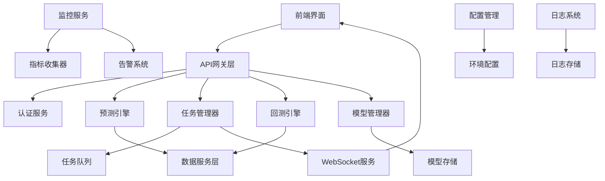

# 生产就绪功能实现设计文档

## 概述

本设计文档描述了如何将股票预测平台中的所有打桩和模拟功能替换为生产就绪的真实实现。系统已经具备了完整的数据管理基础设施，现在需要实现核心的预测、任务管理、回测等业务功能，以及完善的监控、认证、配置管理等支撑功能。

## 架构

### 整体架构


### 服务依赖关系
- **API网关层** 依赖认证服务进行权限验证
- **预测引擎** 依赖数据服务和模型管理器
- **任务管理器** 依赖任务队列和WebSocket服务
- **回测引擎** 依赖数据服务和技术指标服务
- **监控服务** 监控所有业务服务的性能指标
- **配置管理** 为所有服务提供配置支持

## 组件和接口

### 1. 预测引擎 (PredictionEngine)

#### 核心接口
```python
class PredictionEngine:
    def __init__(self, 
                 model_manager: ModelManager,
                 data_service: StockDataService,
                 feature_extractor: FeatureExtractor):
        self.model_manager = model_manager
        self.data_service = data_service
        self.feature_extractor = feature_extractor
        self.prediction_cache = {}
```

#### 主要方法
- `predict_single_stock()` - 预测单只股票
- `predict_multiple_stocks()` - 批量预测多只股票
- `calculate_confidence_interval()` - 计算置信区间
- `assess_risk_metrics()` - 评估风险指标
- `validate_prediction_inputs()` - 验证预测输入参数

#### 预测流程
1. **数据获取** - 从数据服务获取历史价格数据
2. **特征提取** - 计算技术指标和统计特征
3. **模型加载** - 从模型管理器加载训练好的模型
4. **预测计算** - 使用模型进行预测计算
5. **结果后处理** - 计算置信区间和风险指标

### 2. 任务管理器 (TaskManager)

#### 核心接口
```python
class TaskManager:
    def __init__(self,
                 task_queue: TaskQueue,
                 notification_service: NotificationService,
                 task_repository: TaskRepository):
        self.task_queue = task_queue
        self.notification_service = notification_service
        self.task_repository = task_repository
        self.active_tasks = {}
```

#### 主要方法
- `create_task()` - 创建新任务
- `execute_task()` - 执行任务
- `get_task_status()` - 获取任务状态
- `cancel_task()` - 取消任务
- `retry_failed_task()` - 重试失败任务

#### 任务生命周期
1. **创建** - 在数据库中创建任务记录
2. **排队** - 将任务加入执行队列
3. **执行** - 后台进程执行任务
4. **通知** - 通过WebSocket推送状态变化
5. **完成** - 保存结果并更新状态

### 3. 回测引擎 (BacktestEngine)

#### 核心接口
```python
class BacktestEngine:
    def __init__(self,
                 data_service: StockDataService,
                 strategy_factory: StrategyFactory,
                 portfolio_manager: PortfolioManager):
        self.data_service = data_service
        self.strategy_factory = strategy_factory
        self.portfolio_manager = portfolio_manager
```

#### 主要方法
- `run_backtest()` - 运行回测
- `generate_signals()` - 生成交易信号
- `calculate_returns()` - 计算收益率
- `assess_risk_metrics()` - 评估风险指标
- `generate_report()` - 生成回测报告

#### 回测流程
1. **数据准备** - 获取历史价格和技术指标数据
2. **策略初始化** - 根据策略配置初始化策略实例
3. **信号生成** - 逐日计算交易信号
4. **组合管理** - 模拟交易执行和资金管理
5. **性能评估** - 计算收益、风险和绩效指标

### 4. 模型管理器 (ModelManager)

#### 核心接口
```python
class ModelManager:
    def __init__(self,
                 model_storage: ModelStorage,
                 training_service: TrainingService,
                 evaluation_service: EvaluationService):
        self.model_storage = model_storage
        self.training_service = training_service
        self.evaluation_service = evaluation_service
        self.model_cache = {}
```

#### 主要方法
- `train_model()` - 训练新模型
- `load_model()` - 加载模型
- `save_model()` - 保存模型
- `evaluate_model()` - 评估模型性能
- `deploy_model()` - 部署模型到生产环境

#### 模型生命周期
1. **训练** - 使用历史数据训练模型
2. **验证** - 在验证集上评估模型性能
3. **保存** - 将模型权重和配置持久化
4. **部署** - 将模型加载到预测服务
5. **监控** - 持续监控模型性能

### 5. 任务状态通知服务 (NotificationService)

#### 核心接口
```python
class NotificationService:
    def __init__(self,
                 websocket_manager: WebSocketManager,
                 message_formatter: MessageFormatter):
        self.websocket_manager = websocket_manager
        self.message_formatter = message_formatter
        self.active_connections = {}
```

#### 主要方法
- `connect_client()` - 建立WebSocket连接
- `disconnect_client()` - 断开连接
- `notify_task_status()` - 推送任务状态变化
- `broadcast_system_alert()` - 广播系统告警
- `send_personal_notification()` - 发送个人通知

#### 通知类型
- **任务状态变化** - 开始、进行中、完成、失败
- **预测结果就绪** - 预测计算完成通知
- **系统告警** - 服务异常、性能问题
- **数据更新** - 新数据同步完成通知

## 数据模型

### 任务相关模型
```python
@dataclass
class Task:
    task_id: str
    task_name: str
    task_type: TaskType  # PREDICTION, BACKTEST, TRAINING
    status: TaskStatus   # CREATED, QUEUED, RUNNING, COMPLETED, FAILED
    user_id: str
    config: Dict[str, Any]
    created_at: datetime
    started_at: Optional[datetime]
    completed_at: Optional[datetime]
    progress: float
    result: Optional[Dict[str, Any]]
    error_message: Optional[str]

@dataclass
class PredictionTask:
    stock_codes: List[str]
    model_id: str
    horizon: str
    confidence_level: float
    features: List[str]
    
@dataclass
class BacktestTask:
    strategy_name: str
    stock_codes: List[str]
    start_date: datetime
    end_date: datetime
    initial_cash: float
    strategy_config: Dict[str, Any]
```

### 预测相关模型
```python
@dataclass
class PredictionResult:
    stock_code: str
    prediction_date: datetime
    predicted_price: float
    predicted_direction: int  # 1: 上涨, -1: 下跌, 0: 持平
    confidence_score: float
    confidence_interval: Tuple[float, float]
    risk_metrics: RiskMetrics
    model_id: str
    features_used: List[str]

@dataclass
class RiskMetrics:
    value_at_risk: float
    expected_shortfall: float
    volatility: float
    max_drawdown: float
    sharpe_ratio: float
```

### 模型相关模型
```python
@dataclass
class ModelInfo:
    model_id: str
    model_name: str
    model_type: str  # xgboost, lstm, transformer
    version: str
    training_data_period: Tuple[datetime, datetime]
    performance_metrics: Dict[str, float]
    hyperparameters: Dict[str, Any]
    created_at: datetime
    status: str  # training, ready, deployed, deprecated

@dataclass
class ModelPerformance:
    accuracy: float
    precision: float
    recall: float
    f1_score: float
    mse: float
    mae: float
    sharpe_ratio: float
    max_drawdown: float
```

### 回测相关模型
```python
@dataclass
class BacktestResult:
    backtest_id: str
    strategy_name: str
    period: Tuple[datetime, datetime]
    initial_cash: float
    final_value: float
    total_return: float
    annualized_return: float
    volatility: float
    sharpe_ratio: float
    max_drawdown: float
    win_rate: float
    profit_factor: float
    total_trades: int
    trade_history: List[Trade]

@dataclass
class Trade:
    trade_id: str
    stock_code: str
    action: str  # BUY, SELL
    quantity: int
    price: float
    timestamp: datetime
    commission: float
    pnl: float
```

## 正确性属性

*属性是一个特征或行为，应该在系统的所有有效执行中保持为真——本质上是关于系统应该做什么的正式声明。属性作为人类可读规范和机器可验证正确性保证之间的桥梁。*

### 属性反思

在编写具体属性之前，让我分析prework中识别的属性，消除冗余：

- 预测引擎的5个属性都是测试预测功能的不同方面，可以合并为预测准确性和错误处理两个核心属性
- 任务管理的5个属性都是测试任务生命周期管理，可以合并为任务完整性属性
- 回测引擎的5个属性都是测试回测功能，可以合并为回测准确性属性
- 模型管理的5个属性都是测试模型生命周期，可以合并为模型管理完整性属性
- 通知服务的5个属性都是测试WebSocket通知，可以合并为通知可靠性属性
- 性能监控的5个属性都是测试监控功能，可以合并为监控准确性属性
- 数据质量的5个属性都是测试数据质量保证，可以合并为数据质量保证属性
- 认证系统的5个属性都是测试安全功能，可以合并为安全性属性
- 配置管理的5个属性都是测试配置功能，可以合并为配置管理属性
- 日志系统的5个属性都是测试日志功能，可以合并为日志完整性属性

### 核心正确性属性

**属性 1: 预测引擎准确性**
*对于任何* 有效的预测请求，预测引擎应该使用真实的机器学习模型进行计算，返回基于历史数据训练的预测结果，并提供合理的置信区间和风险评估
**验证: 需求 1.1, 1.2, 1.3, 1.4, 1.5**

**属性 2: 任务管理完整性**
*对于任何* 任务操作（创建、执行、查询、完成），任务管理器应该正确维护任务状态，在数据库中持久化任务信息，并通过WebSocket推送状态变化
**验证: 需求 2.1, 2.2, 2.3, 2.4, 2.5**

**属性 3: 回测引擎准确性**
*对于任何* 回测请求，回测引擎应该使用真实的历史数据和技术指标，正确计算交易成本和风险指标，生成准确的回测报告
**验证: 需求 3.1, 3.2, 3.3, 3.4, 3.5**

**属性 4: 模型管理完整性**
*对于任何* 模型操作（训练、保存、加载、评估、部署），模型管理器应该正确处理模型生命周期，使用真实数据进行训练和评估，支持版本管理
**验证: 需求 4.1, 4.2, 4.3, 4.4, 4.5**

**属性 5: 通知服务可靠性**
*对于任何* 任务状态变化，通知服务应该通过WebSocket及时推送状态更新到所有相关客户端，包括任务开始、进度、完成和失败通知
**验证: 需求 5.1, 5.2, 5.3, 5.4, 5.5**

**属性 6: 性能监控准确性**
*对于任何* 系统运行状态，性能监控系统应该准确收集和记录真实的性能指标，及时检测异常并发送告警通知
**验证: 需求 6.1, 6.2, 6.3, 6.4, 6.5**

**属性 7: 数据质量保证**
*对于任何* 输入数据，数据质量系统应该验证数据格式和完整性，自动检测和修复异常数据，并生成质量评估报告
**验证: 需求 7.1, 7.2, 7.3, 7.4, 7.5**

**属性 8: 系统安全性**
*对于任何* 用户访问请求，认证系统应该正确验证用户身份和权限，记录所有操作审计日志，并检测异常访问模式
**验证: 需求 8.1, 8.2, 8.3, 8.4, 8.5**

**属性 9: 配置管理灵活性**
*对于任何* 环境部署，配置管理系统应该根据环境变量加载正确的配置，支持热更新和参数验证，安全管理敏感信息
**验证: 需求 9.1, 9.2, 9.3, 9.4, 9.5**

**属性 10: 日志系统完整性**
*对于任何* 系统操作，日志系统应该使用结构化格式记录所有操作和事件，支持日志聚合、搜索和长期归档
**验证: 需求 10.1, 10.2, 10.3, 10.4, 10.5**

<function_calls>
<invoke name="prework">
<parameter name="featureName">production-ready-implementation
## 错误处理

### 错误分类和处理策略

#### 1. 预测引擎错误
- **模型加载失败**: 使用备用模型或降级到简单预测算法
- **数据不足**: 扩大时间窗口或使用相似股票数据
- **计算超时**: 实施异步计算和结果缓存
- **内存不足**: 分批处理和流式计算

#### 2. 任务管理错误
- **任务队列满**: 实施优先级队列和任务调度
- **任务执行失败**: 自动重试机制和错误恢复
- **数据库连接失败**: 连接池管理和故障转移
- **WebSocket连接断开**: 自动重连和消息缓存

#### 3. 回测引擎错误
- **历史数据缺失**: 数据插值和缺失值处理
- **策略配置错误**: 参数验证和默认值设置
- **计算溢出**: 数值稳定性检查和边界处理
- **内存泄漏**: 资源管理和垃圾回收

#### 4. 模型管理错误
- **训练数据质量问题**: 数据清洗和异常值检测
- **模型收敛失败**: 超参数调优和早停机制
- **模型文件损坏**: 备份恢复和完整性检查
- **版本冲突**: 版本控制和兼容性检查

### 错误恢复机制
```python
class ErrorRecoveryManager:
    def handle_prediction_error(self, error: PredictionError) -> RecoveryAction
    def handle_task_error(self, error: TaskError) -> RecoveryAction
    def handle_model_error(self, error: ModelError) -> RecoveryAction
    def handle_system_error(self, error: SystemError) -> RecoveryAction
    def get_fallback_strategy(self, service: str, error_type: str) -> FallbackStrategy
```

## 测试策略

### 双重测试方法

本系统采用单元测试和基于属性的测试相结合的方法：

#### 单元测试
- **具体示例验证**: 测试特定的预测场景和任务执行流程
- **边界条件测试**: 测试极端输入值和资源限制情况
- **错误条件测试**: 测试各种异常情况的处理
- **集成点测试**: 测试服务之间的交互和数据流

#### 基于属性的测试
- **通用属性验证**: 通过随机输入验证系统的通用属性
- **全面输入覆盖**: 通过随机化测试大量输入组合
- **最少100次迭代**: 每个属性测试运行至少100次随机测试
- **属性标记格式**: **功能: production-ready-implementation, 属性 {编号}: {属性文本}**

#### 测试配置
- **属性测试库**: 使用Python的Hypothesis库进行基于属性的测试
- **测试标记**: 每个属性测试必须引用设计文档中的对应属性
- **并发测试**: 测试系统在高并发访问下的行为
- **性能测试**: 验证系统在负载下的性能表现
- **端到端测试**: 测试完整的用户工作流程

### 测试覆盖范围
- 预测引擎的模型加载和预测计算
- 任务管理的完整生命周期
- 回测引擎的策略执行和结果计算
- 模型管理的训练、保存和部署
- WebSocket通知的实时推送
- 性能监控的指标收集和告警
- 数据质量的检测和修复
- 用户认证和权限控制
- 配置管理的环境适配
- 日志系统的记录和查询

## 部署和运维

### 部署架构
- **容器化部署**: 使用Docker容器化所有服务
- **微服务架构**: 各服务独立部署和扩展
- **负载均衡**: 使用Nginx进行请求分发
- **数据库集群**: Redis集群和PostgreSQL主从复制
- **监控告警**: Prometheus + Grafana监控体系

### 运维策略
- **健康检查**: 所有服务提供健康检查端点
- **自动扩缩容**: 基于CPU和内存使用率自动扩缩容
- **故障恢复**: 自动重启和故障转移机制
- **备份策略**: 定期备份数据库和模型文件
- **日志管理**: 集中化日志收集和分析

### 性能优化
- **缓存策略**: 多层缓存提高响应速度
- **异步处理**: 使用消息队列处理耗时任务
- **数据库优化**: 索引优化和查询性能调优
- **资源管理**: 内存池和连接池管理
- **CDN加速**: 静态资源CDN分发

## 安全考虑

### 数据安全
- **数据加密**: 敏感数据传输和存储加密
- **访问控制**: 基于角色的细粒度权限控制
- **数据脱敏**: 测试环境数据脱敏处理
- **备份加密**: 备份数据加密存储

### 网络安全
- **HTTPS**: 所有API通信使用HTTPS
- **防火墙**: 网络层访问控制
- **DDoS防护**: 流量限制和异常检测
- **安全审计**: 定期安全漏洞扫描

### 应用安全
- **输入验证**: 严格的输入参数验证
- **SQL注入防护**: 使用参数化查询
- **XSS防护**: 输出内容转义处理
- **CSRF防护**: CSRF令牌验证

## 监控和告警

### 监控指标
- **业务指标**: 预测准确率、任务成功率、用户活跃度
- **技术指标**: API响应时间、错误率、资源使用率
- **基础设施指标**: CPU、内存、磁盘、网络使用情况

### 告警策略
- **分级告警**: 根据严重程度分级处理
- **多渠道通知**: 邮件、短信、钉钉等多渠道告警
- **告警抑制**: 避免告警风暴的抑制机制
- **自动恢复**: 部分问题的自动恢复处理

### 可观测性
- **分布式追踪**: 请求链路追踪和性能分析
- **指标可视化**: Grafana仪表板展示关键指标
- **日志分析**: ELK栈进行日志分析和搜索
- **异常检测**: 基于机器学习的异常模式检测