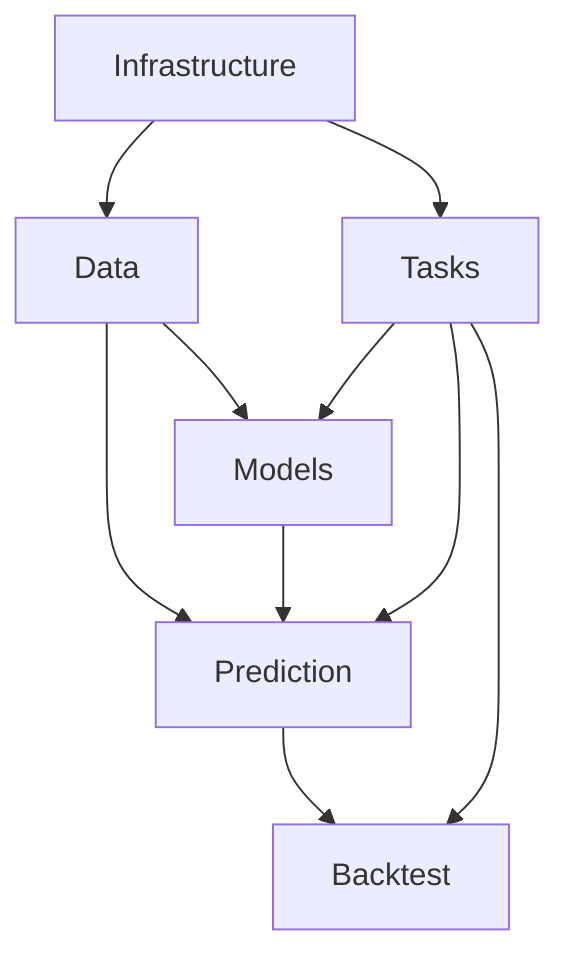

# 服务重构设计文档

## 概述

本设计文档描述了如何将 `backend/app/services` 目录下的 28 个服务文件按功能模块重新组织，以提高代码的可维护性和可读性。重构将创建 6 个功能模块，每个模块包含相关的服务文件。

## 架构

### 目录结构设计

```
backend/app/services/
├── __init__.py                    # 向后兼容的导入接口
├── data/                          # 数据管理模块
│   ├── __init__.py
│   ├── data_service.py
│   ├── data_service_simple.py
│   ├── data_sync_engine.py
│   ├── data_validator.py
│   ├── data_lifecycle.py
│   ├── parquet_manager.py
│   └── stream_processor.py
├── models/                        # 模型管理模块
│   ├── __init__.py
│   ├── model_training_service.py
│   ├── model_training.py
│   ├── model_storage.py
│   ├── model_deployment_service.py
│   ├── model_evaluation.py
│   ├── advanced_training.py
│   └── modern_models.py
├── prediction/                    # 预测引擎模块
│   ├── __init__.py
│   ├── prediction_engine.py
│   ├── prediction_fallback.py
│   ├── risk_assessment.py
│   ├── feature_extractor.py
│   └── technical_indicators.py
├── backtest/                      # 回测引擎模块
│   ├── __init__.py
│   ├── backtest_engine.py
│   └── backtest_executor.py
├── tasks/                         # 任务管理模块
│   ├── __init__.py
│   ├── task_manager.py
│   ├── task_queue.py
│   ├── task_execution_engine.py
│   └── task_notification_service.py
└── infrastructure/                # 基础设施模块
    ├── __init__.py
    ├── cache_service.py
    ├── connection_pool.py
    ├── monitoring_service.py
    ├── enhanced_logger.py
    ├── metrics_collector.py
    └── websocket_manager.py
```

## 组件和接口

### 数据管理模块 (data/)

**职责**: 处理所有与数据相关的操作，包括数据获取、存储、同步、验证和生命周期管理。

**组件**:
- `data_service.py` - 主要数据服务接口
- `data_service_simple.py` - 简化版数据服务
- `data_sync_engine.py` - 数据同步引擎
- `data_validator.py` - 数据验证服务
- `data_lifecycle.py` - 数据生命周期管理
- `parquet_manager.py` - Parquet 文件管理
- `stream_processor.py` - 流数据处理

**导出接口**:
```python
# data/__init__.py
from .data_service import DataService
from .data_service_simple import SimpleDataService
from .data_sync_engine import DataSyncEngine
from .data_validator import DataValidator
from .data_lifecycle import DataLifecycleManager
from .parquet_manager import ParquetManager
from .stream_processor import StreamProcessor

__all__ = [
    'DataService',
    'SimpleDataService', 
    'DataSyncEngine',
    'DataValidator',
    'DataLifecycleManager',
    'ParquetManager',
    'StreamProcessor'
]
```

### 模型管理模块 (models/)

**职责**: 处理机器学习模型的完整生命周期，包括训练、存储、部署和评估。

**组件**:
- `model_training_service.py` - 模型训练服务接口
- `model_training.py` - 模型训练实现
- `model_storage.py` - 模型存储管理
- `model_deployment_service.py` - 模型部署服务
- `model_evaluation.py` - 模型评估
- `advanced_training.py` - 高级训练算法
- `modern_models.py` - 现代模型实现

**导出接口**:
```python
# models/__init__.py
from .model_training_service import ModelTrainingService
from .model_training import ModelTrainer
from .model_storage import ModelStorage
from .model_deployment_service import ModelDeploymentService
from .model_evaluation import ModelEvaluator
from .advanced_training import AdvancedTrainer
from .modern_models import ModernModels

__all__ = [
    'ModelTrainingService',
    'ModelTrainer',
    'ModelStorage', 
    'ModelDeploymentService',
    'ModelEvaluator',
    'AdvancedTrainer',
    'ModernModels'
]
```

### 预测引擎模块 (prediction/)

**职责**: 处理股票预测、风险评估和技术分析相关功能。

**组件**:
- `prediction_engine.py` - 主预测引擎
- `prediction_fallback.py` - 预测回退机制
- `risk_assessment.py` - 风险评估
- `feature_extractor.py` - 特征提取
- `technical_indicators.py` - 技术指标计算

**导出接口**:
```python
# prediction/__init__.py
from .prediction_engine import PredictionEngine
from .prediction_fallback import PredictionFallback
from .risk_assessment import RiskAssessment
from .feature_extractor import FeatureExtractor
from .technical_indicators import TechnicalIndicators

__all__ = [
    'PredictionEngine',
    'PredictionFallback',
    'RiskAssessment',
    'FeatureExtractor',
    'TechnicalIndicators'
]
```

### 回测引擎模块 (backtest/)

**职责**: 处理策略回测和执行相关功能。

**组件**:
- `backtest_engine.py` - 回测引擎核心
- `backtest_executor.py` - 回测执行器

**导出接口**:
```python
# backtest/__init__.py
from .backtest_engine import BacktestEngine
from .backtest_executor import BacktestExecutor

__all__ = [
    'BacktestEngine',
    'BacktestExecutor'
]
```

### 任务管理模块 (tasks/)

**职责**: 处理异步任务调度、执行和通知。

**组件**:
- `task_manager.py` - 任务管理器
- `task_queue.py` - 任务队列
- `task_execution_engine.py` - 任务执行引擎
- `task_notification_service.py` - 任务通知服务

**导出接口**:
```python
# tasks/__init__.py
from .task_manager import TaskManager
from .task_queue import TaskQueue
from .task_execution_engine import TaskExecutionEngine
from .task_notification_service import TaskNotificationService

__all__ = [
    'TaskManager',
    'TaskQueue',
    'TaskExecutionEngine',
    'TaskNotificationService'
]
```

### 基础设施模块 (infrastructure/)

**职责**: 提供系统基础功能，如缓存、连接池、监控等。

**组件**:
- `cache_service.py` - 缓存服务
- `connection_pool.py` - 连接池管理
- `monitoring_service.py` - 监控服务
- `enhanced_logger.py` - 增强日志
- `metrics_collector.py` - 指标收集
- `websocket_manager.py` - WebSocket 管理

**导出接口**:
```python
# infrastructure/__init__.py
from .cache_service import CacheService
from .connection_pool import ConnectionPool
from .monitoring_service import MonitoringService
from .enhanced_logger import EnhancedLogger
from .metrics_collector import MetricsCollector
from .websocket_manager import WebSocketManager

__all__ = [
    'CacheService',
    'ConnectionPool',
    'MonitoringService',
    'EnhancedLogger',
    'MetricsCollector',
    'WebSocketManager'
]
```

## 数据模型

### 模块依赖关系



**依赖层次**:
1. **基础设施层**: 提供基础服务，不依赖其他模块
2. **数据层**: 依赖基础设施，提供数据服务
3. **核心业务层**: 模型、预测、任务管理，依赖数据和基础设施
4. **应用层**: 回测引擎，依赖所有下层模块

## 正确性属性

*属性是一个特征或行为，应该在系统的所有有效执行中保持为真——本质上是关于系统应该做什么的正式声明。属性作为人类可读规范和机器可验证正确性保证之间的桥梁。*

<function_calls>
<invoke name="prework">
<parameter name="featureName">services-refactoring

基于对验收标准的分析，大多数要求都是关于文件组织和模块结构的具体示例验证，只有少数涉及向后兼容性的通用属性。

### 属性反思

在审查所有可测试的标准后，我发现了一些冗余：
- 每个模块的文件组织要求（1.1, 2.1, 3.1, 4.1, 5.1, 6.1）都是相似的模式
- 每个模块的向后兼容性要求（1.4, 2.4, 3.4, 4.4, 5.4, 6.4, 7.1）可以合并为一个通用属性
- 模块接口导出要求（1.3, 2.3, 3.3, 4.3, 5.3, 6.3）遵循相同的模式

### 正确性属性

**属性 1: 向后兼容性保证**
*对于任何* 现有的服务导入语句，重构后该导入应该仍然有效并返回相同的服务类
**验证: 需求 1.4, 2.4, 3.4, 4.4, 5.4, 6.4, 7.1**

**属性 2: 模块完整性**
*对于任何* 功能模块，该模块应该包含其 README.md 中声明的所有服务文件
**验证: 需求 1.2, 2.2, 3.2, 4.2, 5.2, 6.2**

## 错误处理

### 导入错误处理

**缺失模块处理**:
- 如果子模块文件缺失，应该提供清晰的错误信息
- 向后兼容导入失败时，应该提供迁移建议

**循环依赖检测**:
- 在模块重构过程中检测潜在的循环依赖
- 提供依赖关系图验证工具

### 迁移错误处理

**文件移动失败**:
- 如果文件移动失败，应该回滚到原始状态
- 提供详细的失败原因和恢复建议

**测试失败处理**:
- 如果重构后测试失败，应该提供具体的失败分析
- 自动识别需要更新的导入语句

## 测试策略

### 双重测试方法

本重构将使用单元测试和属性测试的组合方法：

**单元测试**:
- 验证每个模块的文件组织是否正确
- 验证每个模块的 `__init__.py` 导出是否完整
- 验证文档文件是否存在且内容正确
- 验证弃用警告是否正确显示

**属性测试**:
- 验证向后兼容性在所有现有导入中保持一致
- 验证模块完整性在所有功能模块中保持一致
- 使用最少 100 次迭代测试各种导入组合

**属性测试配置**:
- 使用 Python 的 `hypothesis` 库进行属性测试
- 每个属性测试运行最少 100 次迭代
- 测试标签格式: **Feature: services-refactoring, Property {number}: {property_text}**

**测试平衡**:
- 单元测试专注于具体的文件组织和接口验证
- 属性测试专注于通用的兼容性和完整性保证
- 两种测试方法互补，确保全面覆盖

### 集成测试

**现有测试兼容性**:
- 运行完整的现有测试套件，确保无需修改导入语句
- 验证所有服务功能在重构后仍然正常工作

**性能测试**:
- 确保重构后的导入性能不会显著下降
- 测试模块加载时间和内存使用

### 回归测试

**API 兼容性测试**:
- 验证所有公共 API 接口保持不变
- 测试服务实例化和方法调用的兼容性

**依赖关系测试**:
- 验证模块间依赖关系符合设计
- 检测意外的循环依赖或紧耦合