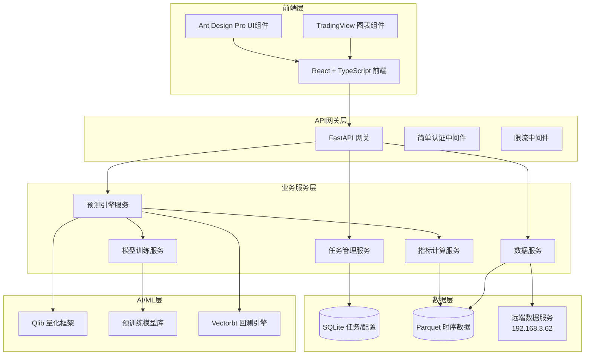
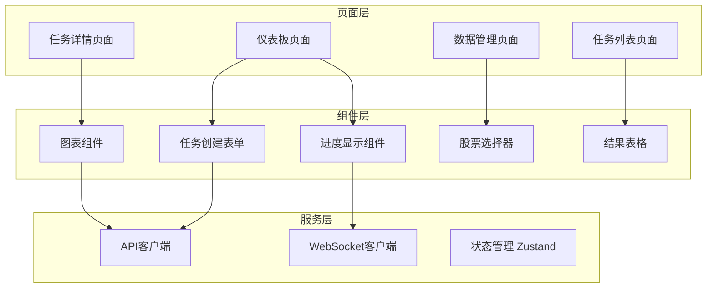
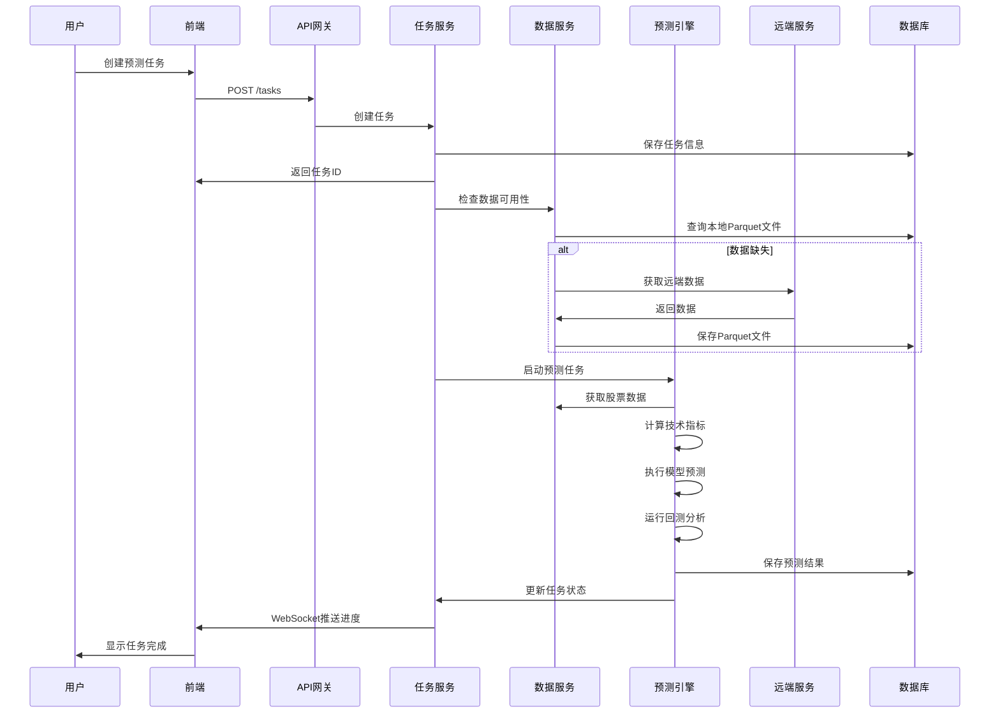

# 设计文档

## 概述

股票预测平台采用现代微服务架构，结合任务式预测管理和统一的Parquet数据存储。系统基于Microsoft Qlib量化框架构建核心预测引擎，使用React + TypeScript构建现代化前端界面，通过FastAPI提供高性能的后端API服务。

平台的核心设计理念是：
- **任务驱动**：所有预测操作都以任务形式管理，支持进度跟踪和历史查询
- **数据统一**：使用Parquet格式统一存储所有时序数据，简化架构
- **模块化**：松耦合的微服务设计，每个组件可独立部署和扩展
- **现代化**：采用最新的AI/ML技术栈和前端框架

## 架构

### 整体架构图



### 服务架构

系统采用基于领域驱动设计（DDD）的微服务架构，每个服务负责特定的业务领域：

1. **任务管理服务**：负责预测任务的生命周期管理
2. **预测引擎服务**：核心预测逻辑和策略执行
3. **数据服务**：数据获取、存储和管理
4. **指标计算服务**：技术指标计算和特征工程
5. **模型训练服务**：机器学习模型的训练和管理

## 组件和接口

### 前端组件架构



#### 核心前端组件

**1. 任务管理组件**
```typescript
interface TaskManagementProps {
  onTaskCreate: (task: PredictionTask) => void;
  onTaskSelect: (taskId: string) => void;
  tasks: PredictionTask[];
}

interface PredictionTask {
  id: string;
  name: string;
  stocks: string[];
  status: 'pending' | 'running' | 'completed' | 'failed';
  progress: number;
  createdAt: Date;
  completedAt?: Date;
  results?: TaskResult[];
}
```

**2. 图表展示组件**
```typescript
interface ChartComponentProps {
  stockCode: string;
  data: StockData[];
  predictions: PredictionResult[];
  indicators: TechnicalIndicator[];
}

interface StockData {
  date: Date;
  open: number;
  high: number;
  low: number;
  close: number;
  volume: number;
}
```

### 后端API接口

#### 任务管理API

```python
# FastAPI 路由定义
@router.post("/tasks", response_model=TaskResponse)
async def create_prediction_task(task: TaskCreateRequest):
    """创建新的预测任务"""
    pass

@router.get("/tasks", response_model=List[TaskSummary])
async def list_tasks(skip: int = 0, limit: int = 100):
    """获取任务列表"""
    pass

@router.get("/tasks/{task_id}", response_model=TaskDetail)
async def get_task_detail(task_id: str):
    """获取任务详情"""
    pass

@router.get("/tasks/{task_id}/progress")
async def get_task_progress(task_id: str):
    """获取任务进度（WebSocket）"""
    pass
```

#### 数据服务API

```python
@router.get("/stocks/{stock_code}/data")
async def get_stock_data(
    stock_code: str,
    start_date: date,
    end_date: date,
    indicators: Optional[List[str]] = None
):
    """获取股票数据和技术指标"""
    pass

@router.get("/data/status")
async def get_data_service_status():
    """获取数据服务状态"""
    pass

@router.post("/data/sync")
async def sync_data_from_remote(stock_codes: List[str]):
    """从远端同步数据"""
    pass
```

### 数据模型

#### 核心数据结构

```python
from pydantic import BaseModel
from datetime import datetime
from typing import List, Optional, Dict, Any

class StockData(BaseModel):
    """股票基础数据"""
    stock_code: str
    date: datetime
    open: float
    high: float
    low: float
    close: float
    volume: int
    adj_close: Optional[float] = None

class TechnicalIndicator(BaseModel):
    """技术指标数据"""
    stock_code: str
    date: datetime
    indicator_name: str
    value: float
    parameters: Dict[str, Any]

class PredictionResult(BaseModel):
    """预测结果"""
    stock_code: str
    prediction_date: datetime
    target_date: datetime
    probability: float
    confidence_interval: tuple[float, float]
    risk_score: float
    expected_return: float

class TaskResult(BaseModel):
    """任务结果"""
    task_id: str
    stock_code: str
    prediction: PredictionResult
    backtest_metrics: Dict[str, float]
    trade_records: List[TradeRecord]
    
class TradeRecord(BaseModel):
    """交易记录"""
    date: datetime
    action: str  # 'buy' | 'sell' | 'hold'
    price: float
    quantity: int
    reason: str
```

## 数据模型

### 数据存储架构

系统采用混合存储策略，针对不同类型的数据使用最适合的存储方案：

#### 1. Parquet 时序数据存储

```
data/
├── stocks/
│   ├── daily/
│   │   ├── 000001.SZ/
│   │   │   ├── 2023.parquet
│   │   │   ├── 2024.parquet
│   │   │   └── 2025.parquet
│   │   └── 000002.SZ/
│   └── indicators/
│       ├── ma/
│       ├── rsi/
│       └── macd/
└── predictions/
    ├── task_001/
    └── task_002/
```

**Parquet文件结构**：
```python
# 股票日线数据 Schema
stock_daily_schema = pa.schema([
    pa.field('date', pa.date32()),
    pa.field('stock_code', pa.string()),
    pa.field('open', pa.float64()),
    pa.field('high', pa.float64()),
    pa.field('low', pa.float64()),
    pa.field('close', pa.float64()),
    pa.field('volume', pa.int64()),
    pa.field('adj_close', pa.float64()),
])

# 技术指标数据 Schema
indicator_schema = pa.schema([
    pa.field('date', pa.date32()),
    pa.field('stock_code', pa.string()),
    pa.field('indicator_name', pa.string()),
    pa.field('value', pa.float64()),
    pa.field('parameters', pa.string()),  # JSON string
])
```

#### 2. SQLite 配置和任务数据

```sql
-- 任务表
CREATE TABLE prediction_tasks (
    id TEXT PRIMARY KEY,
    name TEXT NOT NULL,
    description TEXT,
    stock_codes TEXT NOT NULL,  -- JSON array
    parameters TEXT NOT NULL,   -- JSON object
    status TEXT NOT NULL,       -- pending, running, completed, failed
    progress REAL DEFAULT 0.0,
    created_at TIMESTAMP DEFAULT CURRENT_TIMESTAMP,
    started_at TIMESTAMP,
    completed_at TIMESTAMP,
    error_message TEXT
);

-- 任务结果表
CREATE TABLE task_results (
    id INTEGER PRIMARY KEY AUTOINCREMENT,
    task_id TEXT NOT NULL,
    stock_code TEXT NOT NULL,
    prediction_data TEXT NOT NULL,  -- JSON object
    backtest_metrics TEXT NOT NULL, -- JSON object
    created_at TIMESTAMP DEFAULT CURRENT_TIMESTAMP,
    FOREIGN KEY (task_id) REFERENCES prediction_tasks (id)
);

-- 模型元数据表
CREATE TABLE model_metadata (
    id TEXT PRIMARY KEY,
    name TEXT NOT NULL,
    type TEXT NOT NULL,         -- transformer, lstm, xgboost, etc.
    version TEXT NOT NULL,
    parameters TEXT NOT NULL,   -- JSON object
    performance_metrics TEXT,   -- JSON object
    file_path TEXT NOT NULL,
    created_at TIMESTAMP DEFAULT CURRENT_TIMESTAMP,
    is_active BOOLEAN DEFAULT FALSE
);

-- 系统配置表
CREATE TABLE system_config (
    key TEXT PRIMARY KEY,
    value TEXT NOT NULL,
    description TEXT,
    updated_at TIMESTAMP DEFAULT CURRENT_TIMESTAMP
);
```

### 数据流架构



## 正确性属性

*属性是一个特征或行为，应该在系统的所有有效执行中保持为真——本质上是关于系统应该做什么的正式声明。属性作为人类可读规范和机器可验证正确性保证之间的桥梁。*

基于需求分析，以下是系统必须满足的核心正确性属性：

### 属性 1: 数据获取本地优先策略
*对于任何*股票数据请求，系统应该首先检查本地Parquet文件，只有在数据缺失时才从远端服务获取，并将获取的数据保存为Parquet格式
**验证：需求 1.2, 1.3, 7.3**

### 属性 2: 技术指标计算完整性
*对于任何*有效的股票价格和成交量数据，技术指标计算器应该能够计算所有支持的指标（MA、RSI、MACD、布林带），并返回结构化的结果
**验证：需求 2.1, 2.2, 2.4**

### 属性 3: 输入数据验证一致性
*对于任何*输入数据，系统应该验证数据的完整性和有效性，拒绝无效输入并提供明确的错误信息
**验证：需求 2.3, 6.1**

### 属性 4: 模型训练结果保存
*对于任何*完成训练的机器学习模型，系统应该评估其性能指标（准确率、夏普比率、最大回撤）并保存最佳模型
**验证：需求 3.3**

### 属性 5: 任务生命周期管理
*对于任何*预测任务，系统应该正确管理其完整生命周期：创建时分配唯一ID并保存任务信息，执行时实时更新状态，完成时保存详细结果
**验证：需求 4.1, 4.2, 4.3**

### 属性 6: API处理一致性
*对于任何*API请求，网关应该验证请求格式，正确路由到后端服务，并返回统一格式的响应
**验证：需求 6.1, 6.2, 6.3**

### 属性 7: 数据存储格式统一性
*对于任何*时间序列数据（股票价格、成交量、技术指标），系统应该统一使用Parquet格式存储，并按股票代码和时间范围组织目录结构
**验证：需求 7.1, 7.4**

### 属性 8: 前端数据展示完整性
*对于任何*任务结果查看请求，前端应该展示完整的股票信息，包括价格走势图、技术指标、预测结果、交易记录和回测指标
**验证：需求 5.4**

### 属性 9: 批量处理能力
*对于任何*包含多只股票的批量请求，系统应该能够并行处理所有股票，并保持单只股票处理的相同质量标准
**验证：需求 2.5**

### 属性 10: 增量数据更新
*对于任何*时间范围的数据请求，系统应该只获取缺失的时间段数据，避免重复下载已存在的数据
**验证：需求 1.5**

## 错误处理

### 错误分类和处理策略

系统采用分层错误处理策略，根据错误类型和严重程度采用不同的处理方式：

#### 1. 数据层错误
- **远端服务不可用**：自动切换到本地数据，记录服务状态
- **数据格式错误**：拒绝处理并返回详细错误信息
- **文件损坏**：尝试从备份恢复，失败则重新获取

#### 2. 计算层错误
- **模型加载失败**：回退到基线模型或返回错误状态
- **指标计算异常**：跳过异常指标，记录警告信息
- **内存不足**：分批处理或降低并发度

#### 3. API层错误
- **请求格式错误**：返回400状态码和详细错误信息
- **服务超时**：实施重试机制，最多重试3次
- **限流触发**：返回429状态码和重试建议

#### 4. 前端错误
- **网络连接失败**：显示离线模式，缓存用户操作
- **数据加载失败**：显示错误提示和重试按钮
- **组件渲染异常**：使用错误边界捕获并显示友好提示

### 错误恢复机制

```python
class ErrorRecoveryManager:
    """错误恢复管理器"""
    
    async def handle_data_service_error(self, error: Exception) -> DataServiceResponse:
        """处理数据服务错误"""
        if isinstance(error, ConnectionError):
            # 切换到本地数据
            return await self.fallback_to_local_data()
        elif isinstance(error, DataFormatError):
            # 数据格式错误，无法恢复
            raise ValidationError(f"数据格式错误: {error}")
        else:
            # 其他错误，记录并重试
            await self.log_error(error)
            return await self.retry_with_backoff()
    
    async def handle_prediction_error(self, task_id: str, error: Exception):
        """处理预测任务错误"""
        await self.update_task_status(task_id, "failed", str(error))
        await self.notify_user(task_id, f"任务执行失败: {error}")
        
        # 如果是模型错误，尝试使用备用模型
        if isinstance(error, ModelLoadError):
            await self.retry_with_fallback_model(task_id)
```

## 测试策略

### 双重测试方法

系统采用单元测试和基于属性的测试相结合的综合测试策略：

#### 单元测试
- **具体示例验证**：测试特定输入的预期输出
- **边界条件测试**：测试极端情况和边界值
- **错误条件测试**：验证错误处理逻辑
- **集成点测试**：验证组件间的接口

#### 基于属性的测试
- **通用属性验证**：验证所有输入都满足的通用属性
- **随机输入覆盖**：通过随机生成的输入发现边缘情况
- **不变量检查**：验证系统状态的不变量
- **往返属性测试**：验证序列化/反序列化的一致性

### 测试框架和工具

**后端测试**：
- **pytest**：主要测试框架
- **Hypothesis**：基于属性的测试库，每个属性测试运行最少100次迭代
- **pytest-asyncio**：异步测试支持
- **pytest-mock**：模拟外部依赖

**前端测试**：
- **Jest**：JavaScript测试框架
- **React Testing Library**：React组件测试
- **fast-check**：JavaScript属性测试库
- **Cypress**：端到端测试

### 测试配置要求

每个基于属性的测试必须：
- 运行最少100次迭代（由于随机化特性）
- 使用注释引用设计文档中的属性
- 标签格式：**Feature: stock-prediction-platform, Property {number}: {property_text}**

示例测试标签：
```python
@given(stock_data=stock_data_strategy())
def test_technical_indicator_completeness(stock_data):
    """
    Feature: stock-prediction-platform, Property 2: 技术指标计算完整性
    对于任何有效的股票价格和成交量数据，技术指标计算器应该能够计算所有支持的指标
    """
    # 测试实现
    pass
```

### 测试数据生成策略

**智能生成器设计**：
- **股票数据生成器**：生成符合金融市场规律的价格数据
- **时间序列生成器**：生成连续的时间序列数据
- **任务参数生成器**：生成有效的预测任务配置
- **边界值生成器**：专门生成边界和异常情况

```python
from hypothesis import strategies as st

# 股票价格数据生成策略
@st.composite
def stock_price_strategy(draw):
    """生成符合金融规律的股票价格数据"""
    base_price = draw(st.floats(min_value=1.0, max_value=1000.0))
    volatility = draw(st.floats(min_value=0.01, max_value=0.1))
    
    # 确保 high >= max(open, close) 且 low <= min(open, close)
    open_price = base_price
    close_price = draw(st.floats(
        min_value=base_price * (1 - volatility),
        max_value=base_price * (1 + volatility)
    ))
    
    high = draw(st.floats(
        min_value=max(open_price, close_price),
        max_value=max(open_price, close_price) * 1.05
    ))
    
    low = draw(st.floats(
        min_value=min(open_price, close_price) * 0.95,
        max_value=min(open_price, close_price)
    ))
    
    return StockData(
        open=open_price,
        high=high,
        low=low,
        close=close_price,
        volume=draw(st.integers(min_value=1000, max_value=10000000))
    )
```

这个测试策略确保了系统的可靠性和正确性，通过单元测试捕获具体的错误，通过属性测试验证通用的正确性保证。