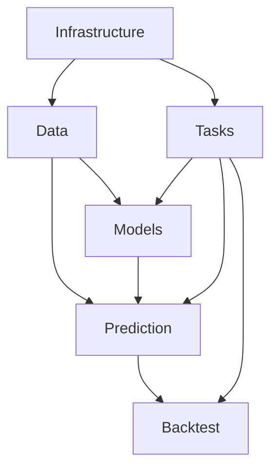

# 服务层架构

本目录包含股票预测平台的所有业务服务，按功能模块组织。

## 模块架构

```
services/
├── data/                    # 数据管理模块
├── models/                  # 模型管理模块
├── prediction/              # 预测引擎模块
├── backtest/               # 回测引擎模块
├── tasks/                  # 任务管理模块
├── infrastructure/         # 基础设施模块
├── __init__.py            # 向后兼容性接口
├── README.md              # 本文档
└── MIGRATION_GUIDE.md     # 迁移指南
```

## 模块依赖关系



### 依赖层次说明

1. **基础设施层 (Infrastructure)**
   - 提供缓存、连接池、监控、日志等基础服务
   - 不依赖其他业务模块
   - 为所有其他模块提供底层支持

2. **数据层 (Data)**
   - 依赖基础设施层的缓存和连接池
   - 提供数据获取、存储、同步、验证服务
   - 为上层业务模块提供数据支持

3. **核心业务层**
   - **Models**: 模型训练、存储、部署、评估
   - **Prediction**: 预测引擎、风险评估、特征提取
   - **Tasks**: 任务管理、队列调度、执行引擎
   - 依赖数据层和基础设施层

4. **应用层 (Backtest)**
   - 回测引擎，策略验证
   - 依赖所有下层模块

## 模块职责

### 数据管理模块 (data/)
- **职责**: 数据获取、存储、同步、验证、生命周期管理
- **核心服务**: DataService, ParquetManager, DataSyncEngine
- **依赖**: infrastructure

### 模型管理模块 (models/)
- **职责**: 模型训练、存储、部署、评估、版本管理
- **核心服务**: ModelTrainingService, ModelStorage, ModelDeploymentService
- **依赖**: data, infrastructure, tasks

### 预测引擎模块 (prediction/)
- **职责**: 股票预测、风险评估、技术分析、特征工程
- **核心服务**: PredictionEngine, RiskAssessmentService, FeatureExtractor
- **依赖**: models, data, infrastructure

### 回测引擎模块 (backtest/)
- **职责**: 策略回测、交易模拟、性能评估
- **核心服务**: BacktestEngine, BacktestExecutor
- **依赖**: prediction, models, data, infrastructure

### 任务管理模块 (tasks/)
- **职责**: 异步任务调度、执行、通知、进度跟踪
- **核心服务**: TaskManager, TaskQueueManager, TaskExecutionEngine
- **依赖**: infrastructure

### 基础设施模块 (infrastructure/)
- **职责**: 缓存、连接池、监控、日志、WebSocket管理
- **核心服务**: CacheManager, ConnectionPoolManager, EnhancedLogger
- **依赖**: 无（基础层）

## 使用指南

### 推荐的导入方式

```python
# 推荐：使用具体模块导入
from app.services.data import DataService
from app.services.models import ModelTrainingService
from app.services.prediction import PredictionEngine
from app.services.backtest import BacktestEngine
from app.services.tasks import TaskManager
from app.services.infrastructure import CacheManager

# 不推荐：从根服务导入（虽然仍然支持）
from app.services import DataService  # 会显示弃用警告
```

### 服务初始化顺序

建议按以下顺序初始化服务：

1. **基础设施服务**: 缓存、连接池、日志
2. **数据服务**: 数据源连接、数据验证
3. **业务服务**: 模型、预测、任务管理
4. **应用服务**: 回测引擎

### 配置管理

每个模块都支持独立配置：

```python
# 示例：配置数据服务
data_config = {
    "cache_enabled": True,
    "connection_pool_size": 10,
    "sync_interval": 3600
}

data_service = DataService(config=data_config)
```

## 性能考虑

### 导入性能
- 新的模块化结构减少了不必要的模块加载
- 支持按需导入，提升启动性能
- 避免了循环依赖问题

### 运行时性能
- 基础设施模块提供缓存和连接池优化
- 异步任务处理提升并发性能
- 模块间松耦合减少性能干扰

## 扩展指南

### 添加新服务

1. 确定服务所属模块
2. 在相应模块目录下创建服务文件
3. 在模块的 `__init__.py` 中导出服务
4. 更新模块的 README.md 文档
5. 添加相应的测试

### 添加新模块

1. 创建模块目录和 `__init__.py`
2. 实现模块服务
3. 创建模块 README.md 文档
4. 更新依赖关系图
5. 在主服务 `__init__.py` 中添加向后兼容支持

## 测试策略

### 单元测试
- 每个服务都应有对应的单元测试
- 测试文件使用新的导入方式
- 模拟外部依赖

### 集成测试
- 测试模块间的交互
- 验证依赖关系正确性
- 测试完整的业务流程

### 性能测试
- 测试服务启动时间
- 测试内存使用情况
- 测试并发处理能力

## 监控和日志

### 服务监控
- 每个模块都集成了监控功能
- 支持健康检查和性能指标收集
- 提供统一的监控接口

### 日志管理
- 使用结构化日志格式
- 支持日志级别和分类
- 自动日志轮转和归档

## 故障排除

### 常见问题

1. **导入错误**: 检查导入路径是否正确
2. **循环依赖**: 检查模块依赖关系
3. **配置错误**: 验证配置参数
4. **性能问题**: 检查缓存和连接池配置

### 调试技巧

1. 启用详细日志记录
2. 使用性能分析工具
3. 检查服务健康状态
4. 监控资源使用情况

## 版本兼容性

- **当前版本**: 支持新旧两种导入方式
- **下一版本**: 将移除向后兼容性支持
- **迁移建议**: 尽快使用新的导入方式

详细的迁移指南请参考 [MIGRATION_GUIDE.md](./MIGRATION_GUIDE.md)。