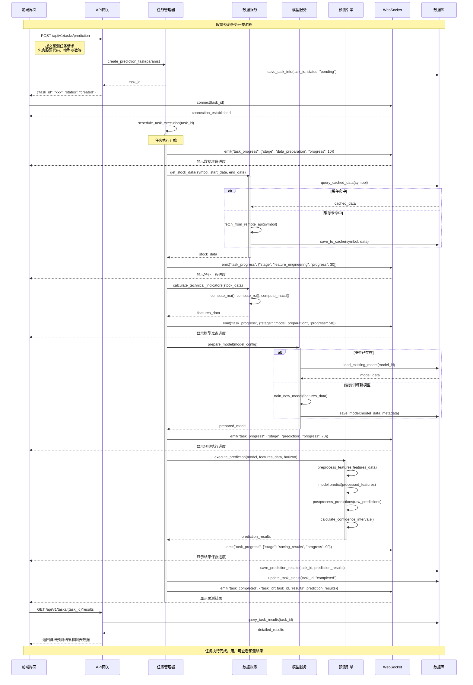

# 股票预测平台系统架构图

本文档包含股票预测平台的完整系统架构图、类图和时序图。

## 📋 目录

1. [系统整体架构图](#系统整体架构图)
2. [核心服务类图](#核心服务类图)
3. [股票预测任务执行时序图](#股票预测任务执行时序图)
4. [MLOps模型训练时序图](#mlops模型训练时序图)
5. [查看工具推荐](#查看工具推荐)

---

## 系统整体架构图

```mermaid
graph TB
    subgraph "前端层 (Frontend Layer)"
        UI[React/Next.js UI]
        WS[WebSocket Client]
        API_CLIENT[API Client]
        STORE[Zustand Store]
    end
    
    subgraph "API网关层 (API Gateway Layer)"
        GATEWAY[FastAPI Gateway]
        MIDDLEWARE[中间件栈]
        CORS[CORS处理]
        RATE_LIMIT[限流控制]
        AUTH[认证授权]
    end
    
    subgraph "业务服务层 (Business Service Layer)"
        subgraph "核心服务 (Core Services)"
            DATA_SVC[数据服务]
            MODEL_SVC[模型服务]
            PRED_SVC[预测服务]
            TASK_SVC[任务服务]
        end
        
        subgraph "扩展服务 (Extended Services)"
            QLIB_SVC[Qlib服务]
            BACKTEST_SVC[回测服务]
            MONITOR_SVC[监控服务]
            FEATURE_SVC[特征服务]
        end
        
        subgraph "MLOps服务 (MLOps Services)"
            AUTOML_SVC[AutoML服务]
            VERSION_SVC[版本管理]
            EXPLAIN_SVC[可解释性]
            AB_TEST_SVC[A/B测试]
        end
    end
    
    subgraph "基础设施层 (Infrastructure Layer)"
        CACHE[缓存服务]
        POOL[连接池]
        LOGGER[日志服务]
        METRICS[指标收集]
        SCHEDULER[任务调度]
        RESOURCE[资源监控]
    end
    
    subgraph "数据层 (Data Layer)"
        DB[(SQLite/PostgreSQL)]
        PARQUET[(Parquet文件)]
        QLIB_DATA[(Qlib数据)]
        REMOTE_API[远程数据API]
    end
    
    subgraph "外部服务 (External Services)"
        STOCK_API[股票数据API]
        ML_MODELS[机器学习模型]
        NOTIFICATION[通知服务]
    end
    
    %% 连接关系
    UI --> API_CLIENT
    WS --> GATEWAY
    API_CLIENT --> GATEWAY
    STORE --> UI
    
    GATEWAY --> MIDDLEWARE
    MIDDLEWARE --> CORS
    MIDDLEWARE --> RATE_LIMIT
    MIDDLEWARE --> AUTH
    
    GATEWAY --> DATA_SVC
    GATEWAY --> MODEL_SVC
    GATEWAY --> PRED_SVC
    GATEWAY --> TASK_SVC
    GATEWAY --> QLIB_SVC
    GATEWAY --> BACKTEST_SVC
    GATEWAY --> MONITOR_SVC
    GATEWAY --> FEATURE_SVC
    GATEWAY --> AUTOML_SVC
    GATEWAY --> VERSION_SVC
    GATEWAY --> EXPLAIN_SVC
    GATEWAY --> AB_TEST_SVC
    
    DATA_SVC --> CACHE
    MODEL_SVC --> POOL
    PRED_SVC --> LOGGER
    TASK_SVC --> METRICS
    QLIB_SVC --> SCHEDULER
    MONITOR_SVC --> RESOURCE
    
    DATA_SVC --> DB
    DATA_SVC --> PARQUET
    DATA_SVC --> REMOTE_API
    QLIB_SVC --> QLIB_DATA
    
    REMOTE_API --> STOCK_API
    MODEL_SVC --> ML_MODELS
    TASK_SVC --> NOTIFICATION
    
    %% 样式
    classDef frontend fill:#e1f5fe
    classDef gateway fill:#f3e5f5
    classDef service fill:#e8f5e8
    classDef infrastructure fill:#fff3e0
    classDef data fill:#fce4ec
    classDef external fill:#f1f8e9
    
    class UI,WS,API_CLIENT,STORE frontend
    class GATEWAY,MIDDLEWARE,CORS,RATE_LIMIT,AUTH gateway
    class DATA_SVC,MODEL_SVC,PRED_SVC,TASK_SVC,QLIB_SVC,BACKTEST_SVC,MONITOR_SVC,FEATURE_SVC,AUTOML_SVC,VERSION_SVC,EXPLAIN_SVC,AB_TEST_SVC service
    class CACHE,POOL,LOGGER,METRICS,SCHEDULER,RESOURCE infrastructure
    class DB,PARQUET,QLIB_DATA,REMOTE_API data
    class STOCK_API,ML_MODELS,NOTIFICATION external
```



### 架构层次说明

1. **前端层 (Frontend Layer)**
   - React/Next.js UI: 用户界面组件
   - WebSocket Client: 实时通信客户端
   - API Client: HTTP API调用客户端
   - Zustand Store: 状态管理

2. **API网关层 (API Gateway Layer)**
   - FastAPI Gateway: 统一API入口
   - 中间件栈: 请求处理中间件
   - CORS处理: 跨域资源共享
   - 限流控制: API请求限流
   - 认证授权: 用户身份验证

3. **业务服务层 (Business Service Layer)**
   - 核心服务: 数据、模型、预测、任务管理
   - 扩展服务: Qlib集成、回测、监控、特征工程
   - MLOps服务: AutoML、版本管理、可解释性、A/B测试

4. **基础设施层 (Infrastructure Layer)**
   - 缓存服务、连接池、日志、指标收集、任务调度、资源监控

5. **数据层 (Data Layer)**
   - 多种数据存储: 关系型数据库、Parquet文件、Qlib数据、远程API

---

## 核心服务类图

```mermaid
classDiagram
    %% 基础设施层
    class CacheService {
        +get(key: str) Any
        +set(key: str, value: Any, ttl: int)
        +delete(key: str)
        +clear()
    }
    
    class ConnectionPool {
        +get_connection() Connection
        +release_connection(conn: Connection)
        +close_all()
    }
    
    class EnhancedLogger {
        +info(message: str)
        +error(message: str, exc_info: bool)
        +warning(message: str)
        +debug(message: str)
    }
    
    %% 数据服务层
    class DataService {
        -cache_service: CacheService
        -logger: EnhancedLogger
        +get_stock_data(symbol: str, start_date: str, end_date: str) DataFrame
        +sync_data(symbols: List[str])
        +validate_data(data: DataFrame) bool
        +get_technical_indicators(symbol: str) Dict
    }
    
    class ParquetManager {
        -data_path: str
        +save_data(symbol: str, data: DataFrame)
        +load_data(symbol: str, start_date: str, end_date: str) DataFrame
        +list_available_symbols() List[str]
        +get_data_info(symbol: str) Dict
    }
    
    %% 模型服务层
    class ModelTrainingService {
        -model_storage: ModelStorage
        -logger: EnhancedLogger
        +train_model(config: TrainingConfig) TrainingResult
        +evaluate_model(model_id: str, test_data: DataFrame) EvaluationResult
        +get_training_progress(task_id: str) ProgressInfo
    }
    
    class ModelStorage {
        -storage_path: str
        +save_model(model: Any, metadata: Dict) str
        +load_model(model_id: str) Any
        +list_models() List[ModelInfo]
        +delete_model(model_id: str)
    }
    
    %% 预测服务层
    class PredictionEngine {
        -model_service: ModelTrainingService
        -data_service: DataService
        +predict(symbol: str, model_id: str, horizon: int) PredictionResult
        +batch_predict(symbols: List[str], model_id: str) List[PredictionResult]
        +get_feature_importance(model_id: str) Dict
    }
    
    class RiskAssessmentService {
        +calculate_var(returns: List[float], confidence: float) float
        +calculate_sharpe_ratio(returns: List[float], risk_free_rate: float) float
        +assess_portfolio_risk(positions: List[Position]) RiskMetrics
    }
    
    %% 任务管理层
    class TaskManager {
        -task_queue: TaskQueue
        -execution_engine: TaskExecutionEngine
        +create_task(task_type: str, params: Dict) str
        +get_task_status(task_id: str) TaskStatus
        +cancel_task(task_id: str)
        +list_tasks(user_id: str) List[TaskInfo]
    }
    
    class TaskExecutionEngine {
        -thread_pool: ThreadPoolExecutor
        +execute_task(task: Task)
        +get_execution_status(task_id: str) ExecutionStatus
        +stop_execution(task_id: str)
    }
    
    %% Qlib集成层
    class QlibModelManager {
        -qlib_provider: EnhancedQlibProvider
        +train_qlib_model(config: QlibConfig) QlibResult
        +predict_with_qlib(symbol: str, model_name: str) QlibPrediction
        +get_qlib_models() List[QlibModelInfo]
    }
    
    class EnhancedQlibProvider {
        -data_path: str
        +initialize_qlib()
        +prepare_data(symbols: List[str]) QlibDataset
        +create_model(model_type: str) QlibModel
    }
    
    %% 关系定义
    DataService --> CacheService : uses
    DataService --> EnhancedLogger : uses
    DataService --> ParquetManager : uses
    
    ModelTrainingService --> ModelStorage : uses
    ModelTrainingService --> EnhancedLogger : uses
    
    PredictionEngine --> ModelTrainingService : uses
    PredictionEngine --> DataService : uses
    
    TaskManager --> TaskExecutionEngine : uses
    
    QlibModelManager --> EnhancedQlibProvider : uses
    
    %% 继承关系
    QlibModelManager --|> ModelTrainingService : extends
```



### 类图说明

- **基础设施层**: 提供缓存、连接池、日志等基础服务
- **数据服务层**: 负责数据获取、存储、验证和技术指标计算
- **模型服务层**: 处理模型训练、存储和管理
- **预测服务层**: 执行股票预测和风险评估
- **任务管理层**: 管理异步任务的执行和调度
- **Qlib集成层**: 集成Qlib量化框架的模型管理

---

## 股票预测任务执行时序图



### 时序图说明

1. **任务创建**: 用户通过前端提交预测任务
2. **WebSocket连接**: 建立实时通信连接
3. **异步执行**: 任务管理器异步执行预测流程
4. **数据准备**: 获取股票数据，支持缓存机制
5. **特征工程**: 计算技术指标和特征
6. **模型准备**: 加载或训练预测模型
7. **预测执行**: 执行股票价格预测
8. **结果保存**: 保存预测结果到数据库
9. **任务完成**: 通过WebSocket返回结果

---

## MLOps模型训练时序图

```mermaid
sequenceDiagram
    participant UI as 前端界面
    participant API as API网关
    participant ML as MLOps服务
    participant AM as AutoML服务
    participant QM as Qlib管理器
    participant VM as 版本管理
    participant MO as 监控服务
    participant WS as WebSocket
    
    Note over UI,WS: MLOps模型训练和部署流程
    
    %% 1. 启动训练任务
    UI->>API: POST /api/v1/models/train
    Note right of UI: 提交训练配置<br/>包含数据集、算法、超参数等
    
    API->>ML: create_training_job(config)
    ML->>VM: create_version(training_config)
    VM-->>ML: version_id
    ML-->>API: {"job_id": "xxx", "version_id": "yyy"}
    API-->>UI: 返回任务ID和版本ID
    
    %% 2. WebSocket连接
    UI->>WS: connect(job_id)
    WS-->>UI: connection_established
    
    %% 3. AutoML超参数优化
    activate ML
    ML->>WS: emit("training_progress", {"stage": "hyperparameter_optimization", "progress": 5})
    WS-->>UI: 显示超参数优化进度
    
    ML->>AM: optimize_hyperparameters(config)
    
    activate AM
    loop 多次试验
        AM->>AM: generate_trial_params()
        AM->>QM: train_trial_model(params)
        
        activate QM
        QM->>QM: prepare_qlib_data()
        QM->>QM: create_qlib_model(params)
        QM->>QM: train_model()
        QM->>QM: evaluate_model()
        QM-->>AM: trial_results
        deactivate QM
        
        AM->>WS: emit("hyperparameter_trial", {"trial": i, "score": score})
        WS-->>UI: 显示试验结果
    end
    
    AM->>AM: select_best_params()
    AM-->>ML: best_hyperparameters
    deactivate AM
    
    %% 4. 最终模型训练
    ML->>WS: emit("training_progress", {"stage": "final_training", "progress": 30})
    WS-->>UI: 显示最终训练进度
    
    ML->>QM: train_final_model(best_params)
    
    activate QM
    QM->>QM: prepare_full_dataset()
    QM->>QM: create_production_model()
    
    loop 训练轮次
        QM->>QM: train_epoch()
        QM->>WS: emit("training_metrics", {"epoch": i, "loss": loss, "accuracy": acc})
        WS-->>UI: 实时显示训练指标
    end
    
    QM->>QM: save_model_checkpoint()
    QM-->>ML: trained_model
    deactivate QM
    
    %% 5. 模型评估
    ML->>WS: emit("training_progress", {"stage": "evaluation", "progress": 70})
    WS-->>UI: 显示评估进度
    
    ML->>ML: evaluate_model_performance()
    ML->>ML: generate_evaluation_report()
    ML->>VM: save_model_version(model, metadata)
    
    %% 6. 模型部署
    ML->>WS: emit("training_progress", {"stage": "deployment", "progress": 85})
    WS-->>UI: 显示部署进度
    
    ML->>ML: deploy_model_to_production()
    ML->>MO: register_model_monitoring(model_id)
    
    activate MO
    MO->>MO: setup_drift_detection()
    MO->>MO: setup_performance_monitoring()
    MO-->>ML: monitoring_configured
    deactivate MO
    
    %% 7. 训练完成
    ML->>WS: emit("training_completed", {
        "job_id": job_id,
        "model_id": model_id,
        "performance_metrics": metrics,
        "deployment_status": "active"
    })
    WS-->>UI: 显示训练完成和部署状态
    
    deactivate ML
    
    %% 8. 获取训练报告
    UI->>API: GET /api/v1/models/{model_id}/report
    API->>VM: get_model_report(model_id)
    VM-->>API: detailed_report
    API-->>UI: 返回详细训练报告
    
    Note over UI,WS: 模型训练完成并部署到生产环境
```

### MLOps流程说明

1. **训练启动**: 用户提交模型训练配置
2. **版本管理**: 创建模型版本记录
3. **超参数优化**: AutoML自动优化超参数
4. **模型训练**: 使用最优参数训练最终模型
5. **模型评估**: 评估模型性能并生成报告
6. **模型部署**: 部署模型到生产环境
7. **监控设置**: 配置模型监控和漂移检测
8. **训练完成**: 返回训练结果和部署状态

---

## 查看工具推荐

### 🔧 推荐的查看工具

#### 1. **在线Mermaid编辑器** (推荐)
- **Mermaid Live Editor**: https://mermaid.live/
- **优点**: 
  - 免费在线使用
  - 实时预览
  - 支持导出PNG、SVG、PDF
  - 支持分享链接
- **使用方法**: 复制上面的mermaid代码到编辑器中即可查看

#### 2. **VS Code插件**
- **Mermaid Preview**: 在VS Code中安装Mermaid Preview插件
- **优点**: 
  - 集成在开发环境中
  - 支持实时预览
  - 可以直接编辑和查看
- **安装**: 在VS Code扩展市场搜索"Mermaid Preview"

#### 3. **GitHub/GitLab**
- **原生支持**: GitHub和GitLab都原生支持Mermaid图表
- **优点**: 
  - 在代码仓库中直接显示
  - 版本控制友好
  - 团队协作方便

#### 4. **Typora编辑器**
- **Markdown编辑器**: Typora原生支持Mermaid图表
- **优点**: 
  - 所见即所得
  - 支持导出多种格式
  - 离线使用

#### 5. **Draw.io (现在的diagrams.net)**
- **在线地址**: https://app.diagrams.net/
- **优点**: 
  - 功能强大的图表编辑器
  - 支持多种图表类型
  - 可以导入Mermaid代码

### 📱 移动端查看

#### 1. **GitHub Mobile App**
- 在GitHub仓库中查看Markdown文件
- 原生支持Mermaid图表渲染

#### 2. **Notion**
- 支持Mermaid代码块
- 可以在移动端查看

### 💡 使用建议

1. **快速查看**: 使用Mermaid Live Editor在线查看
2. **开发环境**: 在VS Code中安装Mermaid Preview插件
3. **团队协作**: 将图表保存在GitHub仓库中
4. **文档编写**: 使用Typora编辑器编写包含图表的文档
5. **演示展示**: 导出为PNG或PDF格式用于演示

### 🎯 最佳实践

1. **保存源码**: 始终保留Mermaid源代码，便于后续修改
2. **版本控制**: 将图表文件纳入版本控制系统
3. **定期更新**: 随着系统演进及时更新架构图
4. **团队共享**: 确保团队成员都能访问和查看图表
5. **格式统一**: 使用统一的图表样式和命名规范

现在您可以使用上述任何一种工具来查看这些架构图了！推荐首先尝试Mermaid Live Editor，它是最简单快捷的方式。