# 股票预测平台系统架构图

本文档包含股票预测平台的完整系统架构图、类图和时序图。

## 📋 目录

1. [系统整体架构图](#系统整体架构图)
2. [核心服务类图](#核心服务类图)
3. [股票预测任务执行时序图](#股票预测任务执行时序图)
4. [MLOps模型训练时序图](#mlops模型训练时序图)
5. [回测任务详细流程图](#回测任务详细流程图)
6. [查看工具推荐](#查看工具推荐)

---

## 系统整体架构图


### 架构层次说明

1. **前端层 (Frontend Layer)**
   - React/Next.js UI: 用户界面组件
   - WebSocket Client: 实时通信客户端
   - API Client: HTTP API调用客户端
   - Zustand Store: 状态管理

2. **API网关层 (API Gateway Layer)**
   - FastAPI Gateway: 统一API入口
   - 中间件栈: 请求处理中间件
   - CORS处理: 跨域资源共享
   - 限流控制: API请求限流
   - 认证授权: 用户身份验证

3. **业务服务层 (Business Service Layer)**
   - 核心服务: 数据、模型、预测、任务管理
   - 扩展服务: Qlib集成、回测、监控、特征工程
   - MLOps服务: AutoML、版本管理、可解释性、A/B测试

4. **基础设施层 (Infrastructure Layer)**
   - 缓存服务、连接池、日志、指标收集、任务调度、资源监控

5. **数据层 (Data Layer)**
   - 多种数据存储: 关系型数据库、Parquet文件、Qlib数据、远程API

---

## 核心服务类图


### 类图说明

- **基础设施层**: 提供缓存、连接池、日志等基础服务
- **数据服务层**: 负责数据获取、存储、验证和技术指标计算
- **模型服务层**: 处理模型训练、存储和管理
- **预测服务层**: 执行股票预测和风险评估
- **任务管理层**: 管理异步任务的执行和调度
- **Qlib集成层**: 集成Qlib量化框架的模型管理

---

## 股票预测任务执行时序图


### 时序图说明

1. **任务创建**: 用户通过前端提交预测任务
2. **WebSocket连接**: 建立实时通信连接
3. **异步执行**: 任务管理器异步执行预测流程
4. **数据准备**: 获取股票数据，支持缓存机制
5. **特征工程**: 计算技术指标和特征
6. **模型准备**: 加载或训练预测模型
7. **预测执行**: 执行股票价格预测
8. **结果保存**: 保存预测结果到数据库
9. **任务完成**: 通过WebSocket返回结果

---

## MLOps模型训练时序图

```mermaid
sequenceDiagram
    participant UI as 前端界面
    participant API as API网关
    participant ML as MLOps服务
    participant AM as AutoML服务
    participant QM as Qlib管理器
    participant VM as 版本管理
    participant MO as 监控服务
    participant WS as WebSocket
    
    Note over UI,WS: MLOps模型训练和部署流程
    
    %% 1. 启动训练任务
    UI->>API: POST /api/v1/models/train
    Note right of UI: 提交训练配置<br/>包含数据集、算法、超参数等
    
    API->>ML: create_training_job(config)
    ML->>VM: create_version(training_config)
    VM-->>ML: version_id
    ML-->>API: {"job_id": "xxx", "version_id": "yyy"}
    API-->>UI: 返回任务ID和版本ID
    
    %% 2. WebSocket连接
    UI->>WS: connect(job_id)
    WS-->>UI: connection_established
    
    %% 3. AutoML超参数优化
    activate ML
    ML->>WS: emit("training_progress", {"stage": "hyperparameter_optimization", "progress": 5})
    WS-->>UI: 显示超参数优化进度
    
    ML->>AM: optimize_hyperparameters(config)
    
    activate AM
    loop 多次试验
        AM->>AM: generate_trial_params()
        AM->>QM: train_trial_model(params)
        
        activate QM
        QM->>QM: prepare_qlib_data()
        QM->>QM: create_qlib_model(params)
        QM->>QM: train_model()
        QM->>QM: evaluate_model()
        QM-->>AM: trial_results
        deactivate QM
        
        AM->>WS: emit("hyperparameter_trial", {"trial": i, "score": score})
        WS-->>UI: 显示试验结果
    end
    
    AM->>AM: select_best_params()
    AM-->>ML: best_hyperparameters
    deactivate AM
    
    %% 4. 最终模型训练
    ML->>WS: emit("training_progress", {"stage": "final_training", "progress": 30})
    WS-->>UI: 显示最终训练进度
    
    ML->>QM: train_final_model(best_params)
    
    activate QM
    QM->>QM: prepare_full_dataset()
    QM->>QM: create_production_model()
    
    loop 训练轮次
        QM->>QM: train_epoch()
        QM->>WS: emit("training_metrics", {"epoch": i, "loss": loss, "accuracy": acc})
        WS-->>UI: 实时显示训练指标
    end
    
    QM->>QM: save_model_checkpoint()
    QM-->>ML: trained_model
    deactivate QM
    
    %% 5. 模型评估
    ML->>WS: emit("training_progress", {"stage": "evaluation", "progress": 70})
    WS-->>UI: 显示评估进度
    
    ML->>ML: evaluate_model_performance()
    ML->>ML: generate_evaluation_report()
    ML->>VM: save_model_version(model, metadata)
    
    %% 6. 模型部署
    ML->>WS: emit("training_progress", {"stage": "deployment", "progress": 85})
    WS-->>UI: 显示部署进度
    
    ML->>ML: deploy_model_to_production()
    ML->>MO: register_model_monitoring(model_id)
    
    activate MO
    MO->>MO: setup_drift_detection()
    MO->>MO: setup_performance_monitoring()
    MO-->>ML: monitoring_configured
    deactivate MO
    
    %% 7. 训练完成
    ML->>WS: emit("training_completed", {
        "job_id": job_id,
        "model_id": model_id,
        "performance_metrics": metrics,
        "deployment_status": "active"
    })
    WS-->>UI: 显示训练完成和部署状态
    
    deactivate ML
    
    %% 8. 获取训练报告
    UI->>API: GET /api/v1/models/{model_id}/report
    API->>VM: get_model_report(model_id)
    VM-->>API: detailed_report
    API-->>UI: 返回详细训练报告
    
    Note over UI,WS: 模型训练完成并部署到生产环境
```

### MLOps流程说明

1. **训练启动**: 用户提交模型训练配置
2. **版本管理**: 创建模型版本记录
3. **超参数优化**: AutoML自动优化超参数
4. **模型训练**: 使用最优参数训练最终模型
5. **模型评估**: 评估模型性能并生成报告
6. **模型部署**: 部署模型到生产环境
7. **监控设置**: 配置模型监控和漂移检测
8. **训练完成**: 返回训练结果和部署状态

---

## 回测任务详细流程图

```mermaid
flowchart TD
    Start([用户提交回测任务]) --> CreateTask[创建任务记录]
    
    CreateTask --> InitDB[(保存到数据库<br/>status: CREATED<br/>progress: 0%)]
    
    InitDB --> QueueTask[加入后台执行队列]
    
    QueueTask --> InitStage{初始化阶段<br/>0-10%}
    
    InitStage --> GenID[生成回测ID<br/>backtest_id = bt_timestamp_hash]
    GenID --> StartMonitor[启动进度监控<br/>backtest_progress_monitor]
    StartMonitor --> UpdateInit[更新阶段状态<br/>initialization: completed]
    
    UpdateInit --> StrategyStage{策略设置阶段<br/>10-25%}
    
    StrategyStage --> CreateStrategy[创建交易策略<br/>StrategyFactory.create_strategy]
    CreateStrategy --> CreatePortfolio[创建组合管理器<br/>PortfolioManager]
    CreatePortfolio --> UpdateStrategy[更新阶段状态<br/>strategy_setup: completed]
    
    UpdateStrategy --> DataStage{数据加载阶段<br/>25-30%}
    
    DataStage --> CheckParallel{股票数量 > 3<br/>且启用并行?}
    
    CheckParallel -->|是| ParallelLoad[并行加载数据<br/>ThreadPoolExecutor<br/>max_workers=CPU核心数]
    CheckParallel -->|否| SequentialLoad[顺序加载数据]
    
    ParallelLoad --> LoadStock1[加载股票1数据<br/>StockDataLoader]
    ParallelLoad --> LoadStock2[加载股票2数据]
    ParallelLoad --> LoadStockN[加载股票N数据]
    
    SequentialLoad --> LoadStock1
    
    LoadStock1 --> ValidateData1[验证数据完整性<br/>检查必需列:<br/>open, high, low, close, volume]
    LoadStock2 --> ValidateData2[验证数据完整性]
    LoadStockN --> ValidateDataN[验证数据完整性]
    
    ValidateData1 --> MergeData[合并所有股票数据<br/>stock_data: Dict]
    ValidateData2 --> MergeData
    ValidateDataN --> MergeData
    
    MergeData --> UpdateDataStage[更新阶段状态<br/>data_loading: completed]
    
    UpdateDataStage --> ExecutionStage{回测执行阶段<br/>30-90%}
    
    ExecutionStage --> GetCalendar[获取交易日历<br/>合并所有股票交易日期<br/>排序并过滤日期范围]
    
    GetCalendar --> ValidateDays{交易日数 >= 20?}
    
    ValidateDays -->|否| Error1[抛出错误<br/>交易日数量不足]
    ValidateDays -->|是| UpdateTotalDays[更新总交易日数<br/>写入数据库]
    
    UpdateTotalDays --> MainLoop[主循环开始<br/>遍历每个交易日]
    
    MainLoop --> GetCurrentDate[获取当前交易日<br/>current_date]
    
    GetCurrentDate --> GetPrices["获取当前价格<br/>遍历所有股票<br/>current_prices(stock_code) = close"]
    
    GetPrices --> CheckPrices{有有效价格?}
    
    CheckPrices -->|否| NextDay[跳过该日<br/>继续下一个交易日]
    CheckPrices -->|是| SignalGen{生成交易信号}
    
    SignalGen --> CheckParallelSignal{股票数量 > 3<br/>且启用并行?}
    
    CheckParallelSignal -->|是| ParallelSignal[并行生成信号<br/>ThreadPoolExecutor]
    CheckParallelSignal -->|否| SequentialSignal[顺序生成信号]
    
    ParallelSignal --> GenSignal1[为股票1生成信号<br/>strategy.generate_signals<br/>historical_data, current_date]
    ParallelSignal --> GenSignal2[为股票2生成信号]
    ParallelSignal --> GenSignalN[为股票N生成信号]
    
    SequentialSignal --> GenSignal1
    
    GenSignal1 --> CollectSignals[收集所有信号<br/>all_signals: List]
    GenSignal2 --> CollectSignals
    GenSignalN --> CollectSignals
    
    CollectSignals --> SaveSignals[保存信号记录到数据库<br/>BacktestDetailedRepository<br/>batch_save_signal_records]
    
    SaveSignals --> ValidateSignals[验证并执行信号<br/>遍历all_signals]
    
    ValidateSignals --> CheckSignal{信号验证通过?<br/>strategy.validate_signal}
    
    CheckSignal -->|否| NextSignal[下一个信号]
    CheckSignal -->|是| ExecuteTrade[执行交易<br/>portfolio_manager.execute_signal<br/>计算手续费和滑点]
    
    ExecuteTrade --> RecordTrade[记录交易信息<br/>trade_id, stock_code, action<br/>quantity, price, commission]
    
    RecordTrade --> MarkExecuted[标记信号为已执行<br/>更新数据库]
    
    MarkExecuted --> NextSignal
    
    NextSignal --> MoreSignals{还有信号?}
    
    MoreSignals -->|是| ValidateSignals
    MoreSignals -->|否| RecordSnapshot[记录组合快照<br/>portfolio_manager.record_portfolio_snapshot<br/>记录现金、持仓、组合价值]
    
    RecordSnapshot --> UpdateProgress{每5天更新进度?}
    
    UpdateProgress -->|是| CalcProgress[计算进度百分比<br/>overall_progress = 30 + <br/>execution_progress / 100 * 60]
    
    CalcProgress --> UpdateDB[更新数据库进度<br/>包含详细数据:<br/>processed_days, total_days<br/>signals_generated, trades_executed<br/>portfolio_value]
    
    UpdateDB --> UpdateMonitor[更新进度监控<br/>backtest_progress_monitor<br/>update_execution_progress]
    
    UpdateMonitor --> CheckMoreDays{还有交易日?}
    UpdateProgress -->|否| CheckMoreDays
    
    CheckMoreDays -->|是| MainLoop
    CheckMoreDays -->|否| MetricsStage{指标计算阶段<br/>90-95%}
    
    MetricsStage --> CalcMetrics[计算绩效指标<br/>portfolio_manager.get_performance_metrics]
    
    CalcMetrics --> CalcReturn[计算收益指标<br/>total_return<br/>annualized_return]
    CalcReturn --> CalcRisk[计算风险指标<br/>volatility<br/>sharpe_ratio<br/>max_drawdown]
    CalcRisk --> CalcTrade[计算交易统计<br/>total_trades<br/>win_rate<br/>profit_factor]
    
    CalcTrade --> ReportStage{报告生成阶段<br/>95-100%}
    
    ReportStage --> GenReport[生成回测报告<br/>_generate_backtest_report]
    
    GenReport --> AddBasicInfo[添加基础信息<br/>strategy_name, stock_codes<br/>start_date, end_date<br/>initial_cash, final_value]
    
    AddBasicInfo --> AddMetrics[添加指标信息<br/>收益指标、风险指标<br/>交易统计]
    
    AddMetrics --> AddTradeHistory["添加交易记录<br/>trade_history: List&lt;Trade&gt;"]
    
    AddTradeHistory --> AddPortfolioHistory["添加组合历史<br/>portfolio_history: List&lt;Snapshot&gt;<br/>包含每日组合价值、持仓"]
    
    AddPortfolioHistory --> AddCostStats[添加成本统计<br/>total_commission<br/>total_slippage<br/>cost_ratio]
    
    AddCostStats --> CalcAdditional[计算额外指标<br/>月度收益、持仓分析<br/>最佳/最差股票]
    
    CalcAdditional --> SaveReport[保存报告到数据库<br/>task.result = backtest_report]
    
    SaveReport --> CompleteMonitor[完成进度监控<br/>backtest_progress_monitor.complete_backtest]
    
    CompleteMonitor --> UpdateTaskStatus[更新任务状态<br/>status: COMPLETED<br/>progress: 100%]
    
    UpdateTaskStatus --> End([回测任务完成])
    
    Error1 --> ErrorHandler[错误处理<br/>记录错误信息<br/>更新状态为FAILED]
    ErrorHandler --> End
    
    %% 样式定义
    classDef startEnd fill:#e1f5fe,stroke:#01579b,stroke-width:3px
    classDef process fill:#e8f5e9,stroke:#2e7d32,stroke-width:2px
    classDef decision fill:#fff3e0,stroke:#e65100,stroke-width:2px
    classDef database fill:#fce4ec,stroke:#c2185b,stroke-width:2px
    classDef parallel fill:#f3e5f5,stroke:#7b1fa2,stroke-width:2px
    classDef error fill:#ffebee,stroke:#c62828,stroke-width:2px
    
    class Start,End startEnd
    class CreateTask,QueueTask,GenID,StartMonitor,CreateStrategy,CreatePortfolio,GetCalendar,GetCurrentDate,GetPrices,CollectSignals,ExecuteTrade,RecordTrade,RecordSnapshot,CalcMetrics,GenReport,SaveReport startEnd
    class InitStage,StrategyStage,DataStage,ExecutionStage,MetricsStage,ReportStage,CheckParallel,ValidateDays,CheckPrices,SignalGen,CheckParallelSignal,CheckSignal,MoreSignals,UpdateProgress,CheckMoreDays decision
    class InitDB,UpdateInit,UpdateStrategy,UpdateDataStage,UpdateTotalDays,SaveSignals,MarkExecuted,UpdateDB,UpdateMonitor,UpdateTaskStatus,CompleteMonitor database
    class ParallelLoad,LoadStock1,LoadStock2,LoadStockN,ParallelSignal,GenSignal1,GenSignal2,GenSignalN parallel
    class Error1,ErrorHandler error
```



### 回测任务流程详细说明

#### 1. 任务创建阶段
- **前端提交**: 用户通过前端界面提交回测任务请求
- **参数包含**: 策略名称、股票代码列表、开始/结束日期、初始资金、手续费率、滑点率等
- **任务记录**: 在数据库中创建任务记录，状态为 `CREATED`，进度为 `0%`
- **队列加入**: 将任务加入后台执行队列，等待执行

#### 2. 初始化阶段 (0-10%)
- **生成回测ID**: `backtest_id = bt_{timestamp}_{hash(stock_codes)}`
- **启动监控**: 启动进度监控服务，建立WebSocket连接
- **阶段完成**: 更新阶段状态为 `initialization: completed`

#### 3. 策略设置阶段 (10-25%)
- **创建策略**: 使用策略工厂创建交易策略实例
  - 优先使用 `AdvancedStrategyFactory`
  - 如果不存在，回退到 `StrategyFactory`
- **创建组合管理器**: 初始化 `PortfolioManager`，设置初始资金、手续费率、滑点率
- **阶段完成**: 更新阶段状态为 `strategy_setup: completed`

#### 4. 数据加载阶段 (25-30%)
- **并行判断**: 如果股票数量 > 3 且启用并行，使用 `ThreadPoolExecutor` 并行加载
- **数据加载**: 使用 `StockDataLoader` 从 `backend/data/` 目录加载CSV文件
- **数据验证**: 检查必需列（open, high, low, close, volume）和数据完整性
- **数据合并**: 将所有股票数据合并为 `Dict[str, pd.DataFrame]` 格式
- **阶段完成**: 更新阶段状态为 `data_loading: completed`

#### 5. 回测执行阶段 (30-90%) - 核心阶段

##### 5.1 交易日历准备
- **获取交易日**: 合并所有股票的交易日期，排序并过滤日期范围
- **验证天数**: 确保交易日数 >= 20，否则抛出错误
- **更新总天数**: 将总交易日数写入数据库

##### 5.2 主循环 - 逐日回测
对每个交易日执行以下步骤：

1. **获取当前价格**
   - 遍历所有股票，获取当前交易日的收盘价
   - 构建 `current_prices` 字典

2. **生成交易信号**
   - **并行模式**（股票数 > 3）: 使用线程池并行为每只股票生成信号
   - **顺序模式**: 依次为每只股票生成信号
   - 策略根据历史数据（到当前日期）生成买卖信号
   - 收集所有信号到 `all_signals` 列表

3. **保存信号记录**
   - 批量保存信号记录到数据库
   - 使用 `BacktestDetailedRepository.batch_save_signal_records`

4. **验证并执行信号**
   - 遍历所有信号，使用 `strategy.validate_signal` 验证
   - 验证通过后，调用 `portfolio_manager.execute_signal` 执行交易
   - 计算手续费和滑点成本
   - 记录交易信息（trade_id, stock_code, action, quantity, price等）
   - 标记信号为已执行

5. **记录组合快照**
   - 调用 `portfolio_manager.record_portfolio_snapshot`
   - 记录当前日期的现金、持仓、组合价值等信息

6. **更新进度**（每5天）
   - 计算进度百分比：`overall_progress = 30 + (execution_progress / 100) * 60`
   - 更新数据库中的任务进度，包含详细数据：
     - `processed_days`: 已处理天数
     - `total_days`: 总天数
     - `signals_generated`: 生成的信号数
     - `trades_executed`: 执行的交易数
     - `portfolio_value`: 组合价值
   - 更新进度监控服务

#### 6. 指标计算阶段 (90-95%)
- **计算绩效指标**: 调用 `portfolio_manager.get_performance_metrics()`
  - **收益指标**: 总收益率、年化收益率
  - **风险指标**: 波动率、夏普比率、最大回撤
  - **交易统计**: 总交易数、胜率、盈亏比
- **阶段完成**: 更新阶段状态为 `metrics_calculation: completed`

#### 7. 报告生成阶段 (95-100%)
- **生成报告**: 调用 `_generate_backtest_report()` 生成完整报告
- **报告内容**:
  - **基础信息**: 策略名称、股票代码、日期范围、初始资金、最终价值
  - **指标信息**: 所有收益、风险、交易指标
  - **交易记录**: 完整的交易历史列表
  - **组合历史**: 每日组合快照，包含持仓详情
  - **成本统计**: 总手续费、总滑点、成本比率
  - **额外指标**: 月度收益分析、持仓分析、最佳/最差股票
- **保存结果**: 将报告保存到数据库 `task.result` 字段
- **完成监控**: 调用 `backtest_progress_monitor.complete_backtest()`
- **更新状态**: 任务状态更新为 `COMPLETED`，进度为 `100%`

#### 8. 错误处理
- 任何阶段出现错误都会：
  - 记录错误信息到数据库
  - 更新任务状态为 `FAILED`
  - 通过WebSocket通知前端
  - 记录详细错误日志

### 关键特性说明

#### 并行化支持
- **数据加载并行化**: 多只股票数据并行加载，提升加载速度
- **信号生成并行化**: 多只股票信号并行生成，绕过GIL限制（使用多进程可进一步提升）

#### 进度监控
- **实时进度推送**: 通过WebSocket实时推送进度更新
- **详细进度数据**: 包含已处理天数、信号数、交易数、组合价值等
- **阶段状态跟踪**: 每个阶段都有明确的状态标识

#### 数据持久化
- **信号记录**: 所有生成的信号都保存到数据库
- **交易记录**: 所有执行的交易都详细记录
- **组合快照**: 每日组合状态都保存，便于后续分析

#### 性能优化
- **批量操作**: 信号和交易记录使用批量保存
- **定期更新**: 进度每5天更新一次，减少数据库写入频率
- **并行处理**: 充分利用多核CPU进行并行计算

---

## 查看工具推荐

### 🔧 推荐的查看工具

#### 1. **在线Mermaid编辑器** (推荐)
- **Mermaid Live Editor**: https://mermaid.live/
- **优点**: 
  - 免费在线使用
  - 实时预览
  - 支持导出PNG、SVG、PDF
  - 支持分享链接
- **使用方法**: 复制上面的mermaid代码到编辑器中即可查看

#### 2. **VS Code插件**
- **Mermaid Preview**: 在VS Code中安装Mermaid Preview插件
- **优点**: 
  - 集成在开发环境中
  - 支持实时预览
  - 可以直接编辑和查看
- **安装**: 在VS Code扩展市场搜索"Mermaid Preview"

#### 3. **GitHub/GitLab**
- **原生支持**: GitHub和GitLab都原生支持Mermaid图表
- **优点**: 
  - 在代码仓库中直接显示
  - 版本控制友好
  - 团队协作方便

#### 4. **Typora编辑器**
- **Markdown编辑器**: Typora原生支持Mermaid图表
- **优点**: 
  - 所见即所得
  - 支持导出多种格式
  - 离线使用

#### 5. **Draw.io (现在的diagrams.net)**
- **在线地址**: https://app.diagrams.net/
- **优点**: 
  - 功能强大的图表编辑器
  - 支持多种图表类型
  - 可以导入Mermaid代码

### 📱 移动端查看

#### 1. **GitHub Mobile App**
- 在GitHub仓库中查看Markdown文件
- 原生支持Mermaid图表渲染

#### 2. **Notion**
- 支持Mermaid代码块
- 可以在移动端查看

### 💡 使用建议

1. **快速查看**: 使用Mermaid Live Editor在线查看
2. **开发环境**: 在VS Code中安装Mermaid Preview插件
3. **团队协作**: 将图表保存在GitHub仓库中
4. **文档编写**: 使用Typora编辑器编写包含图表的文档
5. **演示展示**: 导出为PNG或PDF格式用于演示

### 🎯 最佳实践

1. **保存源码**: 始终保留Mermaid源代码，便于后续修改
2. **版本控制**: 将图表文件纳入版本控制系统
3. **定期更新**: 随着系统演进及时更新架构图
4. **团队共享**: 确保团队成员都能访问和查看图表
5. **格式统一**: 使用统一的图表样式和命名规范

现在您可以使用上述任何一种工具来查看这些架构图了！推荐首先尝试Mermaid Live Editor，它是最简单快捷的方式。