# 回测平台流程图 (Mermaid格式)

本文档包含所有回测流程的Mermaid流程图，可以在支持Mermaid的工具中渲染（如GitHub、VS Code、Typora等）。

---

## 1. 回测流程整体图


---

## 2. 回测执行详细流程图

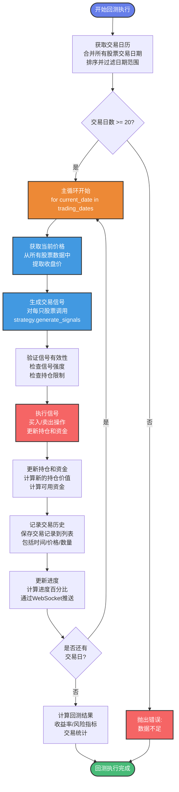

---

## 3. 策略分类架构图

```mermaid
graph TD
    Root[量化交易策略] --> Tech[技术分析策略]
    Root --> Stat[统计套利策略]
    Root --> Factor[因子投资策略]
    
    Tech --> MA[移动平均策略<br/>MovingAverage]
    Tech --> RSI[RSI策略<br/>RSI]
    Tech --> MACD[MACD策略<br/>MACD]
    Tech --> BB[布林带策略<br/>BollingerBands]
    Tech --> STOCH[随机指标策略<br/>Stochastic]
    Tech --> CCI[CCI策略<br/>CCI]
    
    Stat --> Pairs[配对交易策略<br/>PairsTrading]
    Stat --> MeanRev[均值回归策略<br/>MeanReversion]
    Stat --> Coint[协整策略<br/>Cointegration]
    
    Factor --> Value[价值因子策略<br/>ValueFactor]
    Factor --> Momentum[动量因子策略<br/>MomentumFactor]
    Factor --> LowVol[低波动因子策略<br/>LowVolatility]
    Factor --> Multi[多因子组合策略<br/>MultiFactor]
    
    style Root fill:#667eea,stroke:#333,stroke-width:3px,color:#fff
    style Tech fill:#4299e1,stroke:#333,stroke-width:2px,color:#fff
    style Stat fill:#48bb78,stroke:#333,stroke-width:2px,color:#fff
    style Factor fill:#ed8936,stroke:#333,stroke-width:2px,color:#fff
    style MA fill:#e2e8f0,stroke:#333,stroke-width:1px
    style RSI fill:#e2e8f0,stroke:#333,stroke-width:1px
    style MACD fill:#e2e8f0,stroke:#333,stroke-width:1px
    style BB fill:#e2e8f0,stroke:#333,stroke-width:1px
    style STOCH fill:#e2e8f0,stroke:#333,stroke-width:1px
    style CCI fill:#e2e8f0,stroke:#333,stroke-width:1px
    style Pairs fill:#c6f6d5,stroke:#333,stroke-width:1px
    style MeanRev fill:#c6f6d5,stroke:#333,stroke-width:1px
    style Coint fill:#c6f6d5,stroke:#333,stroke-width:1px
    style Value fill:#fed7aa,stroke:#333,stroke-width:1px
    style Momentum fill:#fed7aa,stroke:#333,stroke-width:1px
    style LowVol fill:#fed7aa,stroke:#333,stroke-width:1px
    style Multi fill:#fed7aa,stroke:#333,stroke-width:1px
```

---

## 4. 移动平均策略流程图

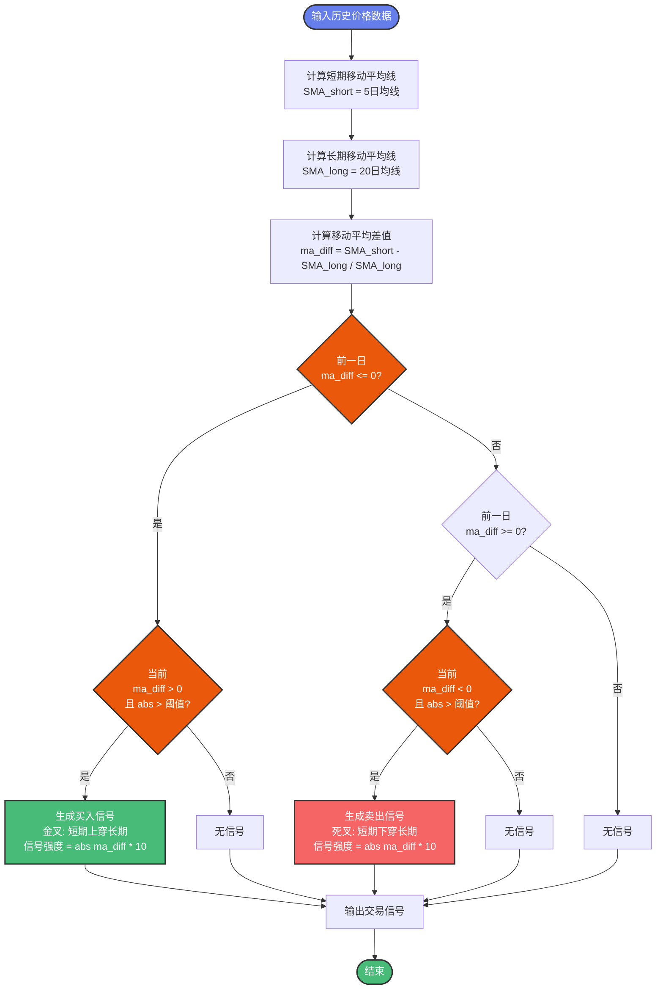

---

## 5. RSI策略流程图


---

## 6. 组合策略信号整合流程图

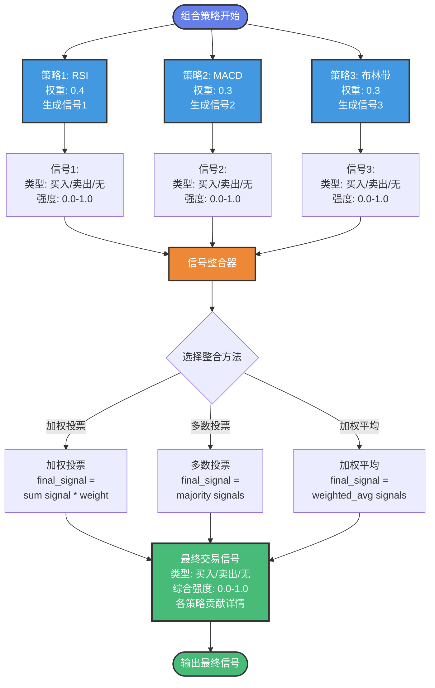

---

## 7. 数据加载流程图


---

## 8. 任务创建流程图

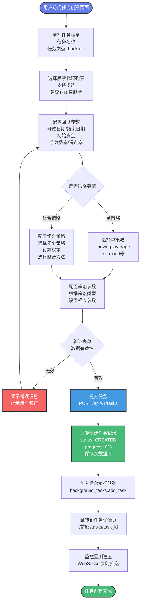

---

## 9. MACD策略流程图

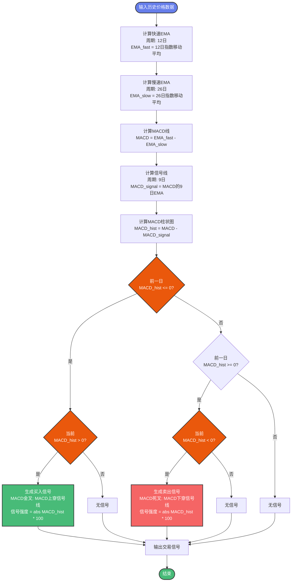

---

## 10. 布林带策略流程图

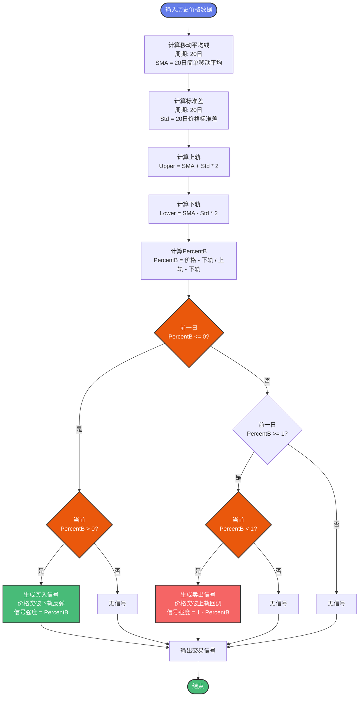

---

## 11. 随机指标策略流程图

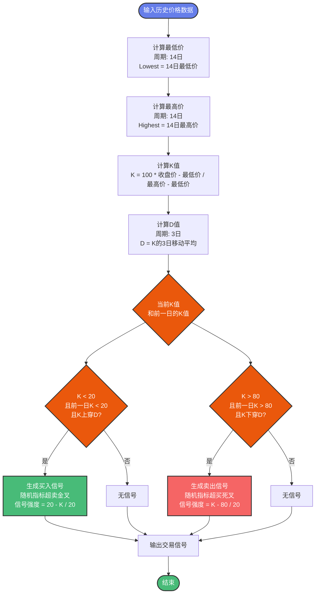

---

## 12. CCI策略流程图

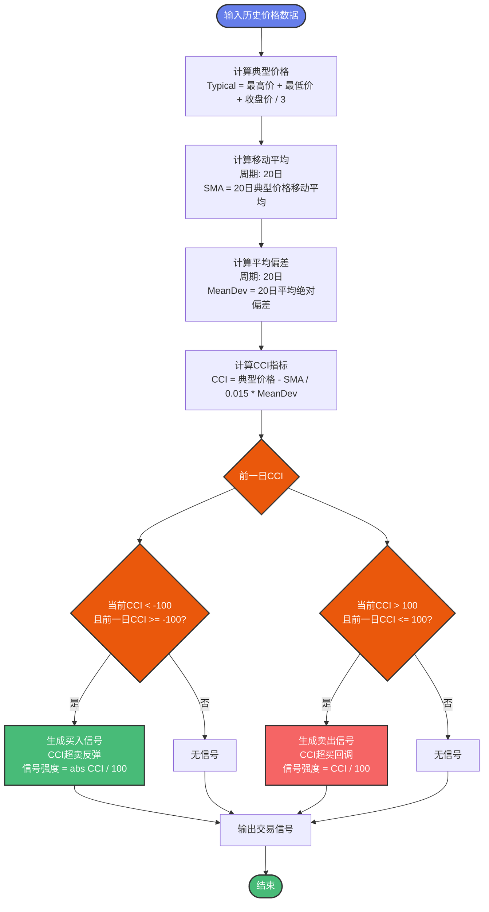

---

## 13. 配对交易策略流程图

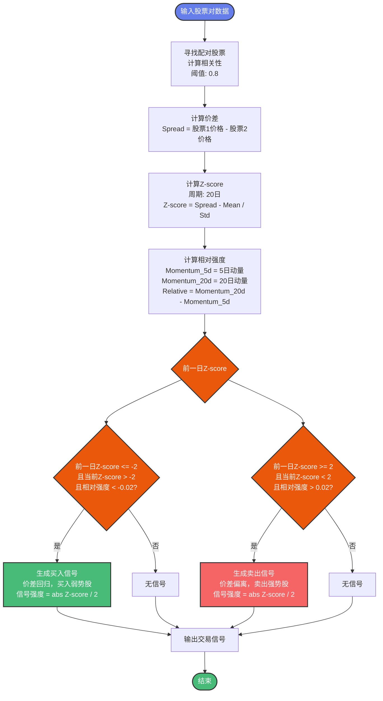

---

## 14. 均值回归策略流程图

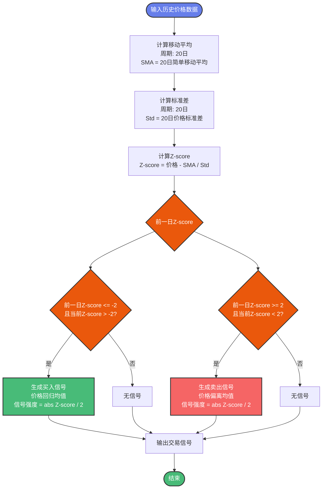

---

## 15. 协整策略流程图

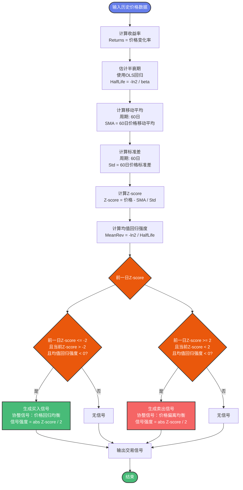

---

## 16. 价值因子策略流程图

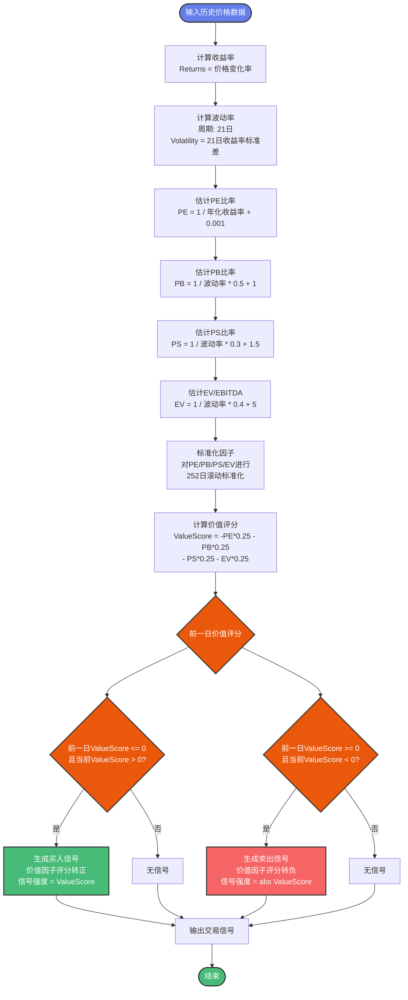

---

## 17. 动量因子策略流程图

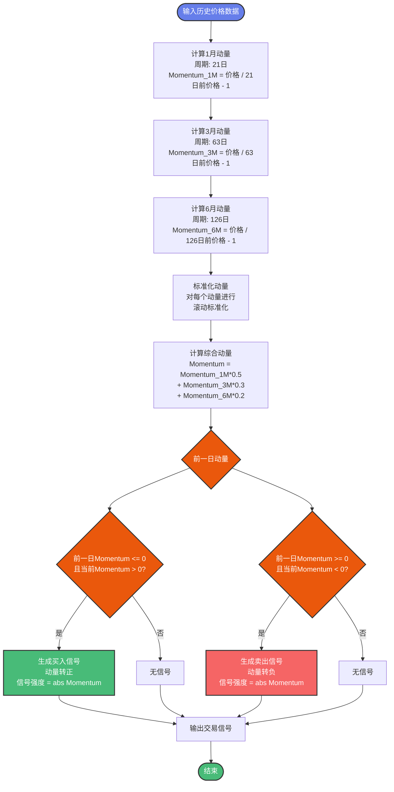

---

## 18. 低波动因子策略流程图

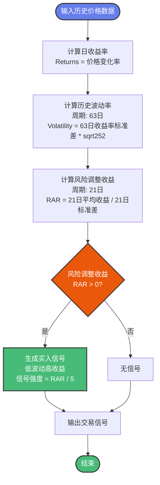

---

## 19. 多因子组合策略流程图


---

## 使用说明

### 如何查看这些流程图

1. **GitHub**: 直接在GitHub上查看，自动渲染Mermaid图表
2. **VS Code**: 安装 "Markdown Preview Mermaid Support" 插件
3. **Typora**: 原生支持Mermaid，直接打开即可查看
4. **在线工具**: 
   - https://mermaid.live/ - 在线Mermaid编辑器
   - https://mermaid-js.github.io/mermaid-live-editor/ - 官方在线编辑器

### 如何导出为图片

1. 使用在线工具 (mermaid.live):
   - 复制Mermaid代码
   - 粘贴到在线编辑器
   - 点击"Actions" → "Download PNG/SVG"

2. 使用VS Code:
   - 安装 "Markdown Preview Mermaid Support" 插件
   - 右键点击图表 → "导出为图片"

3. 使用命令行工具:
   ```bash
   npm install -g @mermaid-js/mermaid-cli
   mmdc -i flowchart.mmd -o flowchart.png
   ```

---

## 文件说明

- **回测平台PPT_Marp.md**: Marp格式的完整PPT，可直接生成演示文稿
- **回测平台PPT_简洁版.md**: 简洁版PPT，22页幻灯片
- **回测平台流程图_Mermaid.md**: 所有流程图的Mermaid源码
- **回测平台PPT讲解.md**: 详细的讲解文档（原始版本）
